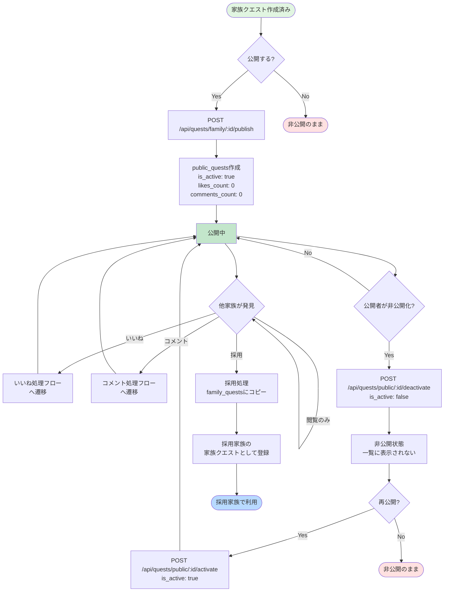
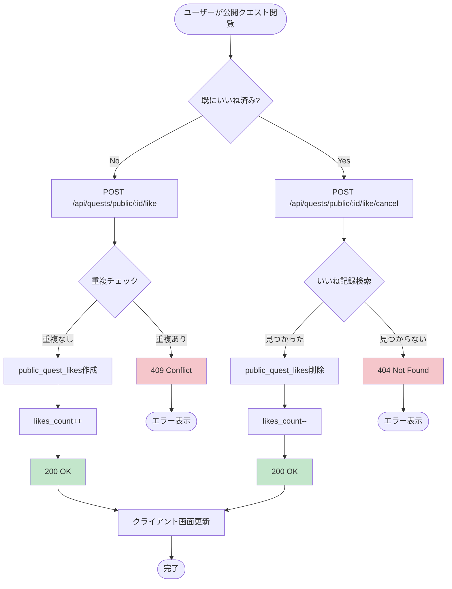
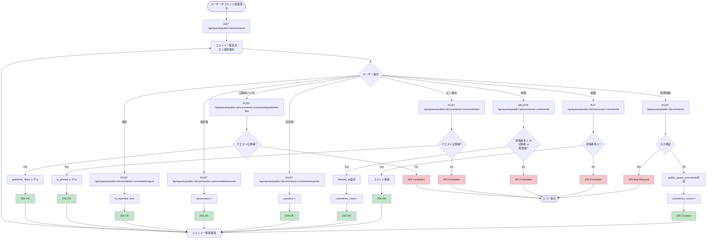
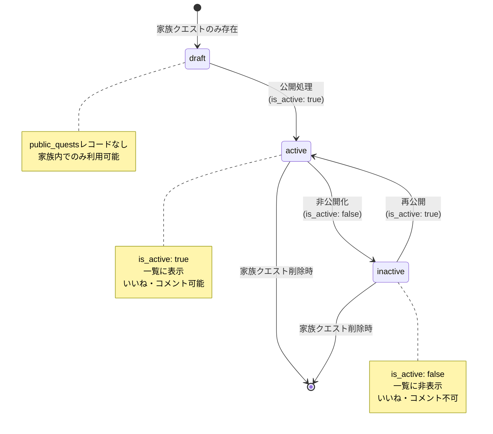

(2026年3月15日 14:30記載)

# 公開クエスト機能フロー図

## クエスト公開から採用までのライフサイクル

## いいね処理フロー

## コメント投稿・管理フロー

## モデレーション権限マトリクス

| 操作 | 投稿者本人 | クエスト公開者 | 他家族 | 管理者 |
|------|-----------|--------------|--------|--------|
| コメント投稿 | ✅ | ✅ | ✅ | ✅ |
| コメント編集 | ✅ | ❌ | ❌ | ✅ |
| コメント削除 | ✅ | ✅ | ❌ | ✅ |
| 高評価/低評価 | ✅ | ✅ | ✅ | ✅ |
| コメント報告 | ✅ | ✅ | ✅ | ✅ |
| ピン留め | ❌ | ✅ | ❌ | ✅ |
| 公開者いいね | ❌ | ✅ | ❌ | ✅ |
| クエスト非公開化 | ❌ | ✅ | ❌ | ✅ |

## ステータス管理

### 公開クエストステータス

