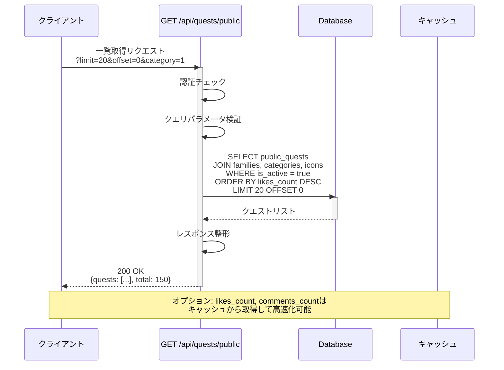
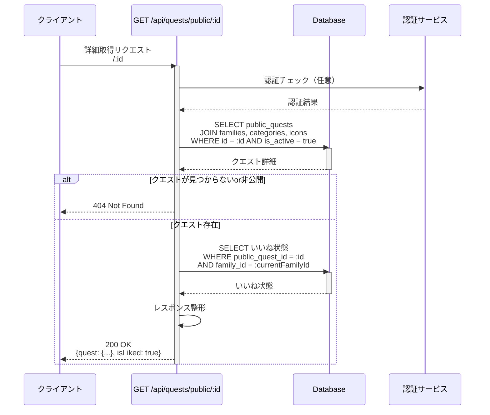
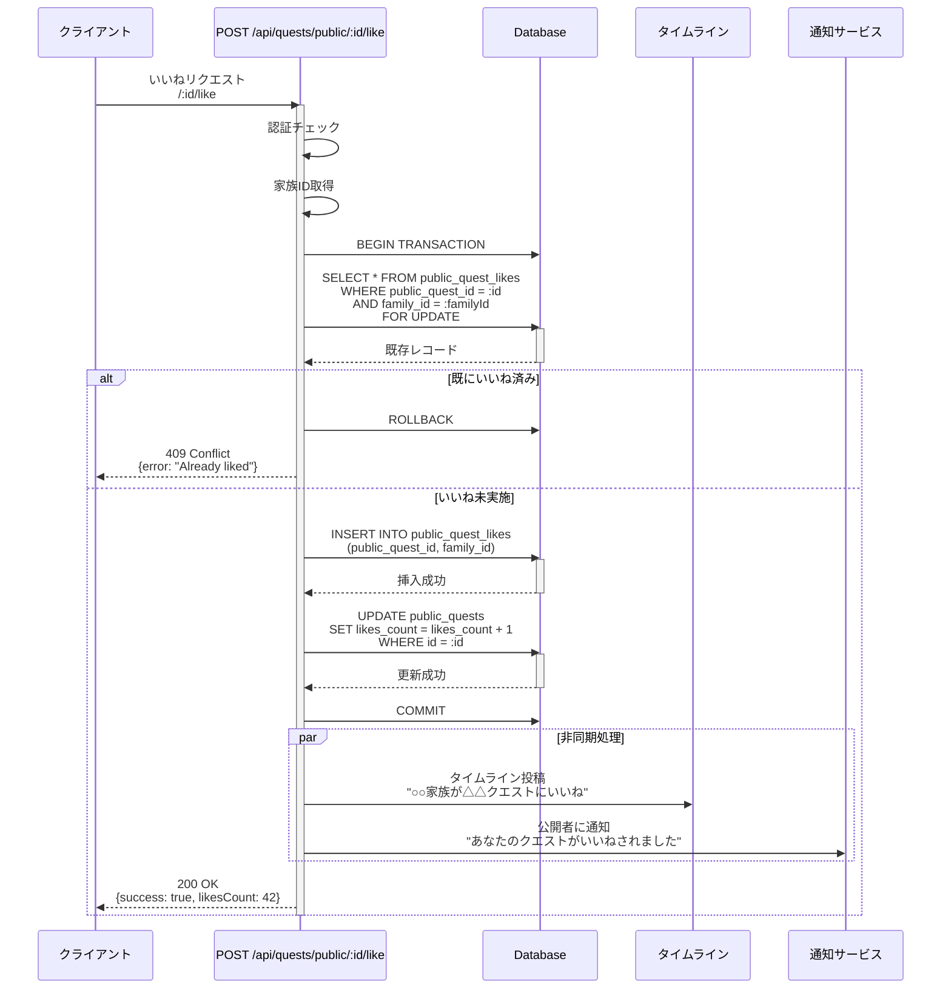
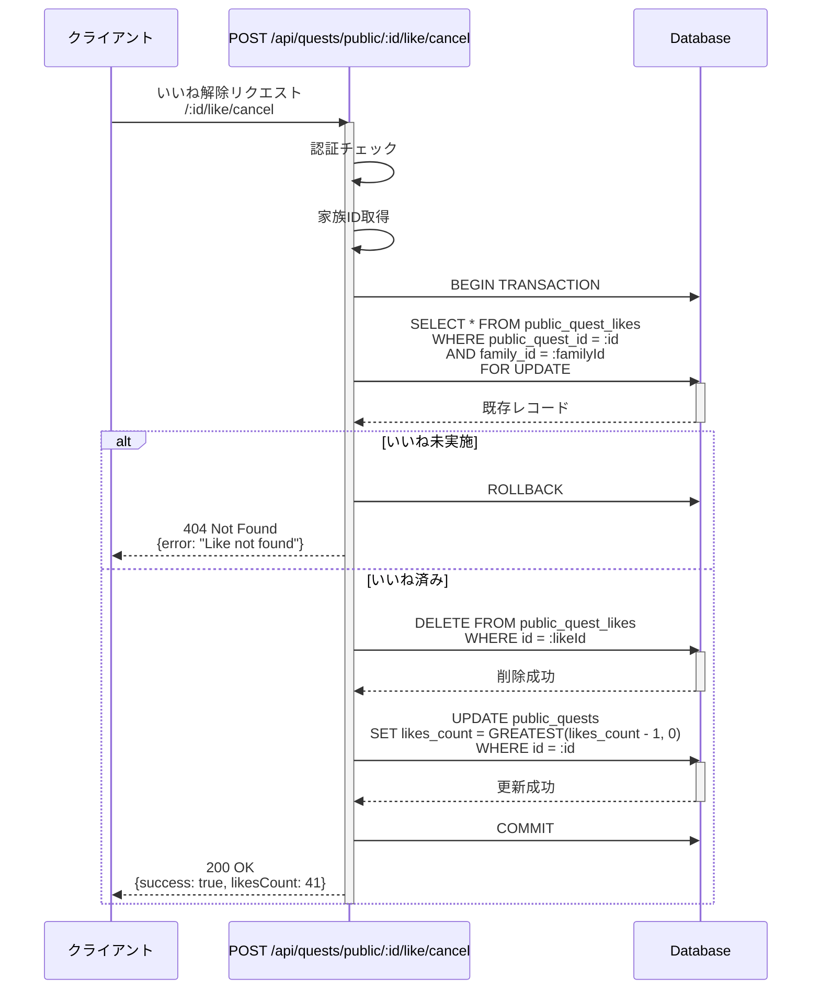
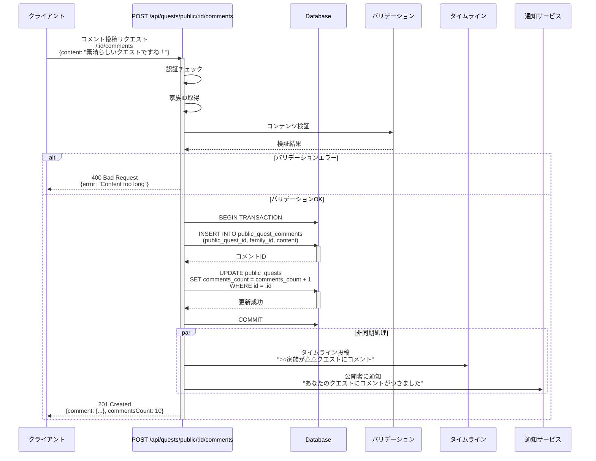
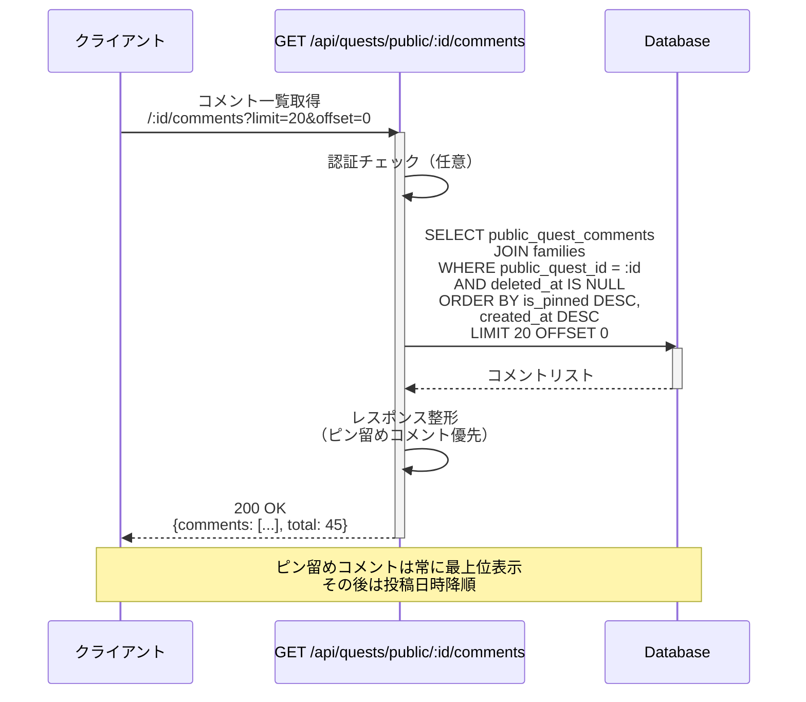
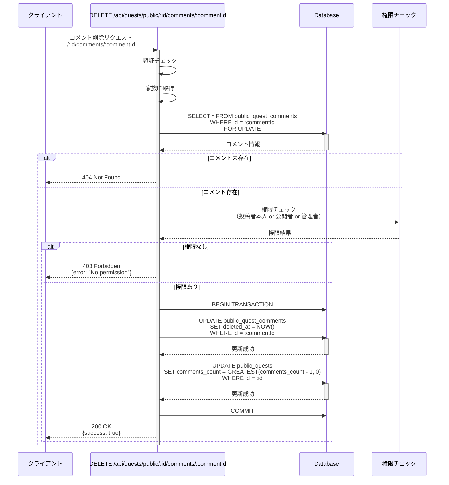
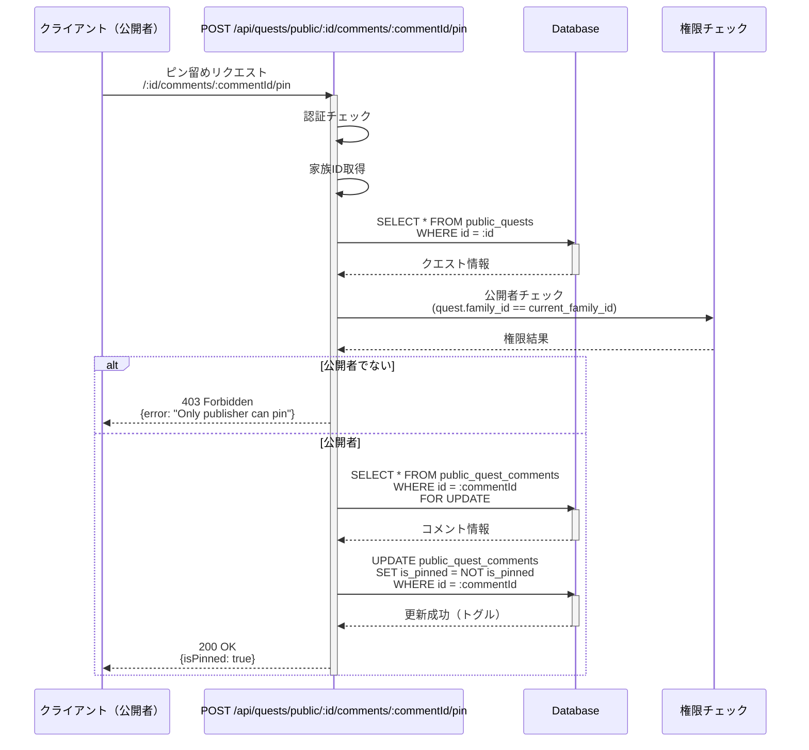
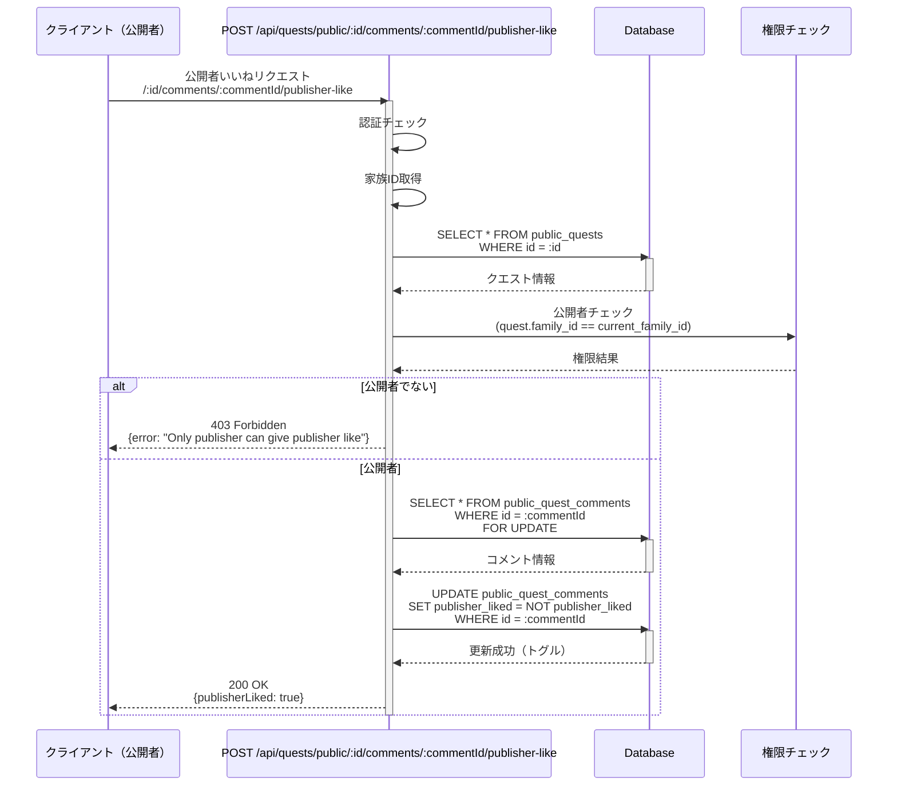
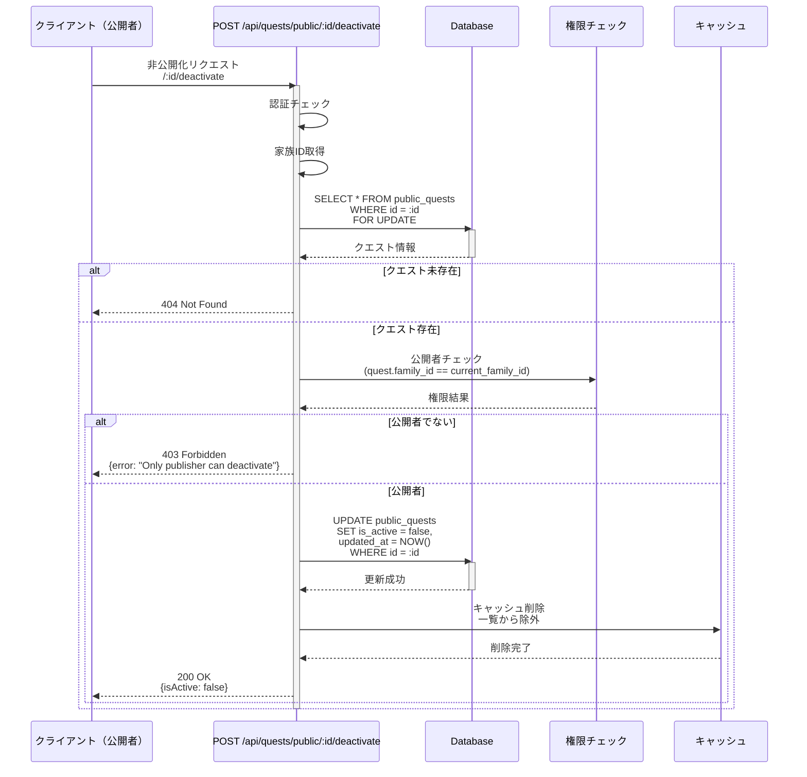

(2026年3月15日 14:30記載)

# 公開クエストAPI シーケンス図

## 公開クエスト一覧取得

```mermaid
sequenceDiagram
    participant C as クライアント
    participant API as GET /api/quests/public
    participant DB as Database
    participant Cache as キャッシュ
    
    C->>API: 一覧取得リクエスト<br/>?limit=20&offset=0&category=1
    
    activate API
    API->>API: 認証チェック
    API->>API: クエリパラメータ検証
    
    API->>DB: SELECT public_quests<br/>JOIN families, categories, icons<br/>WHERE is_active = true<br/>ORDER BY likes_count DESC<br/>LIMIT 20 OFFSET 0
    
    activate DB
    DB-->>API: クエストリスト
    deactivate DB
    
    API->>API: レスポンス整形
    API-->>C: 200 OK<br/>{quests: [...], total: 150}
    deactivate API
    
    Note over C,Cache: オプション: likes_count, comments_countは<br/>キャッシュから取得して高速化可能
```

## 公開クエスト詳細取得

```mermaid
sequenceDiagram
    participant C as クライアント
    participant API as GET /api/quests/public/:id
    participant DB as Database
    participant Auth as 認証サービス
    
    C->>API: 詳細取得リクエスト<br/>/:id
    
    activate API
    API->>Auth: 認証チェック（任意）
    Auth-->>API: 認証結果
    
    API->>DB: SELECT public_quests<br/>JOIN families, categories, icons<br/>WHERE id = :id AND is_active = true
    
    activate DB
    DB-->>API: クエスト詳細
    deactivate DB
    
    alt クエストが見つからないor非公開
        API-->>C: 404 Not Found
    else クエスト存在
        API->>DB: SELECT いいね状態<br/>WHERE public_quest_id = :id<br/>AND family_id = :currentFamilyId
        
        activate DB
        DB-->>API: いいね状態
        deactivate DB
        
        API->>API: レスポンス整形
        API-->>C: 200 OK<br/>{quest: {...}, isLiked: true}
    end
    deactivate API
```

## いいね処理

```mermaid
sequenceDiagram
    participant C as クライアント
    participant API as POST /api/quests/public/:id/like
    participant DB as Database
    participant TL as タイムライン
    participant Notify as 通知サービス
    
    C->>API: いいねリクエスト<br/>/:id/like
    
    activate API
    API->>API: 認証チェック
    API->>API: 家族ID取得
    
    API->>DB: BEGIN TRANSACTION
    
    API->>DB: SELECT * FROM public_quest_likes<br/>WHERE public_quest_id = :id<br/>AND family_id = :familyId<br/>FOR UPDATE
    
    activate DB
    DB-->>API: 既存レコード
    deactivate DB
    
    alt 既にいいね済み
        API->>DB: ROLLBACK
        API-->>C: 409 Conflict<br/>{error: "Already liked"}
    else いいね未実施
        API->>DB: INSERT INTO public_quest_likes<br/>(public_quest_id, family_id)
        
        activate DB
        DB-->>API: 挿入成功
        deactivate DB
        
        API->>DB: UPDATE public_quests<br/>SET likes_count = likes_count + 1<br/>WHERE id = :id
        
        activate DB
        DB-->>API: 更新成功
        deactivate DB
        
        API->>DB: COMMIT
        
        par 非同期処理
            API->>TL: タイムライン投稿<br/>"○○家族が△△クエストにいいね"
            API->>Notify: 公開者に通知<br/>"あなたのクエストがいいねされました"
        end
        
        API-->>C: 200 OK<br/>{success: true, likesCount: 42}
    end
    deactivate API
```

## いいね解除処理

```mermaid
sequenceDiagram
    participant C as クライアント
    participant API as POST /api/quests/public/:id/like/cancel
    participant DB as Database
    
    C->>API: いいね解除リクエスト<br/>/:id/like/cancel
    
    activate API
    API->>API: 認証チェック
    API->>API: 家族ID取得
    
    API->>DB: BEGIN TRANSACTION
    
    API->>DB: SELECT * FROM public_quest_likes<br/>WHERE public_quest_id = :id<br/>AND family_id = :familyId<br/>FOR UPDATE
    
    activate DB
    DB-->>API: 既存レコード
    deactivate DB
    
    alt いいね未実施
        API->>DB: ROLLBACK
        API-->>C: 404 Not Found<br/>{error: "Like not found"}
    else いいね済み
        API->>DB: DELETE FROM public_quest_likes<br/>WHERE id = :likeId
        
        activate DB
        DB-->>API: 削除成功
        deactivate DB
        
        API->>DB: UPDATE public_quests<br/>SET likes_count = GREATEST(likes_count - 1, 0)<br/>WHERE id = :id
        
        activate DB
        DB-->>API: 更新成功
        deactivate DB
        
        API->>DB: COMMIT
        
        API-->>C: 200 OK<br/>{success: true, likesCount: 41}
    end
    deactivate API
```

## コメント投稿

```mermaid
sequenceDiagram
    participant C as クライアント
    participant API as POST /api/quests/public/:id/comments
    participant DB as Database
    participant Valid as バリデーション
    participant TL as タイムライン
    participant Notify as 通知サービス
    
    C->>API: コメント投稿リクエスト<br/>/:id/comments<br/>{content: "素晴らしいクエストですね！"}
    
    activate API
    API->>API: 認証チェック
    API->>API: 家族ID取得
    
    API->>Valid: コンテンツ検証
    Valid-->>API: 検証結果
    
    alt バリデーションエラー
        API-->>C: 400 Bad Request<br/>{error: "Content too long"}
    else バリデーションOK
        API->>DB: BEGIN TRANSACTION
        
        API->>DB: INSERT INTO public_quest_comments<br/>(public_quest_id, family_id, content)
        
        activate DB
        DB-->>API: コメントID
        deactivate DB
        
        API->>DB: UPDATE public_quests<br/>SET comments_count = comments_count + 1<br/>WHERE id = :id
        
        activate DB
        DB-->>API: 更新成功
        deactivate DB
        
        API->>DB: COMMIT
        
        par 非同期処理
            API->>TL: タイムライン投稿<br/>"○○家族が△△クエストにコメント"
            API->>Notify: 公開者に通知<br/>"あなたのクエストにコメントがつきました"
        end
        
        API-->>C: 201 Created<br/>{comment: {...}, commentsCount: 10}
    end
    deactivate API
```

## コメント一覧取得

```mermaid
sequenceDiagram
    participant C as クライアント
    participant API as GET /api/quests/public/:id/comments
    participant DB as Database
    
    C->>API: コメント一覧取得<br/>/:id/comments?limit=20&offset=0
    
    activate API
    API->>API: 認証チェック（任意）
    
    API->>DB: SELECT public_quest_comments<br/>JOIN families<br/>WHERE public_quest_id = :id<br/>AND deleted_at IS NULL<br/>ORDER BY is_pinned DESC,<br/>         created_at DESC<br/>LIMIT 20 OFFSET 0
    
    activate DB
    DB-->>API: コメントリスト
    deactivate DB
    
    API->>API: レスポンス整形<br/>（ピン留めコメント優先）
    
    API-->>C: 200 OK<br/>{comments: [...], total: 45}
    deactivate API
    
    Note over C,DB: ピン留めコメントは常に最上位表示<br/>その後は投稿日時降順
```

## コメント削除（ソフトデリート）

```mermaid
sequenceDiagram
    participant C as クライアント
    participant API as DELETE /api/quests/public/:id/comments/:commentId
    participant DB as Database
    participant Auth as 権限チェック
    
    C->>API: コメント削除リクエスト<br/>/:id/comments/:commentId
    
    activate API
    API->>API: 認証チェック
    API->>API: 家族ID取得
    
    API->>DB: SELECT * FROM public_quest_comments<br/>WHERE id = :commentId<br/>FOR UPDATE
    
    activate DB
    DB-->>API: コメント情報
    deactivate DB
    
    alt コメント未存在
        API-->>C: 404 Not Found
    else コメント存在
        API->>Auth: 権限チェック<br/>（投稿者本人 or 公開者 or 管理者）
        Auth-->>API: 権限結果
        
        alt 権限なし
            API-->>C: 403 Forbidden<br/>{error: "No permission"}
        else 権限あり
            API->>DB: BEGIN TRANSACTION
            
            API->>DB: UPDATE public_quest_comments<br/>SET deleted_at = NOW()<br/>WHERE id = :commentId
            
            activate DB
            DB-->>API: 更新成功
            deactivate DB
            
            API->>DB: UPDATE public_quests<br/>SET comments_count = GREATEST(comments_count - 1, 0)<br/>WHERE id = :id
            
            activate DB
            DB-->>API: 更新成功
            deactivate DB
            
            API->>DB: COMMIT
            
            API-->>C: 200 OK<br/>{success: true}
        end
    end
    deactivate API
```

## コメントピン留め（公開者のみ）

```mermaid
sequenceDiagram
    participant C as クライアント（公開者）
    participant API as POST /api/quests/public/:id/comments/:commentId/pin
    participant DB as Database
    participant Auth as 権限チェック
    
    C->>API: ピン留めリクエスト<br/>/:id/comments/:commentId/pin
    
    activate API
    API->>API: 認証チェック
    API->>API: 家族ID取得
    
    API->>DB: SELECT * FROM public_quests<br/>WHERE id = :id
    
    activate DB
    DB-->>API: クエスト情報
    deactivate DB
    
    API->>Auth: 公開者チェック<br/>(quest.family_id == current_family_id)
    Auth-->>API: 権限結果
    
    alt 公開者でない
        API-->>C: 403 Forbidden<br/>{error: "Only publisher can pin"}
    else 公開者
        API->>DB: SELECT * FROM public_quest_comments<br/>WHERE id = :commentId<br/>FOR UPDATE
        
        activate DB
        DB-->>API: コメント情報
        deactivate DB
        
        API->>DB: UPDATE public_quest_comments<br/>SET is_pinned = NOT is_pinned<br/>WHERE id = :commentId
        
        activate DB
        DB-->>API: 更新成功（トグル）
        deactivate DB
        
        API-->>C: 200 OK<br/>{isPinned: true}
    end
    deactivate API
```

## 公開者いいね（公開者のみ）

```mermaid
sequenceDiagram
    participant C as クライアント（公開者）
    participant API as POST /api/quests/public/:id/comments/:commentId/publisher-like
    participant DB as Database
    participant Auth as 権限チェック
    
    C->>API: 公開者いいねリクエスト<br/>/:id/comments/:commentId/publisher-like
    
    activate API
    API->>API: 認証チェック
    API->>API: 家族ID取得
    
    API->>DB: SELECT * FROM public_quests<br/>WHERE id = :id
    
    activate DB
    DB-->>API: クエスト情報
    deactivate DB
    
    API->>Auth: 公開者チェック<br/>(quest.family_id == current_family_id)
    Auth-->>API: 権限結果
    
    alt 公開者でない
        API-->>C: 403 Forbidden<br/>{error: "Only publisher can give publisher like"}
    else 公開者
        API->>DB: SELECT * FROM public_quest_comments<br/>WHERE id = :commentId<br/>FOR UPDATE
        
        activate DB
        DB-->>API: コメント情報
        deactivate DB
        
        API->>DB: UPDATE public_quest_comments<br/>SET publisher_liked = NOT publisher_liked<br/>WHERE id = :commentId
        
        activate DB
        DB-->>API: 更新成功（トグル）
        deactivate DB
        
        API-->>C: 200 OK<br/>{publisherLiked: true}
    end
    deactivate API
```

## 非公開化処理

```mermaid
sequenceDiagram
    participant C as クライアント（公開者）
    participant API as POST /api/quests/public/:id/deactivate
    participant DB as Database
    participant Auth as 権限チェック
    participant Cache as キャッシュ
    
    C->>API: 非公開化リクエスト<br/>/:id/deactivate
    
    activate API
    API->>API: 認証チェック
    API->>API: 家族ID取得
    
    API->>DB: SELECT * FROM public_quests<br/>WHERE id = :id<br/>FOR UPDATE
    
    activate DB
    DB-->>API: クエスト情報
    deactivate DB
    
    alt クエスト未存在
        API-->>C: 404 Not Found
    else クエスト存在
        API->>Auth: 公開者チェック<br/>(quest.family_id == current_family_id)
        Auth-->>API: 権限結果
        
        alt 公開者でない
            API-->>C: 403 Forbidden<br/>{error: "Only publisher can deactivate"}
        else 公開者
            API->>DB: UPDATE public_quests<br/>SET is_active = false,<br/>    updated_at = NOW()<br/>WHERE id = :id
            
            activate DB
            DB-->>API: 更新成功
            deactivate DB
            
            API->>Cache: キャッシュ削除<br/>一覧から除外
            Cache-->>API: 削除完了
            
            API-->>C: 200 OK<br/>{isActive: false}
        end
    end
    deactivate API
```
