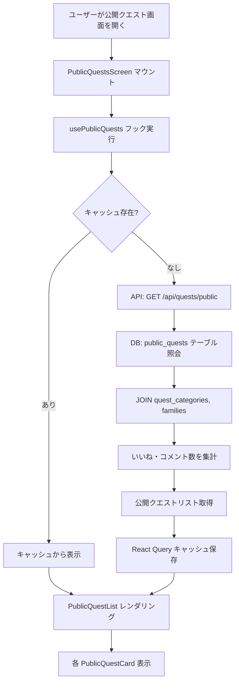
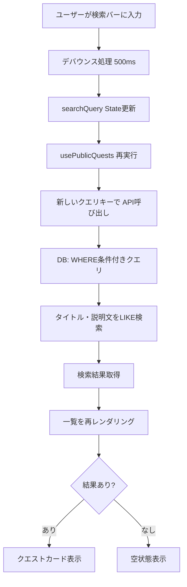
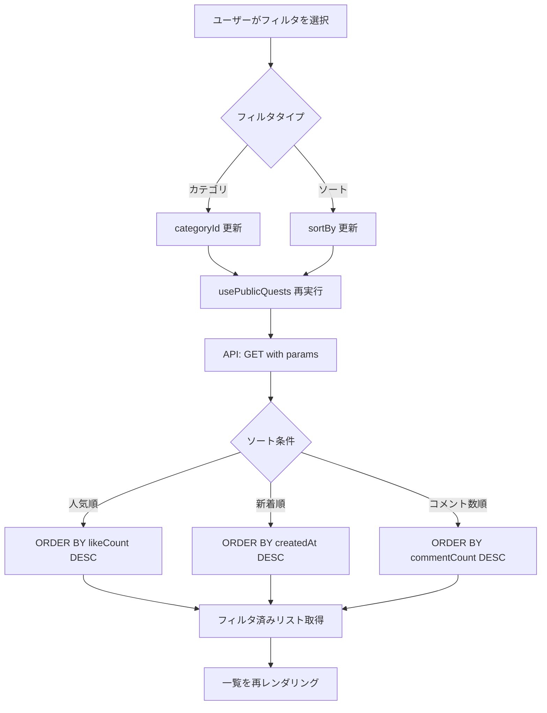
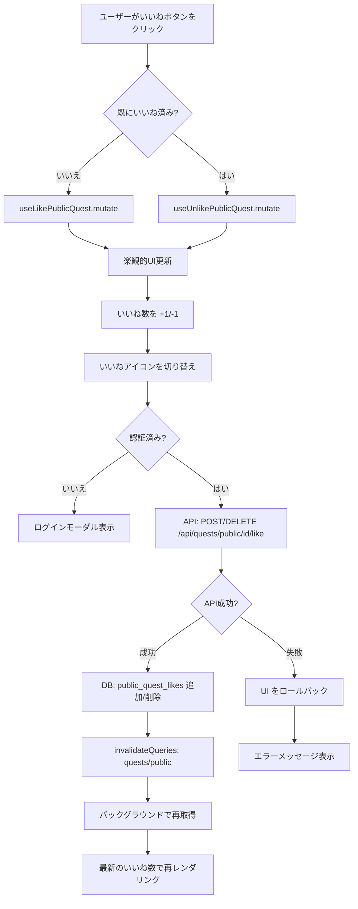
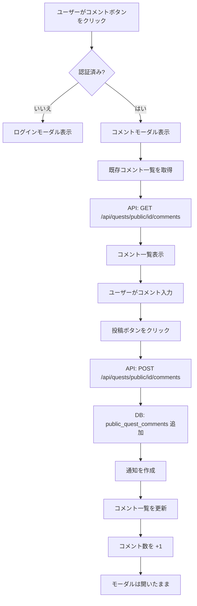
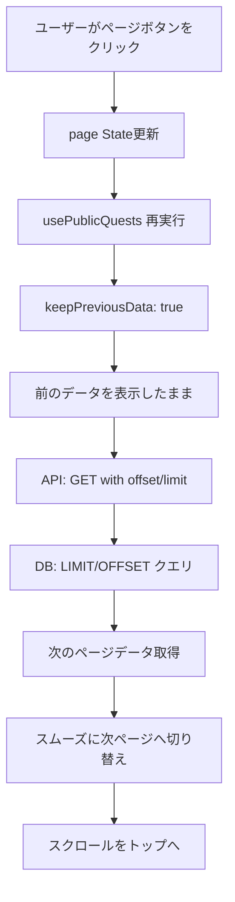
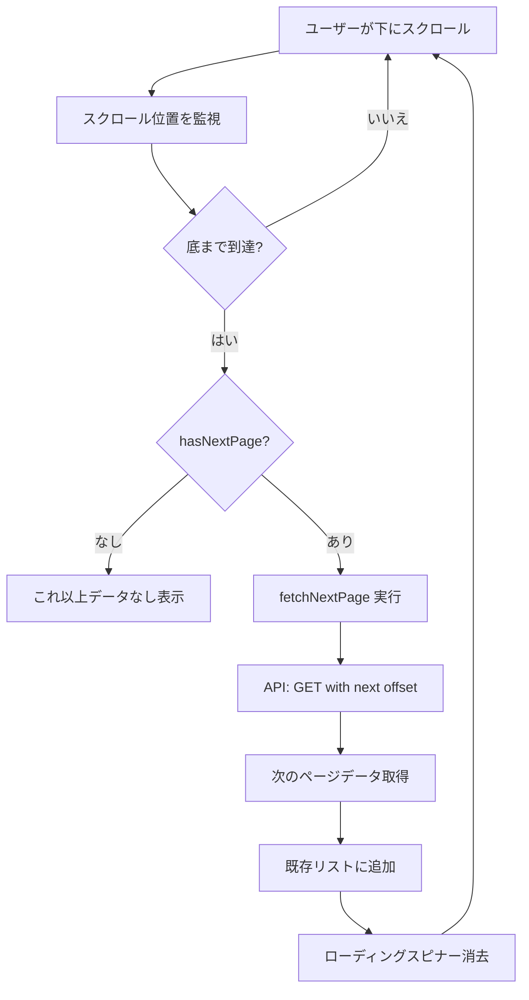
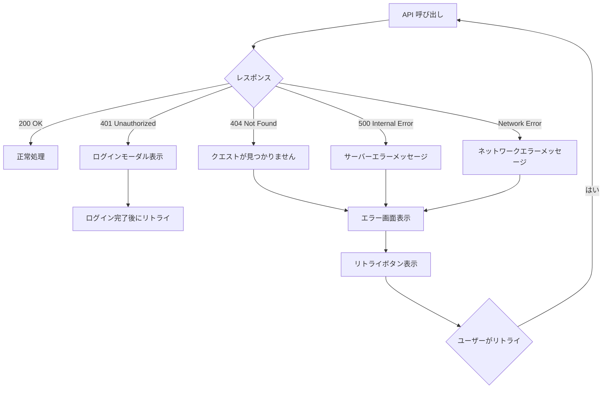
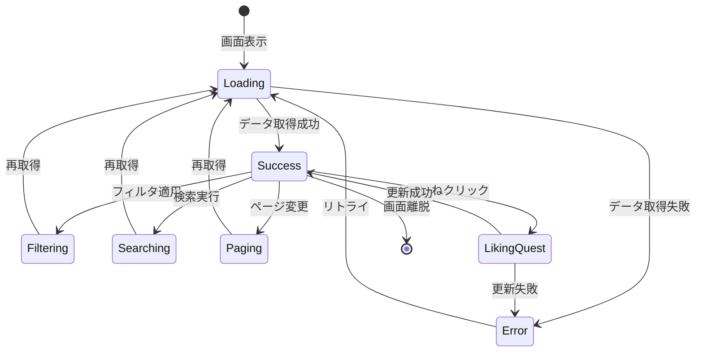
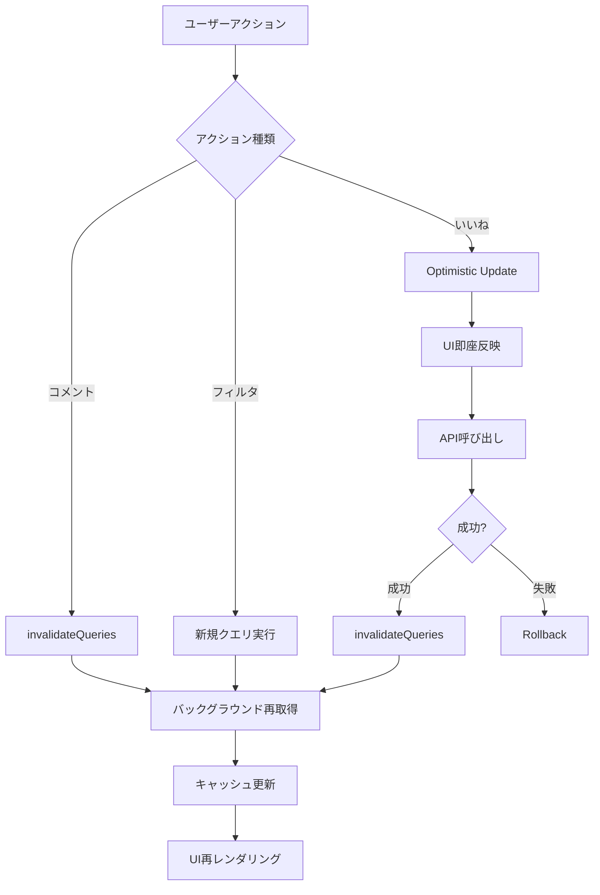

(2026年3月15日 14:30記載)

# 公開クエスト一覧 フロー図

## 初期表示フロー



## 検索フロー



## フィルタリングフロー



## いいねフロー



## コメントフロー



## ページネーションフロー



## 無限スクロールフロー



## クエスト詳細遷移フロー

```mermaid
flowchart TD
    A[ユーザーがクエストカードをクリック] --> B[クエストIDを取得]
    B --> C[/quests/public/id へ遷移]
    C --> D[クエスト詳細画面を表示]
```

## エラーハンドリングフロー



## 状態遷移図



## キャッシュ更新フロー


