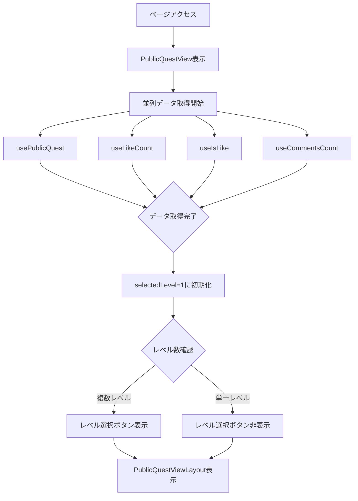
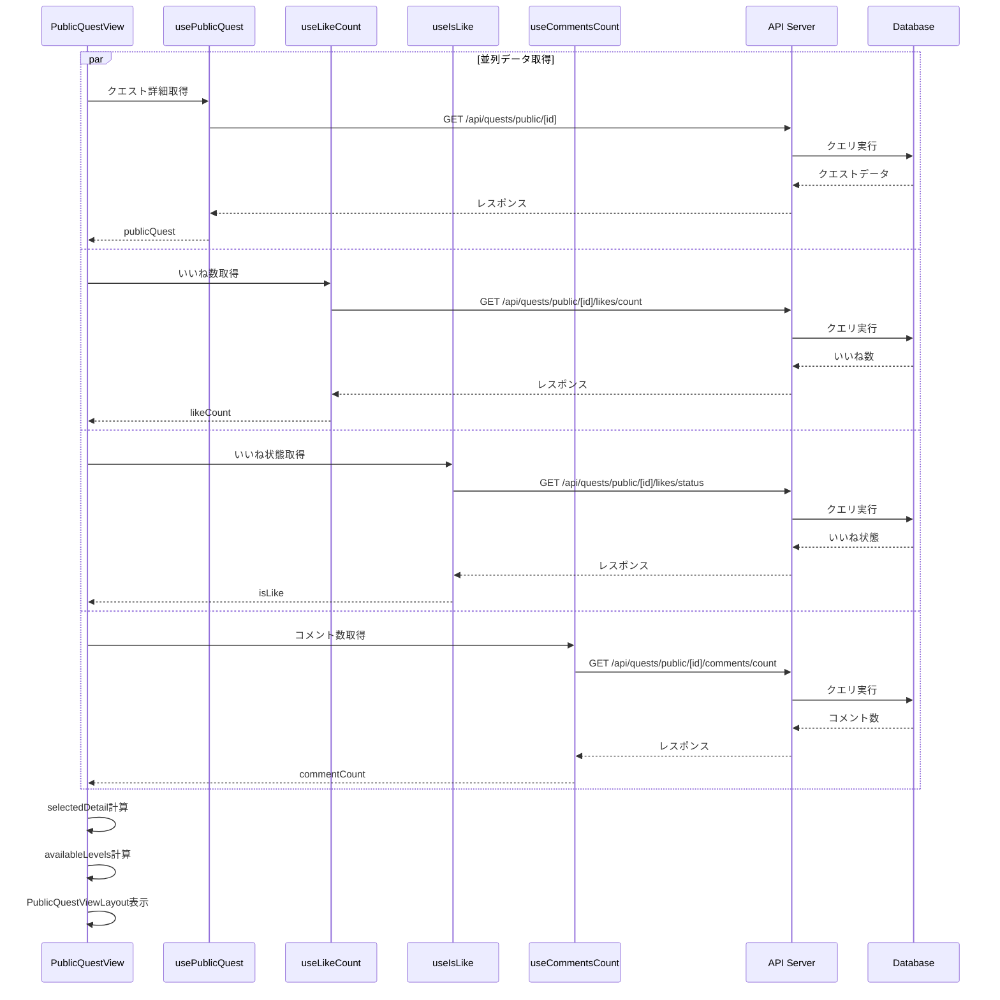
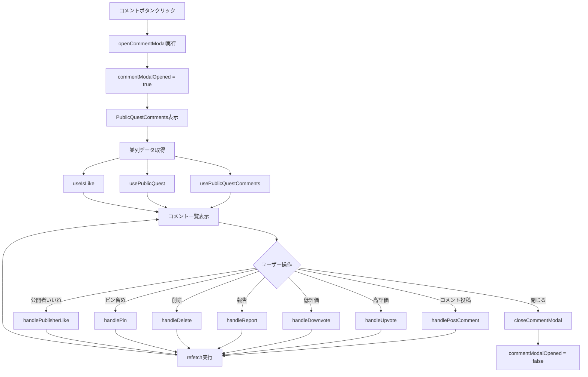
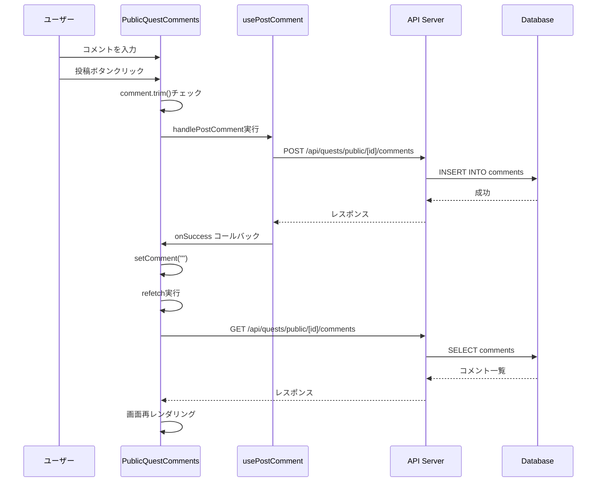
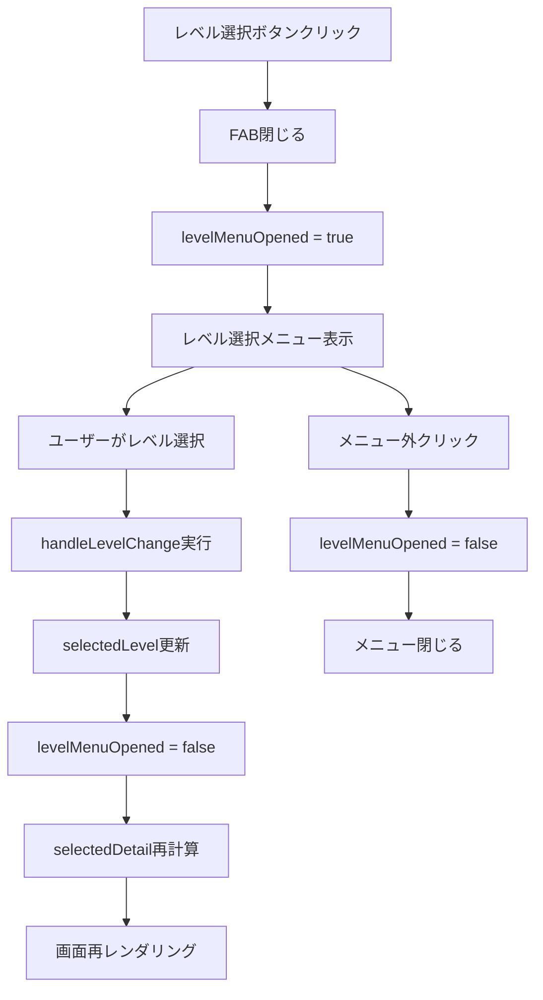
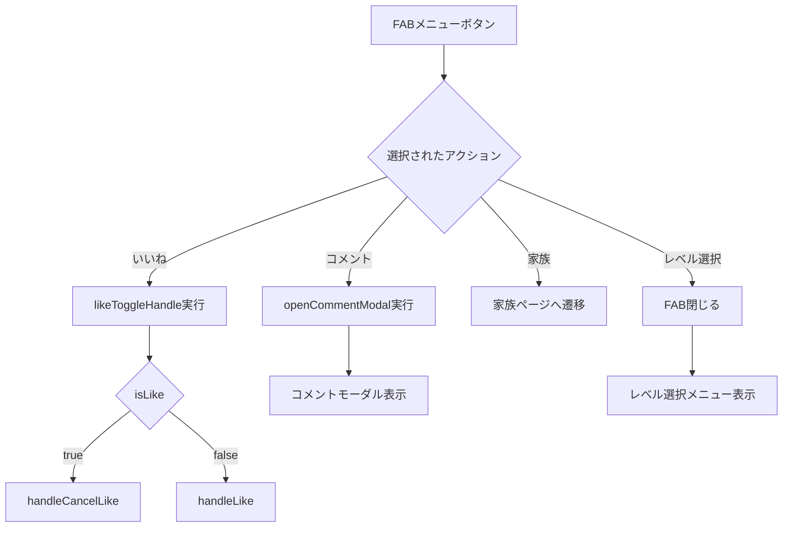
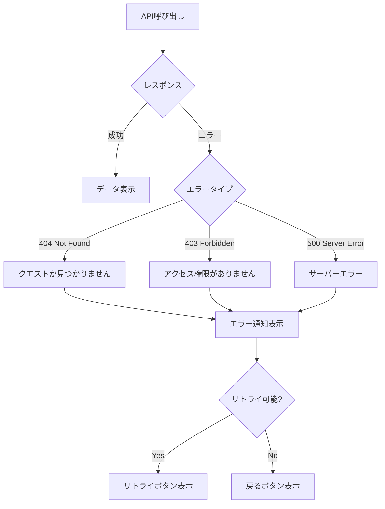

# 公開クエスト閲覧画面 - フロー図

**(2026年3月記載)**

## 画面表示フロー



## データ取得シーケンス



## いいね操作フロー

```mermaid
graph TD
    A[いいねボタンクリック] --> B{現在の状態}
    B -->|isLike === true| C[handleCancelLike実行]
    B -->|isLike === false| D[handleLike実行]
    
    C --> E[DELETE /api/quests/public/[id]/likes]
    D --> F[POST /api/quests/public/[id]/likes]
    
    E --> G{API結果}
    F --> H{API結果}
    
    G -->|成功| I[いいね状態更新]
    G -->|エラー| J[エラー通知]
    
    H -->|成功| K[いいね状態更新]
    H -->|エラー| L[エラー通知]
    
    I --> M[useLikeCount, useIsLike再取得]
    K --> M
    
    M --> N[画面再レンダリング]
```

## コメントモーダルフロー



## コメント投稿フロー



## 高評価・低評価フロー

```mermaid
graph TD
    A[高評価/低評価ボタンクリック] --> B[commentId取得]
    B --> C[comments配列から該当コメント検索]
    C --> D{コメント存在?}
    
    D -->|No| E[何もしない]
    D -->|Yes| F{現在の状態}
    
    F -->|高評価済み| G[高評価解除API]
    F -->|未評価| H[高評価API]
    F -->|低評価済み| I[低評価解除API]
    
    G --> J[PUT /api/comments/[commentId]/upvote]
    H --> J
    I --> K[PUT /api/comments/[commentId]/downvote]
    
    J --> L{API結果}
    K --> L
    
    L -->|成功| M[onSuccess コールバック]
    L -->|エラー| N[エラー通知]
    
    M --> O[refetch実行]
    O --> P[コメント一覧再取得]
```

## レベル選択フロー



## FAB操作フロー



## コメントソート切り替えフロー

```mermaid
graph TD
    A[ソートボタンクリック] --> B{現在のソート}
    B -->|newest| C[sortType = "likes"に変更]
    B -->|likes| D[sortType = "newest"に変更]
    
    C --> E[コメント配列を再ソート]
    D --> E
    
    E --> F{sortType}
    F -->|newest| G[createdAt DESC]
    F -->|likes| H[likeCount DESC]
    
    G --> I[画面再レンダリング]
    H --> I
```

## 条件付きレンダリング

### レベル選択ボタンの表示条件
```typescript
availableLevels.length > 1
```

### レベル選択メニューの表示条件
```typescript
availableLevels.length > 1 && levelMenuOpened
```

### コメント削除ボタンの表示条件
```typescript
isOwnComment === true
```

### ピン留めボタンの表示条件
```typescript
isPublisher === true
```

### 公開者いいねの表示条件
```typescript
isPublisher === true
```

## エラーハンドリングフロー



## ローディング状態の管理

### 画面全体のローディング
```typescript
// 画面表示時のローディング
isLoading: boolean (usePublicQuest)

// PublicQuestViewLayoutに渡す
<PublicQuestViewLayout
  isLoading={isLoading}
  // ...other props
/>
```

### コメントモーダルのローディング
```typescript
// すべてのローディング状態を統合
const isLoading = 
  isPostingComment || 
  isUpvoting || 
  isDownvoting || 
  isReporting || 
  isDeleting || 
  isPinning || 
  isPublisherLiking

// モーダル全体にローディングオーバーレイ
<LoadingOverlay visible={isLoading} />
```

### ボタン個別のローディング
```typescript
<Button
  loading={isPostingComment}
  disabled={isPostingComment}
>
  投稿
</Button>
```
