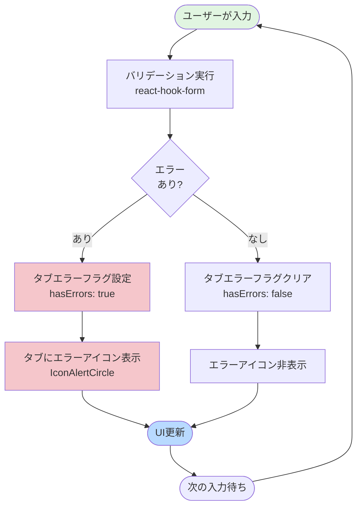
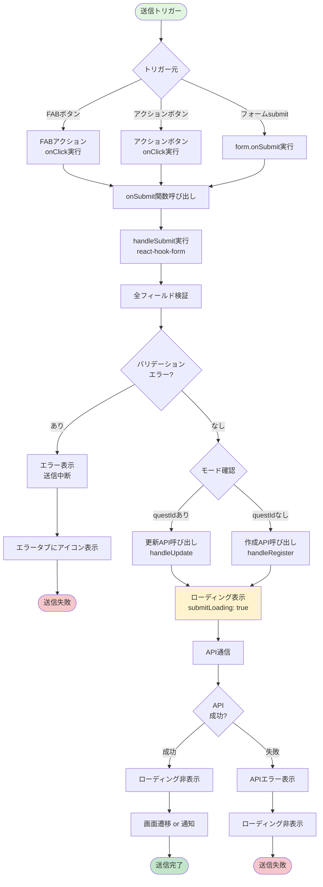
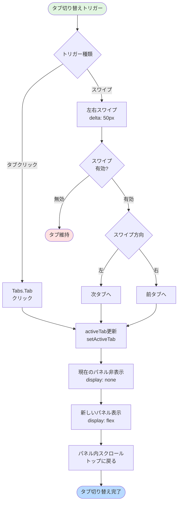

(2026年3月15日 14:30記載)

# QuestEditLayout フロー図

## レイアウト初期化フロー

```mermaid
flowchart TD
    Start([QuestEditLayoutマウント]) --> CheckQuestId{questId<br/>存在する?}
    
    CheckQuestId -->|あり| EditMode[編集モード]
    CheckQuestId -->|なし| CreateMode[新規作成モード]
    
    EditMode --> SetEditTitle[タイトル: クエスト編集]
    CreateMode --> SetCreateTitle[タイトル: クエスト登録]
    
    SetEditTitle --> SetEditActions[editActions選択]
    SetCreateTitle --> SetCreateActions[createActions選択]
    
    SetEditActions --> SetEditFAB[fabEditActions選択]
    SetCreateActions --> SetCreateFAB[fabCreateActions選択]
    
    SetEditFAB --> InitTabs[タブ初期化]
    SetCreateFAB --> InitTabs
    
    InitTabs --> SetActiveTab[activeTab設定<br/>tabs[0]?.value ?? basic]
    
    SetActiveTab --> CheckLoading{isLoading?}
    
    CheckLoading -->|true| ShowOverlay[LoadingOverlay表示]
    CheckLoading -->|false| HideOverlay[LoadingOverlay非表示]
    
    ShowOverlay --> RenderLayout[レイアウト描画]
    HideOverlay --> RenderLayout
    
    RenderLayout --> Ready([準備完了])
    
    style Start fill:#e1f5e1
    style Ready fill:#b8daff
    style EditMode fill:#fff3cd
    style CreateMode fill:#d1ecf1
```

## フォームバインディングフロー

```mermaid
flowchart TD
    Start([親コンポーネント]) --> InitForm[フォーム初期化<br/>react-hook-form]
    
    InitForm --> FetchData{questId<br/>あり?}
    
    FetchData -->|あり| LoadQuest[クエストデータ取得]
    FetchData -->|なし| SetDefaults[デフォルト値設定]
    
    LoadQuest --> PopulateForm[フォームにデータ投入<br/>setValue]
    SetDefaults --> PopulateForm
    
    PopulateForm --> PassPropsToLayout[QuestEditLayoutに<br/>props渡す]
    
    PassPropsToLayout --> RenderTabs[タブコンテンツ描画]
    
    RenderTabs --> TabContent1[{"基本設定タブ<br/>(BasicSettings)"}]
    RenderTabs --> TabContent2[{"詳細設定タブ<br/>(DetailSettings)"}]
    RenderTabs --> TabContent3[{"子供設定タブ<br/>(ChildSettings)"}]
    
    TabContent1 --> BindFields1[フィールドバインディング<br/>register/setValue/watch]
    TabContent2 --> BindFields2[フィールドバインディング<br/>register/setValue/watch]
    TabContent3 --> BindFields3[フィールドバインディング<br/>register/setValue/watch]
    
    BindFields1 --> UserInput([ユーザー入力])
    BindFields2 --> UserInput
    BindFields3 --> UserInput
    
    style Start fill:#e1f5e1
    style UserInput fill:#b8daff
```

## バリデーションフロー



## 送信フロー



## タブ切り替えフロー



## ScrollableTabs仕様

### スワイプ検出パラメータ
- **delta**: 50ピクセル（スワイプと認識する最小移動距離）
- **swipeDuration**: 500ミリ秒（スワイプと認識する最大時間）
- 縦スクロール中でもスワイプ検出可能

### タブ固定化
- タブヘッダーがスティッキー（画面上部に固定）
- 横スクロール対応（タブが多い場合）
- コンテンツはタブヘッダーの下でスクロール

### レイアウト構造
```
ScrollableTabs
├── Tabs.List (sticky, 上部固定)
│   └── Tabs.Tab[] (横スクロール可能)
└── スワイプエリア (flex: 1, 残り全高)
    └── Tabs.Panel[] (コンテンツ)
```
