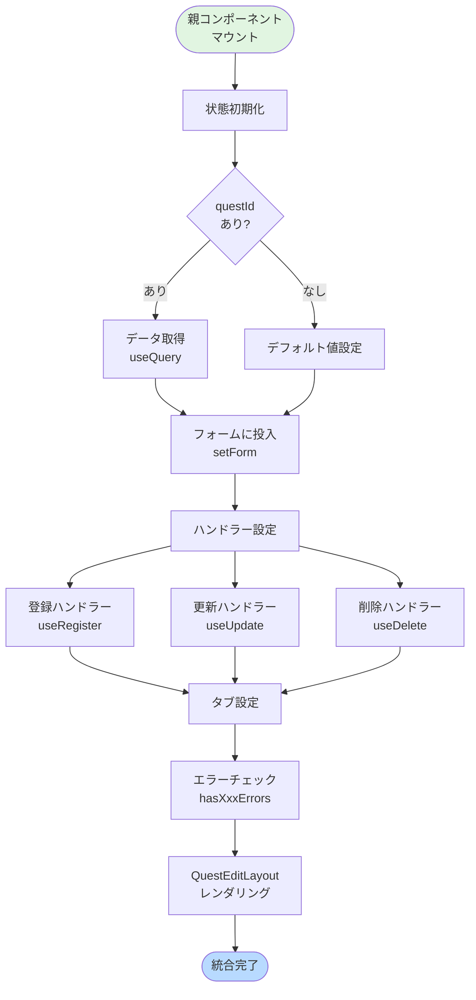

(2026年3月15日 14:30記載)

# QuestEditLayout 統合ガイド

## 親コンポーネントとの統合パターン

### 基本的な統合フロー



## React Hook Form との統合

### フォーム初期化

```typescript
import { useForm } from "react-hook-form"
import { zodResolver } from "@hookform/resolvers/zod"

/** フォーム初期化 */
const {
  register,
  handleSubmit,
  setValue,
  watch,
  formState: { errors },
  reset
} = useForm<FamilyQuestFormType>({
  resolver: zodResolver(familyQuestFormSchema),
  defaultValues: {
    name: "",
    iconId: undefined,
    iconColor: "blue",
    categoryId: undefined,
    tags: [],
    details: [],
    childSettings: []
  }
})
```

### データ取得時のフォーム投入

```typescript
/** クエストデータ取得 */
const { data: questData, isLoading } = useQuery({
  queryKey: ["familyQuest", familyQuestId],
  queryFn: () => fetchFamilyQuest({ id: familyQuestId! }),
  enabled: !!familyQuestId
})

/** データ取得完了時にフォームに投入 */
useEffect(() => {
  if (questData) {
    reset(questData) // フォーム全体をリセットしてデータ投入
  }
}, [questData, reset])
```

## カスタムフック連携

### 登録・更新・削除ハンドラー

```typescript
/** ハンドラー取得 */
const { handleRegister, isLoading: registerLoading } = useRegisterFamilyQuest({ 
  setId: setFamilyQuestId 
})

const { handleUpdate, isLoading: updateLoading } = useUpdateFamilyQuest()

const { handleDelete, isLoading: deleteLoading } = useDeleteFamilyQuest()

/** ローディング状態統合 */
const [submitLoading, setSubmitLoading] = useState(false)
useEffect(() => {
  setSubmitLoading(deleteLoading || registerLoading || updateLoading)
}, [deleteLoading, registerLoading, updateLoading])
```

### フォーム送信ハンドラー

```typescript
/** フォーム送信 */
const onSubmit = handleSubmit((form) => {
  if (familyQuestId) {
    // 更新
    handleUpdate({ 
      form, 
      familyQuestId, 
      updatedAt: fetchedEntity?.base.updatedAt,
      questUpdatedAt: fetchedEntity?.quest.updatedAt
    })
  } else {
    // 新規作成
    handleRegister({ form })
  }
})
```

## エラーハンドリング統合

### タブごとのエラー集約

```typescript
/** 基本設定タブのエラー */
const hasBasicErrors = !!(
  errors.name ||
  errors.iconId ||
  errors.iconColor ||
  errors.categoryId ||
  errors.tags ||
  errors.client ||
  errors.requestDetail ||
  errors.ageFrom ||
  errors.ageTo ||
  errors.monthFrom ||
  errors.monthTo
)

/** 詳細設定タブのエラー */
const hasDetailErrors = !!(errors.details)

/** 子供設定タブのエラー */
const hasChildErrors = !!(errors.childSettings)
```

### エラー表示とタブ連動

```typescript
tabs={[
  {
    value: "basic",
    label: "基本設定",
    hasErrors: hasBasicErrors, // エラーがあればタブにアイコン表示
    content: <BasicSettings {...basicSettingsProps} />
  },
  {
    value: "details",
    label: "詳細設定",
    hasErrors: hasDetailErrors,
    content: <DetailSettings {...detailSettingsProps} />
  },
  {
    value: "children",
    label: "子供設定",
    hasErrors: hasChildErrors,
    content: <ChildSettings {...childSettingsProps} />
  }
]}
```

## ポップアップ統合

### ポップアップ状態管理

```typescript
import { useDisclosure } from "@mantine/hooks"

/** アイコン選択ポップアップ制御 */
const [iconPopupOpened, { open: openIconPopup, close: closeIconPopup }] = useDisclosure(false)

/** 削除確認ダイアログ制御 */
const [deleteConfirmOpened, { open: openDeleteConfirm, close: closeDeleteConfirm }] = useDisclosure(false)
```

### ポップアップ統合

```typescript
popups={
  <>
    {/* アイコン選択 */}
    <IconSelectPopup
      opened={iconPopupOpened}
      close={closeIconPopup}
      setIcon={(iconId) => setValue("iconId", iconId)}
      setColor={(iconColor) => setValue("iconColor", iconColor)}
      currentIconId={watch().iconId}
      currentColor={watch().iconColor}
    />
    
    {/* 削除確認 */}
    <ConfirmDialog
      opened={deleteConfirmOpened}
      close={closeDeleteConfirm}
      title="削除確認"
      message="このクエストを削除してもよろしいですか？"
      onConfirm={handleDeleteConfirm}
    />
  </>
}
```

## FABアクション統合

### 編集モード時のFABアクション

```typescript
const fabEditActions: FloatingActionItem[] = [
  {
    icon: <IconDeviceFloppy size={20} />,
    label: "保存",
    onClick: () => onSubmit(), // フォーム送信
  },
  publicQuest ? {
    icon: <IconExternalLink size={20} />,
    label: "公開中確認",
    onClick: () => router.push(PUBLIC_QUEST_URL(publicQuest.id)),
    color: "violet" as const,
  } : {
    icon: <IconWorld size={20} />,
    label: "公開",
    onClick: () => handlePublish({ familyQuestId: familyQuestId! }),
    color: "green" as const,
  },
  {
    icon: <IconTrash size={20} />,
    label: "削除",
    onClick: () => openDeleteConfirm(), // 確認ダイアログ表示
    color: "red" as const,
  },
]
```

### 新規作成モード時のFABアクション

```typescript
const fabCreateActions: FloatingActionItem[] = [
  {
    icon: <IconDeviceFloppy size={20} />,
    label: "保存",
    onClick: () => onSubmit(),
  },
]
```

## セッションストレージ統合

### フォーム復元

```typescript
import { appStorage } from "@/app/(core)/_sessionStorage/appStorage"

/** 起動時にセッションストレージから復元 */
useEffect(() => {
  const form = appStorage.familyQuestForm.pop()
  if (form) {
    reset(form) // フォームにセット
  }
}, [])
```

### フォーム保存

```typescript
/** 画面遷移前にセッションストレージに保存 */
const handleNavigateWithSave = () => {
  const currentForm = watch() // 現在のフォーム値
  appStorage.familyQuestForm.push(currentForm)
  router.push("/somewhere")
}
```

## タブ状態管理統合

### レベル別保存状態（詳細設定タブ）

```typescript
/** アクティブレベル */
const [activeLevel, setActiveLevel] = useState<string | null>(() => {
  const details = watch().details
  if (details && details.length > 0) {
    return details[0].level.toString()
  }
  return "1"
})

/** レベル別の保存状態 */
const [levels, setLevels] = useState<Record<string, boolean>>({
  "1": false,
  "2": false,
  "3": false,
  "4": false,
  "5": false,
})

/** レベル保存ハンドル */
const handleLevelSave = (level: string) => {
  setLevels(prev => ({ ...prev, [level]: true }))
  const nextLevel = (parseInt(level) + 1).toString()
  if (parseInt(nextLevel) <= 5) {
    setActiveLevel(nextLevel)
  }
}
```

### タブコンテンツへの状態受け渡し

```typescript
{
  value: "details",
  label: "詳細設定",
  hasErrors: hasDetailErrors,
  content: (
    <DetailSettings
      activeLevel={activeLevel}
      setActiveLevel={setActiveLevel}
      levels={levels}
      onSave={handleLevelSave}
      register={register}
      errors={errors}
      setValue={setValue}
      watch={watch}
    />
  )
}
```

## 統合時の注意点

### 型キャスト

親コンポーネントとタブコンポーネント間で型が異なる場合、適切にキャストする:

```typescript
<BasicSettings
  register={register as unknown as UseFormRegister<BaseQuestFormType>}
  errors={errors as unknown as FieldErrors<BaseQuestFormType>}
  setValue={setValue as unknown as UseFormSetValue<BaseQuestFormType>}
  watch={watch as unknown as UseFormWatch<BaseQuestFormType>}
/>
```

### ローディング状態の統合

複数のローディング状態を統合して、QuestEditLayoutに渡す:

```typescript
const isLoading = questLoading || submitLoading
```

### エンティティ取得時のID設定

データ取得完了時に、questIdを更新する:

```typescript
useEffect(() => {
  if (fetchedEntity?.base.id) {
    setFamilyQuestId(fetchedEntity.base.id)
  }
}, [fetchedEntity])
```
