# クエストリストレイアウト - フロー図

**最終更新:** 2026年3月記載

## データローディングフロー

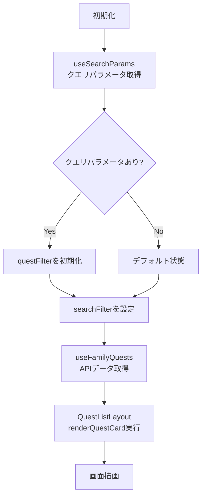

## フィルタリングフロー

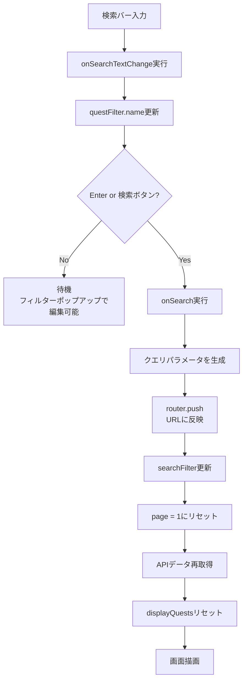

## フィルターポップアップフロー

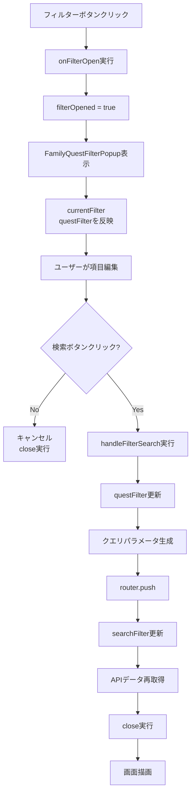

## ソートフロー

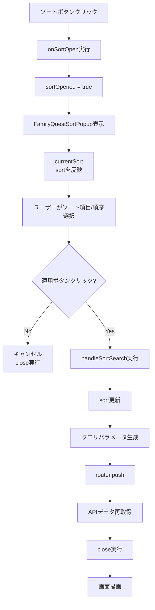

## カテゴリタブ切替フロー

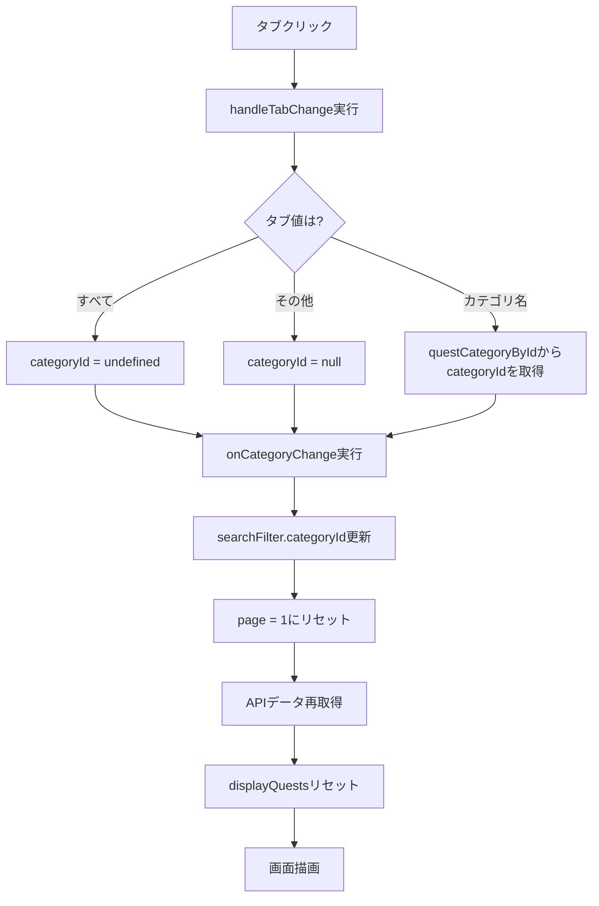

## 無限スクロールフロー

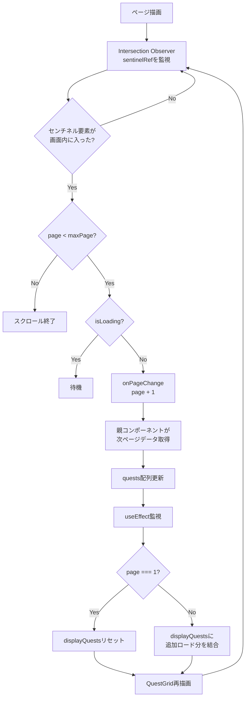

## ページネーション処理詳細

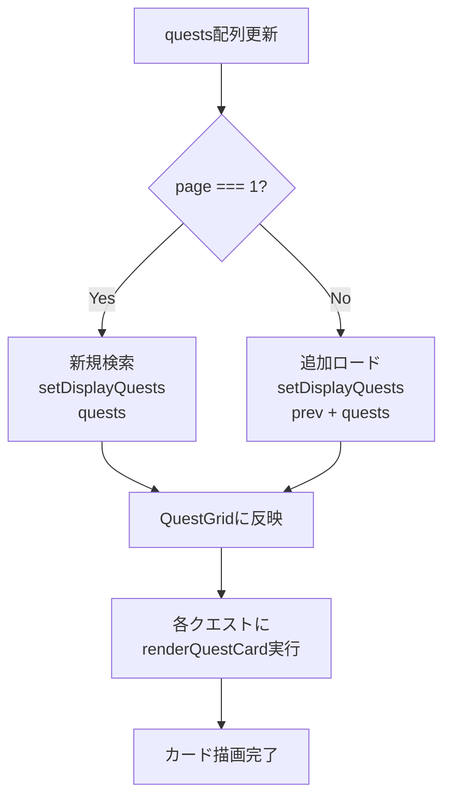

## 検索テキスト連動フロー

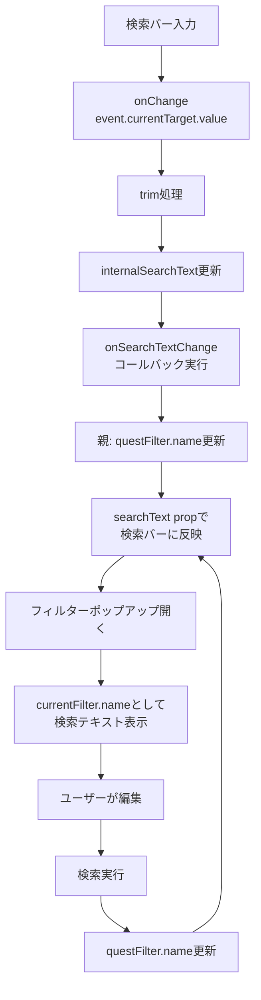

## バッジ表示ロジック

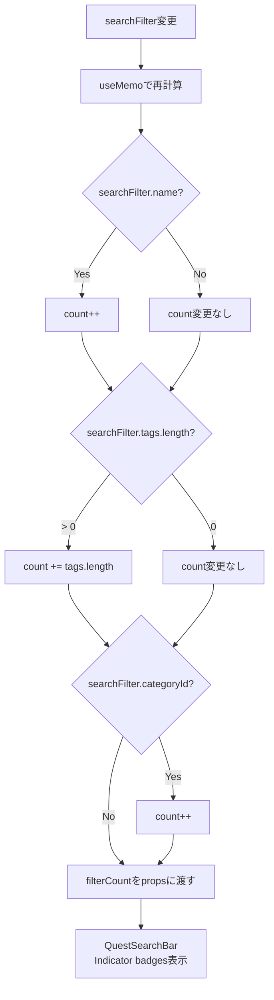

## ローディング状態管理

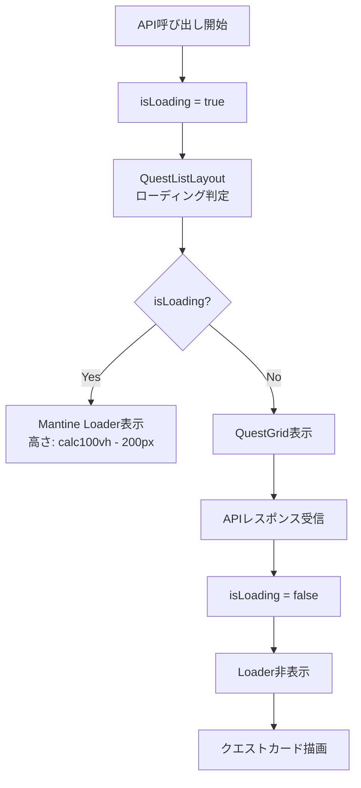

## エラーハンドリングフロー

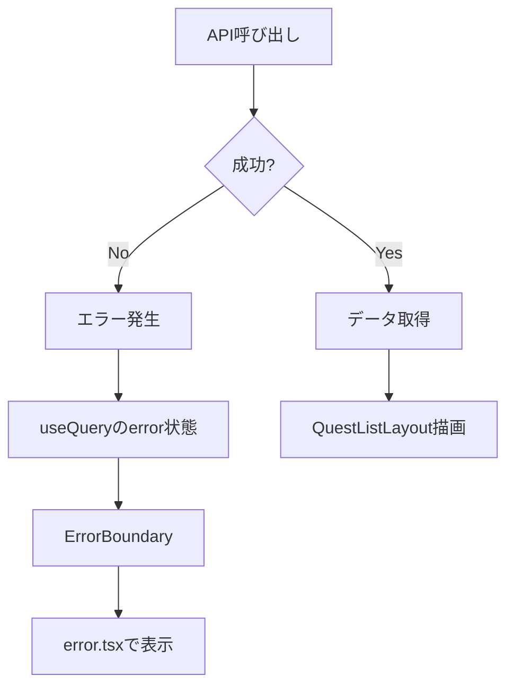

## データ同期フロー（全体像）

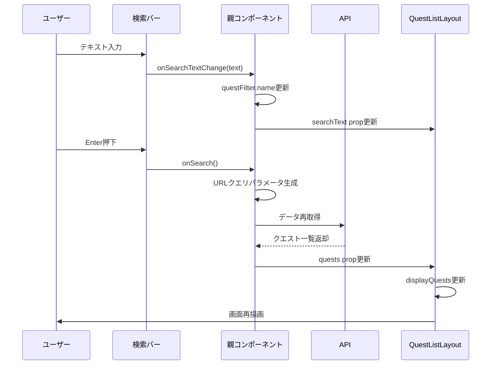
