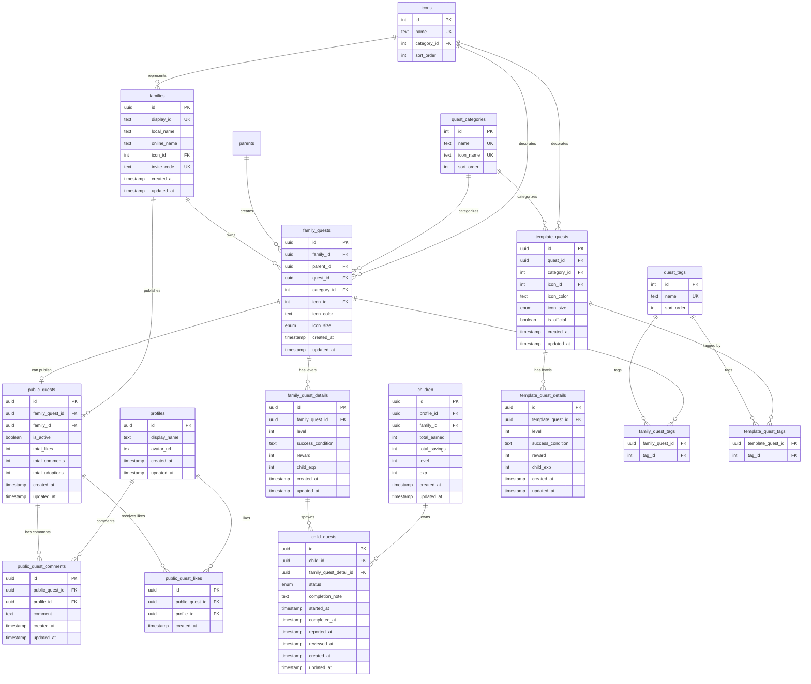
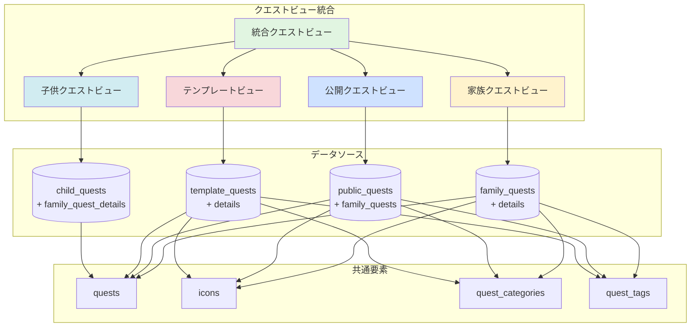

(2026年3月記載)

# クエスト閲覧 統合ER図

## クエストビュー統合のデータ構造

## ビュー統合の概念モデル

## 共通フィールド構造

各クエストタイプの閲覧ビューは以下の共通構造を持つ：

| フィールド | 家族 | 公開 | テンプレート | 子供 | 説明 |
|-----------|-----|-----|-------------|-----|------|
| base | ✓ | ✓ | ✓ | ✓ | 基本情報（ID、更新日時等） |
| quest | ✓ | ✓ | ✓ | ✓ | クエスト詳細（タイトル、説明等） |
| details | ✓ | ✓ | ✓ | ✓ | レベル別詳細（報酬、経験値等） |
| icon | ✓ | ✓ | ✓ | ✓ | アイコン情報（名前、サイズ、色） |
| category | ✓ | ✓ | ✓ | ✓ | カテゴリ情報 |
| tags | ✓ | ✓ | ✓ | - | タグ一覧 |
| familyIcon | - | ✓ | - | - | 公開元家族のアイコン |
| childQuestStatus | - | - | - | ✓ | 子供クエストのステータス情報 |
| likes | - | ✓ | - | - | いいね関連情報 |
| comments | - | ✓ | - | - | コメント関連情報 |
