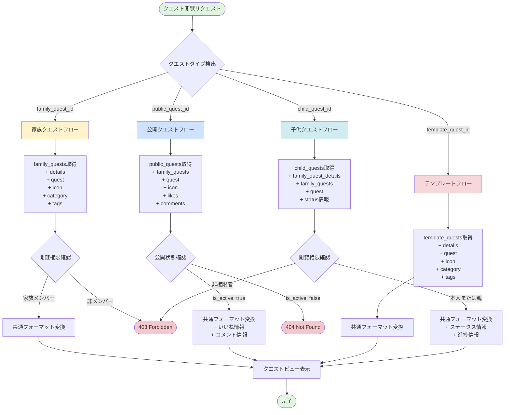
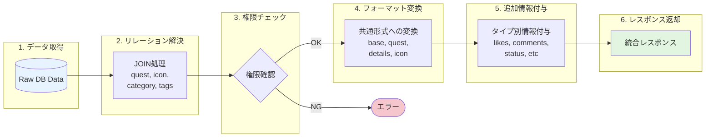
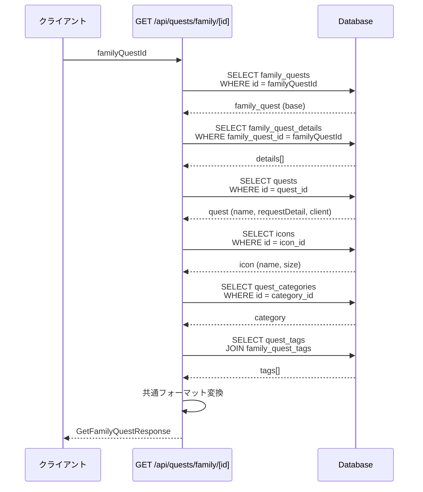
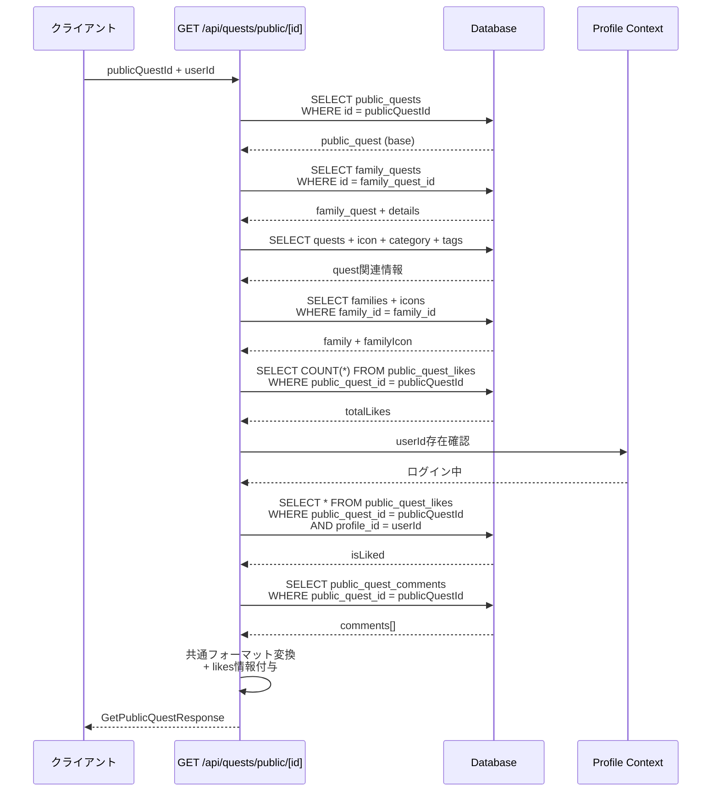
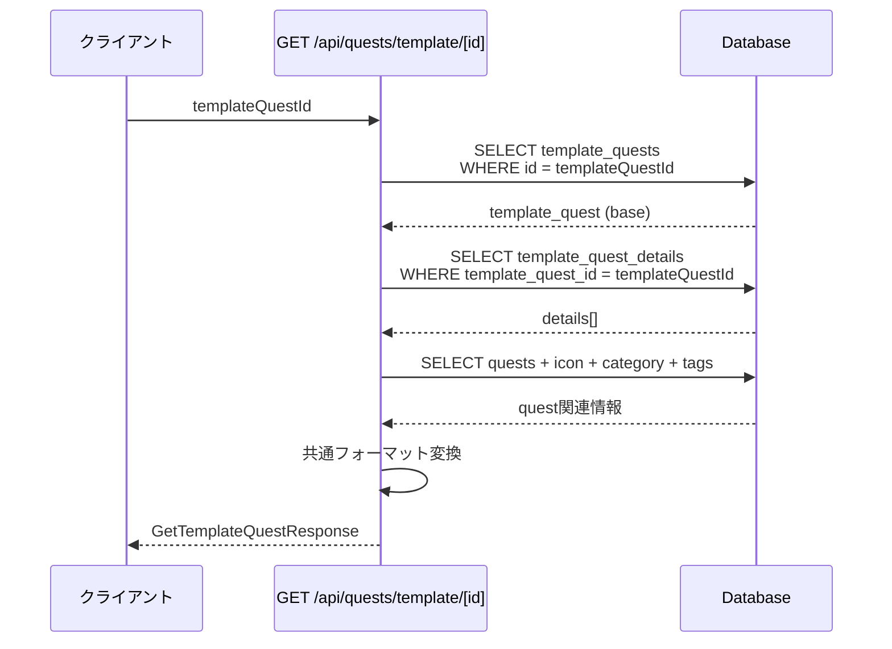
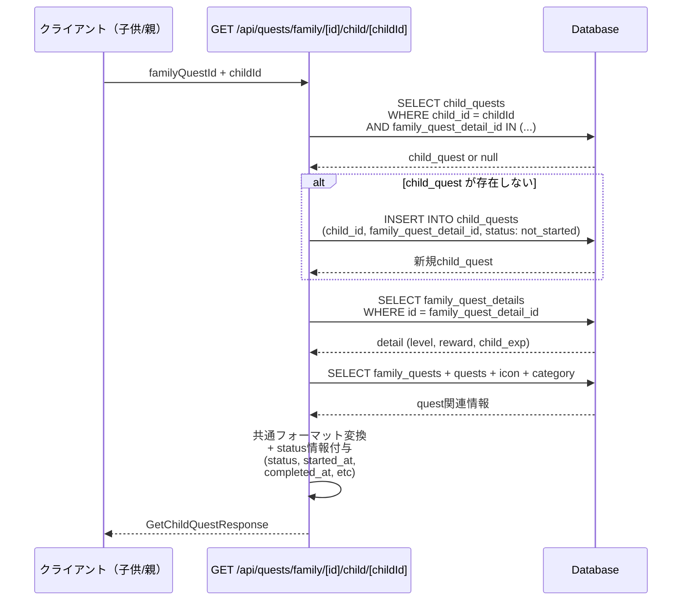
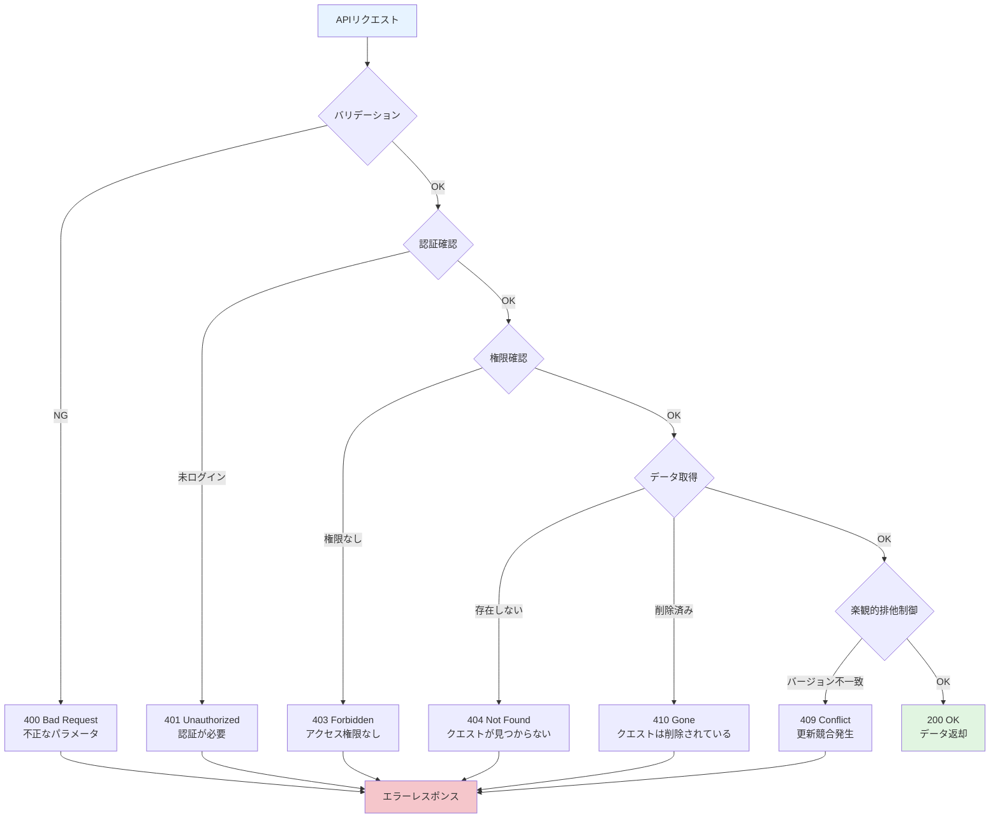

(2026年3月15日 14:30記載)

# クエストビュー解決フロー図

## クエストタイプ検出と閲覧フロー

```mermaid
flowchart TD
    Start([クエスト閲覧リクエスト]) --> DetectType{クエストタイプ検出}
    
    DetectType -->|family_quest_id| FamilyFlow[家族クエストフロー]
    DetectType -->|public_quest_id| PublicFlow[公開クエストフロー]
    DetectType -->|template_quest_id| TemplateFlow[テンプレートフロー]
    DetectType -->|child_quest_id| ChildFlow[子供クエストフロー]
    
    %% 家族クエストフロー
    FamilyFlow --> FamilyFetch[family_quests取得<br/>+ details<br/>+ quest<br/>+ icon<br/>+ category<br/>+ tags]
    FamilyFetch --> FamilyAuth{閲覧権限確認}
    FamilyAuth -->|家族メンバー| FamilyTransform[共通フォーマット変換]
    FamilyAuth -->|非メンバー| AuthError([403 Forbidden])
    
    %% 公開クエストフロー
    PublicFlow --> PublicFetch[public_quests取得<br/>+ family_quests<br/>+ quest<br/>+ icon<br/>+ likes<br/>+ comments]
    PublicFetch --> PublicActive{公開状態確認}
    PublicActive -->|is_active: true| PublicTransform[共通フォーマット変換<br/>+ いいね情報<br/>+ コメント情報]
    PublicActive -->|is_active: false| NotFound([404 Not Found])
    
    %% テンプレートフロー
    TemplateFlow --> TemplateFetch[template_quests取得<br/>+ details<br/>+ quest<br/>+ icon<br/>+ category<br/>+ tags]
    TemplateFetch --> TemplateTransform[共通フォーマット変換]
    
    %% 子供クエストフロー
    ChildFlow --> ChildFetch[child_quests取得<br/>+ family_quest_details<br/>+ family_quests<br/>+ quest<br/>+ status情報]
    ChildFetch --> ChildAuth{閲覧権限確認}
    ChildAuth -->|本人または親| ChildTransform[共通フォーマット変換<br/>+ ステータス情報<br/>+ 進捗情報]
    ChildAuth -->|非権限者| AuthError
    
    %% 共通フォーマット変換
    FamilyTransform --> Render[クエストビュー表示]
    PublicTransform --> Render
    TemplateTransform --> Render
    ChildTransform --> Render
    
    Render --> End([完了])
    
    style Start fill:#e1f5e1
    style End fill:#e1f5e1
    style AuthError fill:#f5c6cb
    style NotFound fill:#f5c6cb
    style FamilyFlow fill:#fff3cd
    style PublicFlow fill:#cfe2ff
    style TemplateFlow fill:#f8d7da
    style ChildFlow fill:#d1ecf1
```

## データ取得・変換パイプライン

```mermaid
flowchart LR
    subgraph "1. データ取得"
        Raw[(Raw DB Data)]
    end
    
    subgraph "2. リレーション解決"
        Join[JOIN処理<br/>quest, icon,<br/>category, tags]
    end
    
    subgraph "3. 権限チェック"
        Auth{権限確認}
    end
    
    subgraph "4. フォーマット変換"
        Transform[共通形式への変換<br/>base, quest,<br/>details, icon]
    end
    
    subgraph "5. 追加情報付与"
        Enrich[タイプ別情報付与<br/>likes, comments,<br/>status, etc]
    end
    
    subgraph "6. レスポンス返却"
        Response[統合レスポンス]
    end
    
    Raw --> Join
    Join --> Auth
    Auth -->|OK| Transform
    Auth -->|NG| Error([エラー])
    Transform --> Enrich
    Enrich --> Response
    
    style Raw fill:#e7f3ff
    style Response fill:#e1f5e1
    style Error fill:#f5c6cb
```

## クエストタイプ別の取得処理フロー

### 家族クエスト取得フロー

```mermaid
sequenceDiagram
    participant C as クライアント
    participant API as GET /api/quests/family/[id]
    participant DB as Database
    
    C->>API: familyQuestId
    API->>DB: SELECT family_quests<br/>WHERE id = familyQuestId
    DB-->>API: family_quest (base)
    
    API->>DB: SELECT family_quest_details<br/>WHERE family_quest_id = familyQuestId
    DB-->>API: details[]
    
    API->>DB: SELECT quests<br/>WHERE id = quest_id
    DB-->>API: quest (name, requestDetail, client)
    
    API->>DB: SELECT icons<br/>WHERE id = icon_id
    DB-->>API: icon (name, size)
    
    API->>DB: SELECT quest_categories<br/>WHERE id = category_id
    DB-->>API: category
    
    API->>DB: SELECT quest_tags<br/>JOIN family_quest_tags
    DB-->>API: tags[]
    
    API->>API: 共通フォーマット変換
    API-->>C: GetFamilyQuestResponse
```

### 公開クエスト取得フロー

```mermaid
sequenceDiagram
    participant C as クライアント
    participant API as GET /api/quests/public/[id]
    participant DB as Database
    participant Profile as Profile Context
    
    C->>API: publicQuestId + userId
    API->>DB: SELECT public_quests<br/>WHERE id = publicQuestId
    DB-->>API: public_quest (base)
    
    API->>DB: SELECT family_quests<br/>WHERE id = family_quest_id
    DB-->>API: family_quest + details
    
    API->>DB: SELECT quests + icon + category + tags
    DB-->>API: quest関連情報
    
    API->>DB: SELECT families + icons<br/>WHERE family_id = family_id
    DB-->>API: family + familyIcon
    
    API->>DB: SELECT COUNT(*) FROM public_quest_likes<br/>WHERE public_quest_id = publicQuestId
    DB-->>API: totalLikes
    
    API->>Profile: userId存在確認
    Profile-->>API: ログイン中
    
    API->>DB: SELECT * FROM public_quest_likes<br/>WHERE public_quest_id = publicQuestId<br/>AND profile_id = userId
    DB-->>API: isLiked
    
    API->>DB: SELECT public_quest_comments<br/>WHERE public_quest_id = publicQuestId
    DB-->>API: comments[]
    
    API->>API: 共通フォーマット変換<br/>+ likes情報付与
    API-->>C: GetPublicQuestResponse
```

### テンプレートクエスト取得フロー

```mermaid
sequenceDiagram
    participant C as クライアント
    participant API as GET /api/quests/template/[id]
    participant DB as Database
    
    C->>API: templateQuestId
    API->>DB: SELECT template_quests<br/>WHERE id = templateQuestId
    DB-->>API: template_quest (base)
    
    API->>DB: SELECT template_quest_details<br/>WHERE template_quest_id = templateQuestId
    DB-->>API: details[]
    
    API->>DB: SELECT quests + icon + category + tags
    DB-->>API: quest関連情報
    
    API->>API: 共通フォーマット変換
    API-->>C: GetTemplateQuestResponse
```

### 子供クエスト取得フロー

```mermaid
sequenceDiagram
    participant C as クライアント（子供/親）
    participant API as GET /api/quests/family/[id]/child/[childId]
    participant DB as Database
    
    C->>API: familyQuestId + childId
    API->>DB: SELECT child_quests<br/>WHERE child_id = childId<br/>AND family_quest_detail_id IN (...)
    DB-->>API: child_quest or null
    
    alt child_quest が存在しない
        API->>DB: INSERT INTO child_quests<br/>(child_id, family_quest_detail_id, status: not_started)
        DB-->>API: 新規child_quest
    end
    
    API->>DB: SELECT family_quest_details<br/>WHERE id = family_quest_detail_id
    DB-->>API: detail (level, reward, child_exp)
    
    API->>DB: SELECT family_quests + quests + icon + category
    DB-->>API: quest関連情報
    
    API->>API: 共通フォーマット変換<br/>+ status情報付与<br/>(status, started_at,<br/>completed_at, etc)
    API-->>C: GetChildQuestResponse
```

## エラーハンドリングフロー

```mermaid
flowchart TD
    Request[APIリクエスト] --> Validate{バリデーション}
    
    Validate -->|NG| ValidationError[400 Bad Request<br/>不正なパラメータ]
    Validate -->|OK| Auth{認証確認}
    
    Auth -->|未ログイン| AuthError[401 Unauthorized<br/>認証が必要]
    Auth -->|OK| Permission{権限確認}
    
    Permission -->|権限なし| PermissionError[403 Forbidden<br/>アクセス権限なし]
    Permission -->|OK| Fetch{データ取得}
    
    Fetch -->|存在しない| NotFoundError[404 Not Found<br/>クエストが見つからない]
    Fetch -->|削除済み| GoneError[410 Gone<br/>クエストは削除されている]
    Fetch -->|OK| Version{楽観的排他制御}
    
    Version -->|バージョン不一致| ConflictError[409 Conflict<br/>更新競合発生]
    Version -->|OK| Success[200 OK<br/>データ返却]
    
    ValidationError --> ErrorResponse[エラーレスポンス]
    AuthError --> ErrorResponse
    PermissionError --> ErrorResponse
    NotFoundError --> ErrorResponse
    GoneError --> ErrorResponse
    ConflictError --> ErrorResponse
    
    style Success fill:#e1f5e1
    style ErrorResponse fill:#f5c6cb
    style Request fill:#e7f3ff
```
