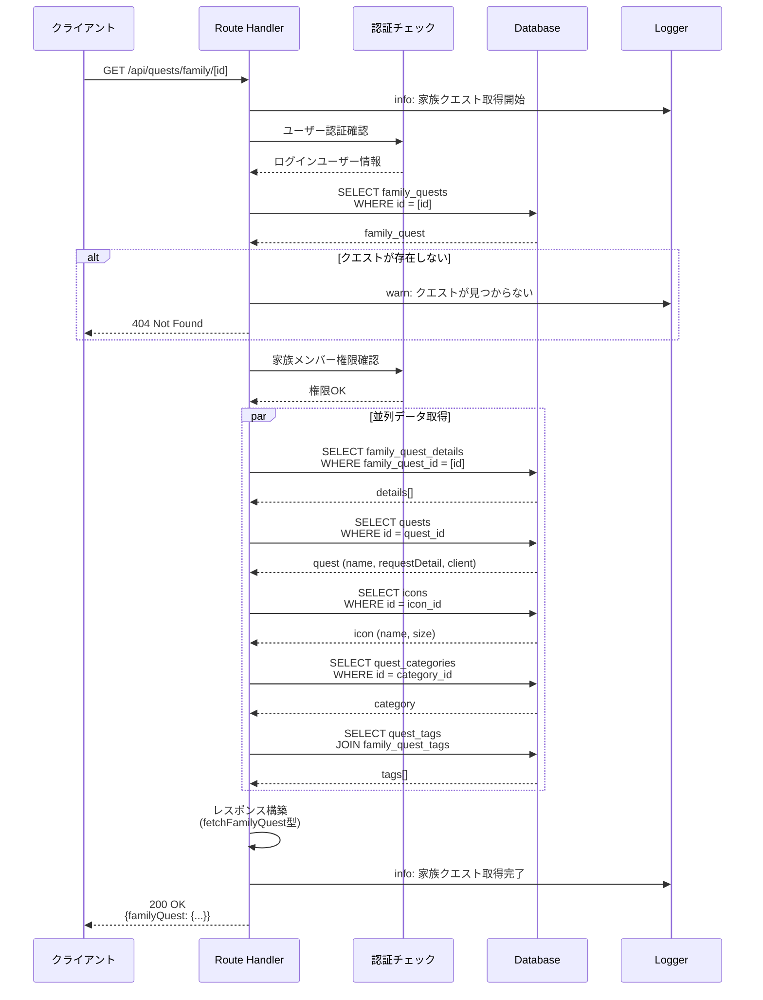
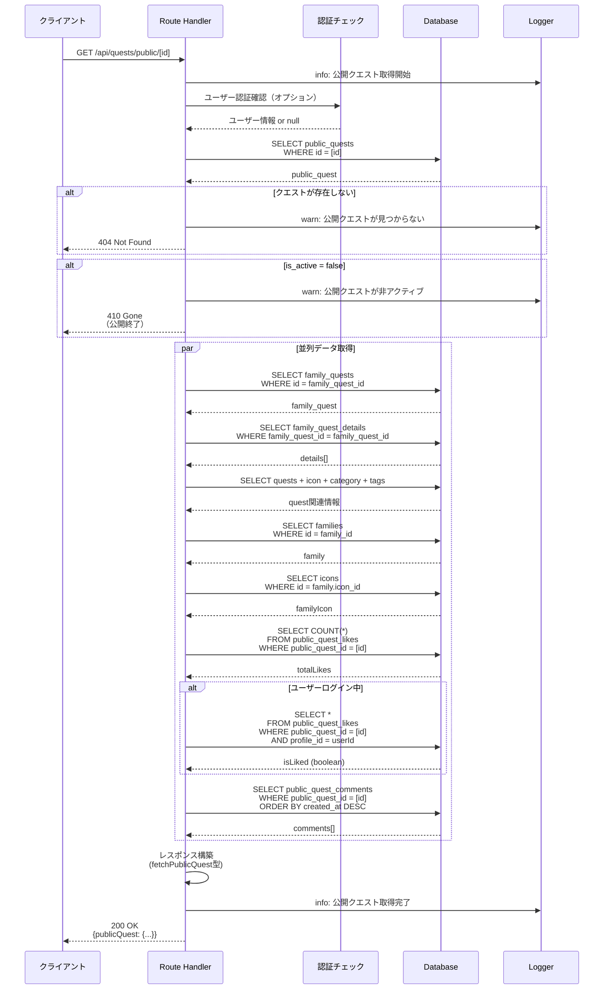
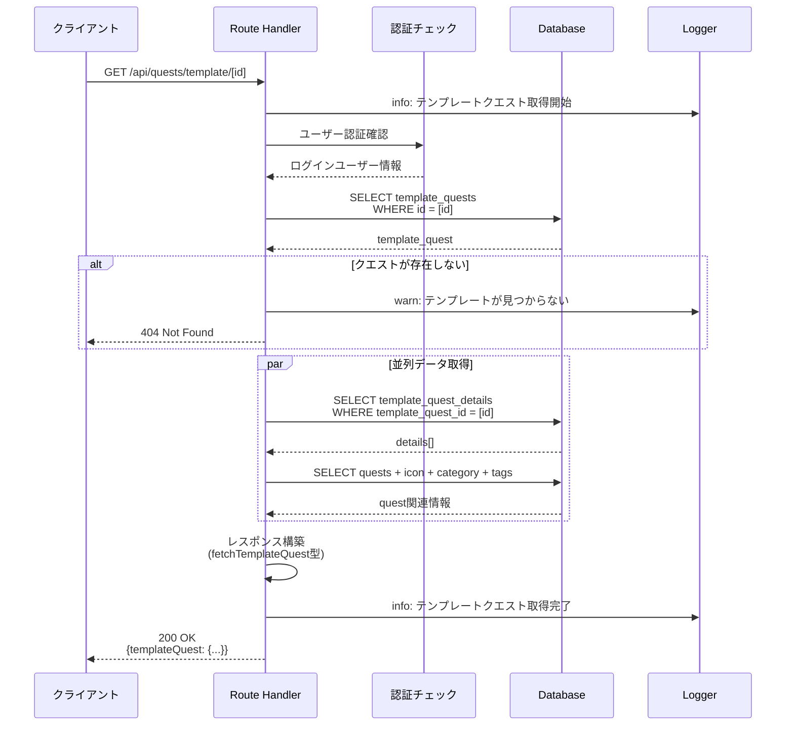
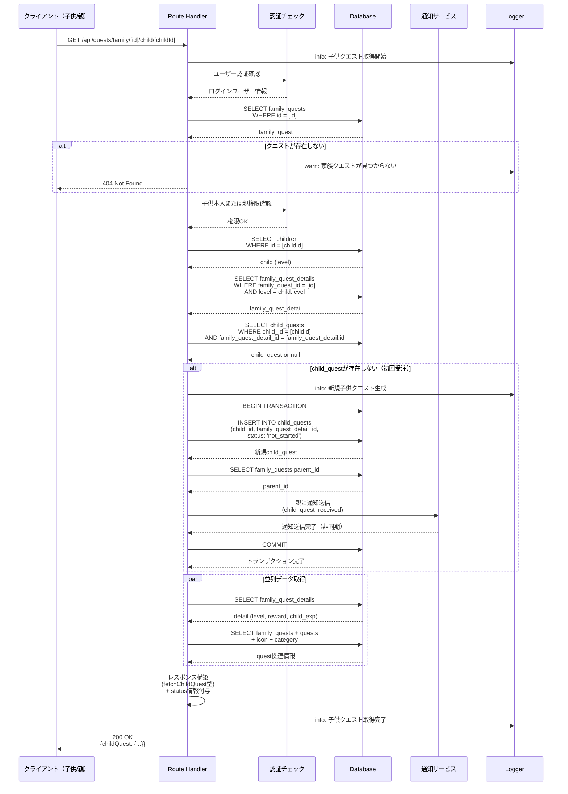
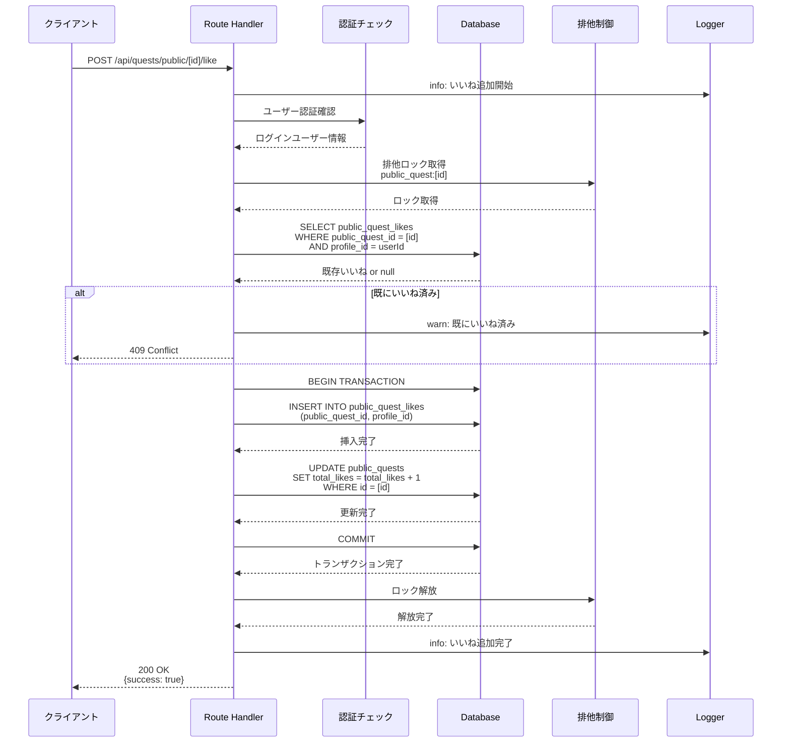
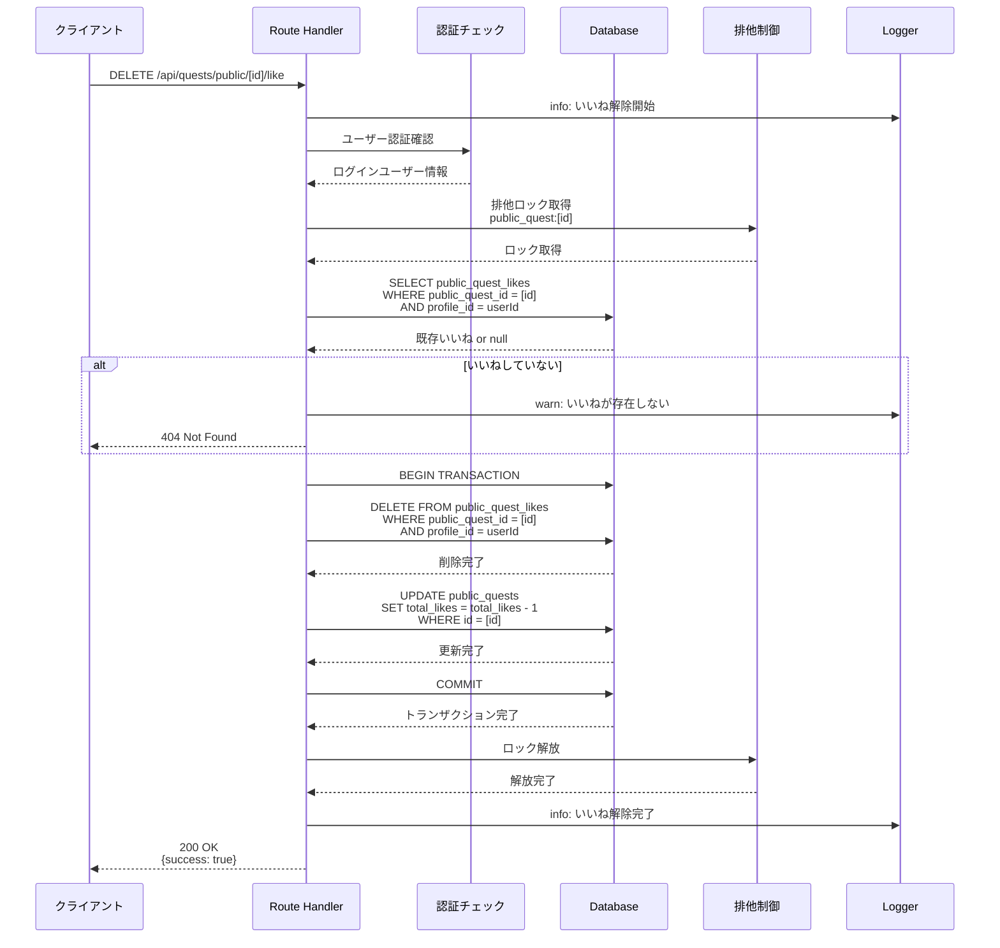
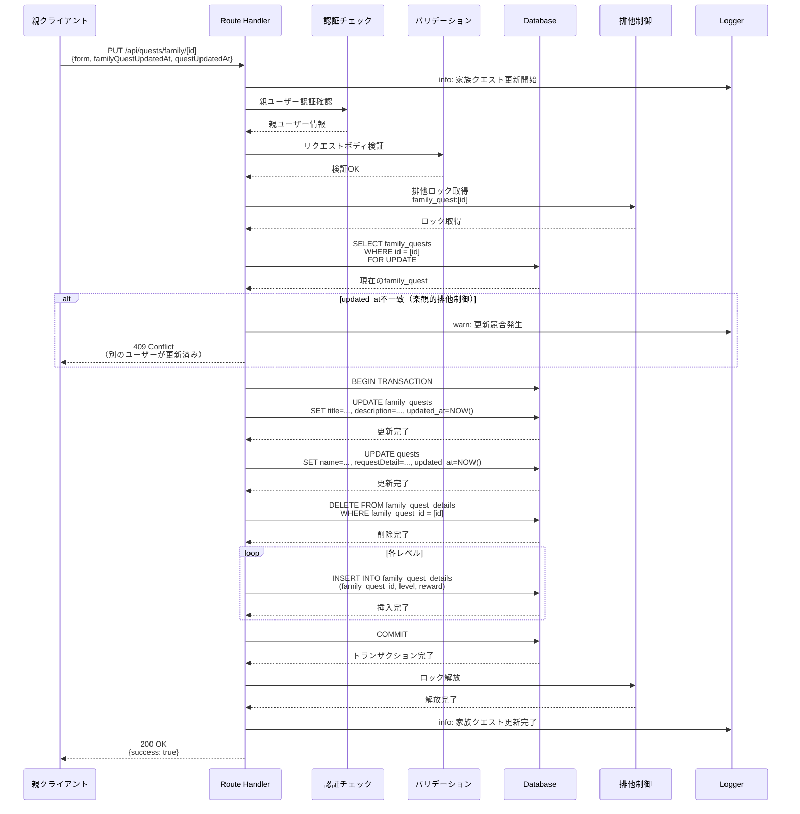
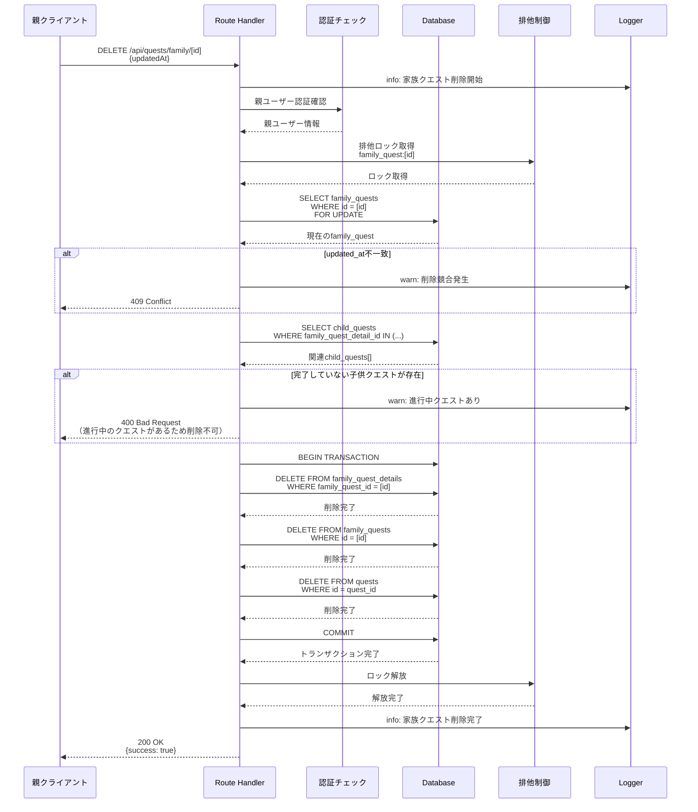

(2026年3月記載)

# クエストビューAPI シーケンス図

## API エンドポイント一覧

### 家族クエスト閲覧
- `GET /api/quests/family/[id]`: 家族クエスト詳細取得
- `PUT /api/quests/family/[id]`: 家族クエスト更新
- `DELETE /api/quests/family/[id]`: 家族クエスト削除

### 公開クエスト閲覧
- `GET /api/quests/public/[id]`: 公開クエスト詳細取得
- `PUT /api/quests/public/[id]`: 公開クエスト更新
- `DELETE /api/quests/public/[id]`: 公開クエスト削除
- `GET /api/quests/public/[id]/like-count`: いいね数取得
- `GET /api/quests/public/[id]/is-like`: いいね状態取得
- `POST /api/quests/public/[id]/like`: いいね追加
- `DELETE /api/quests/public/[id]/like`: いいね解除

### テンプレートクエスト閲覧
- `GET /api/quests/template/[id]`: テンプレートクエスト詳細取得
- `PUT /api/quests/template/[id]`: テンプレートクエスト更新
- `DELETE /api/quests/template/[id]`: テンプレートクエスト削除

### 子供クエスト閲覧
- `GET /api/quests/family/[id]/child/[childId]`: 子供クエスト詳細取得（自動生成）

## GET /api/quests/family/[id]（家族クエスト詳細取得）

## GET /api/quests/public/[id]（公開クエスト詳細取得）

## GET /api/quests/template/[id]（テンプレートクエスト詳細取得）

## GET /api/quests/family/[id]/child/[childId]（子供クエスト取得/生成）

## POST /api/quests/public/[id]/like（いいね追加）

## DELETE /api/quests/public/[id]/like（いいね解除）

## PUT /api/quests/family/[id]（家族クエスト更新）

## DELETE /api/quests/family/[id]（家族クエスト削除）

