# クエスト閲覧画面 レンダリング・インタラクションフロー

**最終更新: 2026年3月記載**

## 初期表示フロー

### 家族クエスト閲覧画面

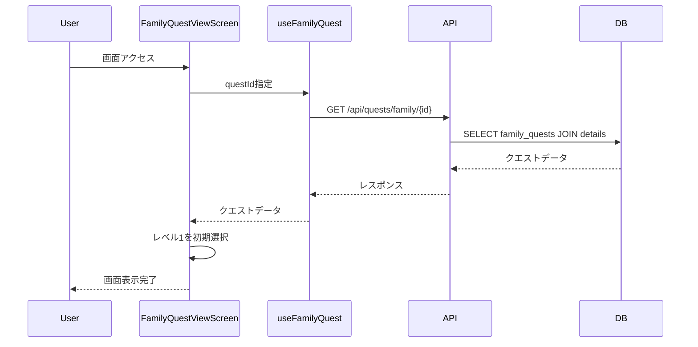

**処理詳細:**
1. FamilyQuestViewScreen がマウント
2. useFamilyQuest フックで全レベルのクエスト詳細を取得
3. 初期表示レベル（level: 1）を設定
4. FamilyQuestViewLayoutに選択レベルのデータを渡して表示

---

### 公開クエスト閲覧画面

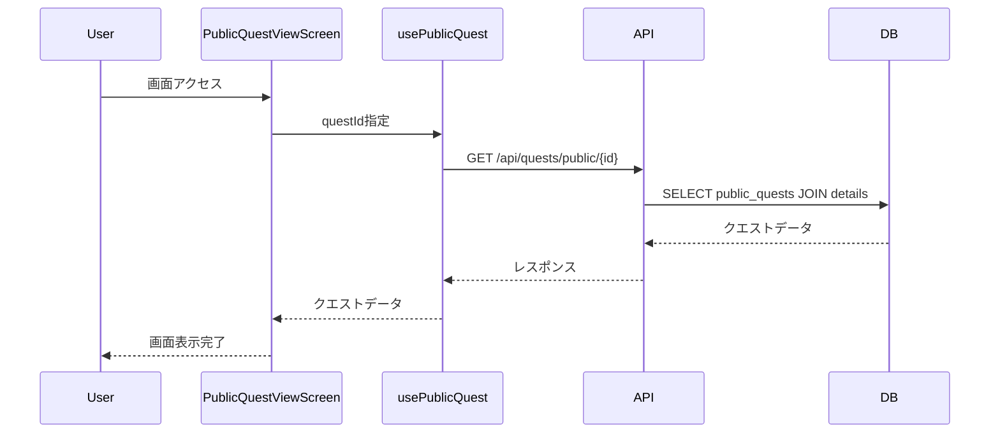

---

### テンプレートクエスト閲覧画面

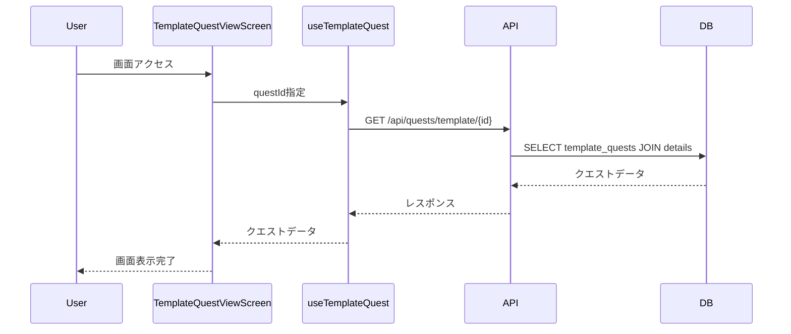

---

### 子供クエスト閲覧画面

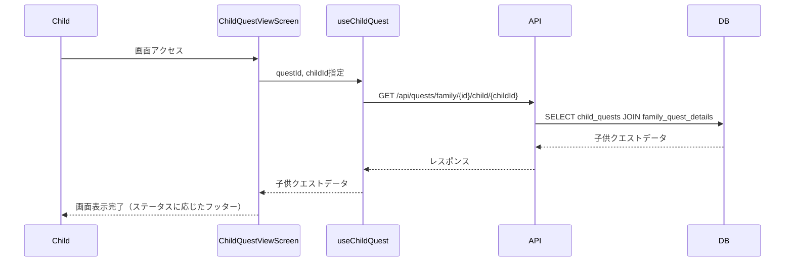

---

## レベル選択フロー（家族クエスト）

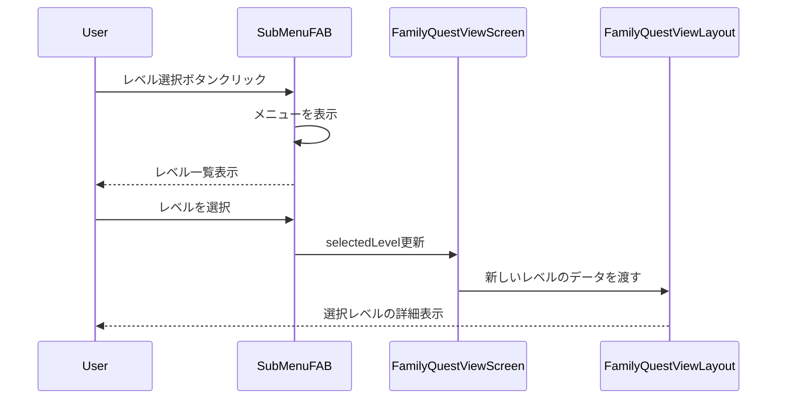

**UI動作:**
- SubMenuFABにレベル選択ボタンと編集ボタンを統合
- レベル選択ボタン押下でPaperベースのメニューを表示
- メニューから選択したレベルに応じて画面内容を更新

---

## タブ切り替えフロー

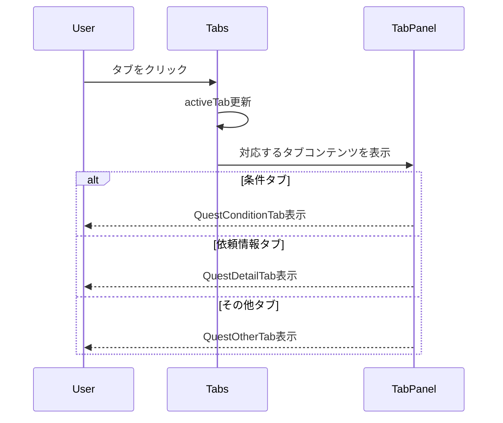

**タブ種類:**
1. **条件タブ**: レベル、カテゴリ、達成条件、報酬、経験値、必要完了回数
2. **依頼情報タブ**: 依頼主、依頼内容
3. **その他タブ**: タグ、推奨年齢・月齢

---

## 完了報告フロー（子供クエスト）

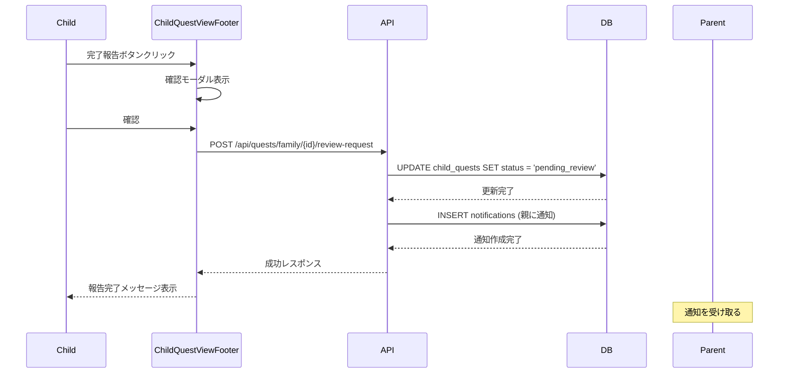

**ステータス遷移:**
- `in_progress` → `pending_review`

---

## 完了報告取消フロー（子供クエスト）

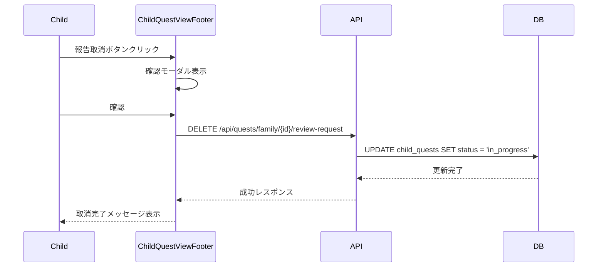

**ステータス遷移:**
- `pending_review` → `in_progress`

---

## 編集モードへの遷移（家族クエスト）

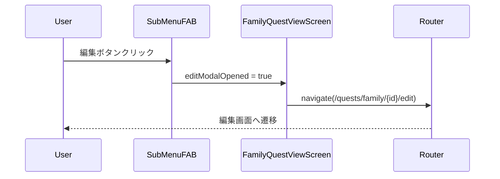

---

## 採用フロー（テンプレートクエスト）

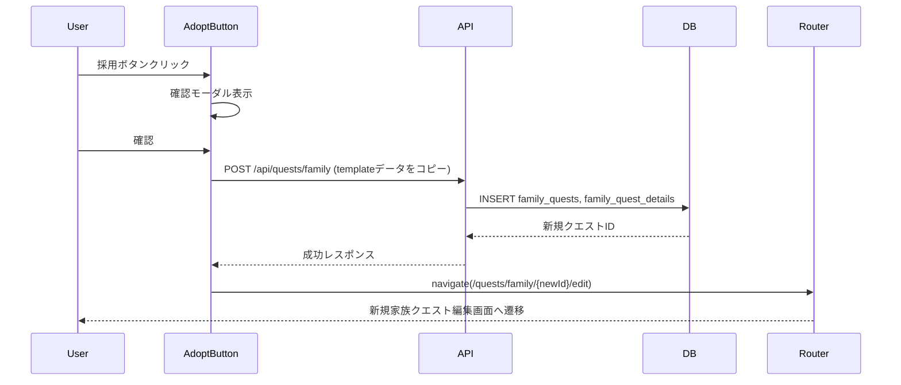

---

## いいね・コメント機能フロー（公開クエスト）

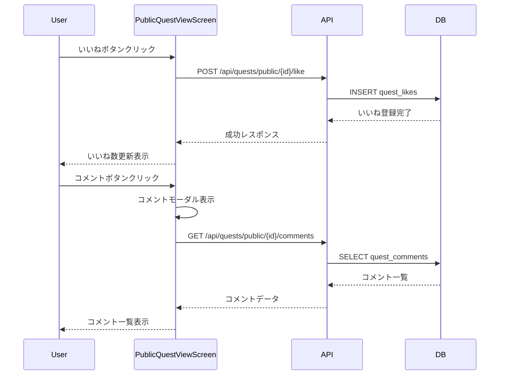
