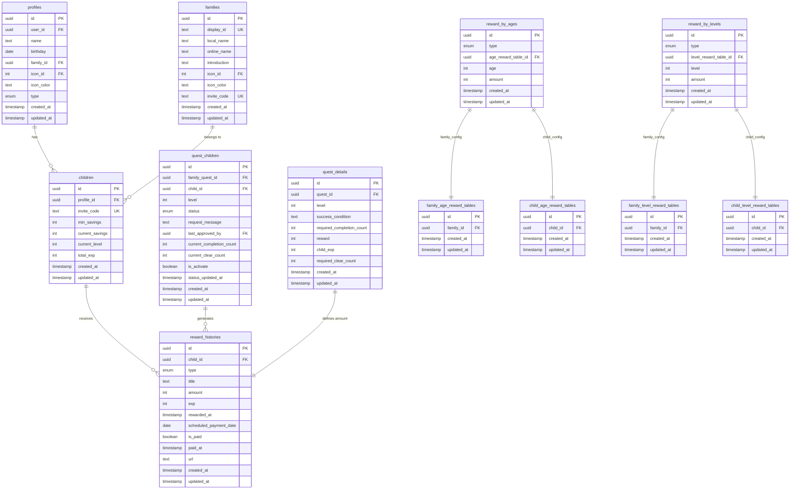

(2026年3月記載)

# 報酬関連テーブル ER図

## 報酬システムのデータ構造



## 主要なリレーション

### 報酬履歴
- `reward_histories.child_id` → `children.id`: 報酬を受け取る子供
- `reward_histories.url`: クエスト完了時はクエスト詳細URLを参照

### 子供テーブル
- `children.profile_id` → `profiles.id`: 子供のプロフィール情報
- `children.current_savings`: 現在の貯金額（報酬付与時に加算）
- `children.total_exp`: 総獲得経験値（報酬付与時に加算）
- `children.current_level`: 現在のレベル（経験値に基づき計算、TODO実装）

### クエスト子供
- `quest_children.child_id` → `children.id`: クエスト受注子供
- `quest_children.current_completion_count`: 現在の達成回数
- `quest_children.current_clear_count`: 現在のクリア回数
- `quest_children.level`: クエストの現在レベル（1-5）

### クエスト詳細
- `quest_details.reward`: 報酬額（承認時に付与）
- `quest_details.child_exp`: 獲得経験値（承認時に付与）
- `quest_details.required_completion_count`: 必要達成回数
- `quest_details.required_clear_count`: 次レベルに必要なクリア回数（nullの場合は最大レベル）

### 報酬テーブル
- `reward_by_ages.type`: "family" | "child" で家族/子供設定を区別
- `reward_by_levels.type`: "family" | "child" | "template" で設定タイプを区別
- `reward_by_ages.age_reward_table_id`: 対応する報酬テーブルマスタへの参照
- `reward_by_levels.level_reward_table_id`: 対応する報酬テーブルマスタへの参照

## 報酬タイプ（reward_type enum）

```typescript
type RewardType = 
  | "quest"                   // クエスト達成
  | "quest_level_up"          // クエストレベルアップ
  | "level_up"                // 子供レベルアップ
  | "age_monthly"             // 年齢別定期報酬（rewardByAges）
  | "level_monthly"           // レベル別定期報酬（rewardByLevels）
  | "child_day"               // こどもの日
  | "quest_like_milestone"    // お気に入り数突破
  | "child_birthday"          // 子供の誕生日
  | "other"                   // その他
```
