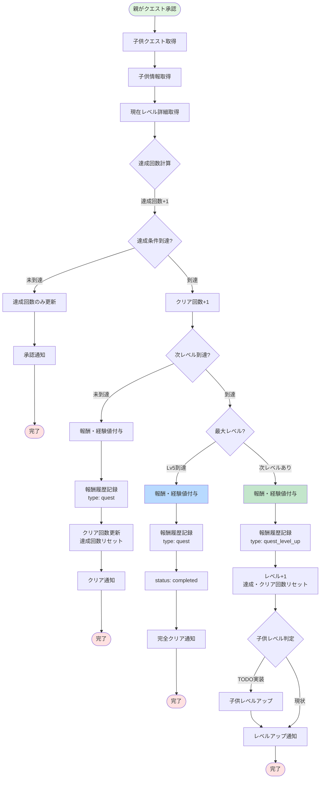
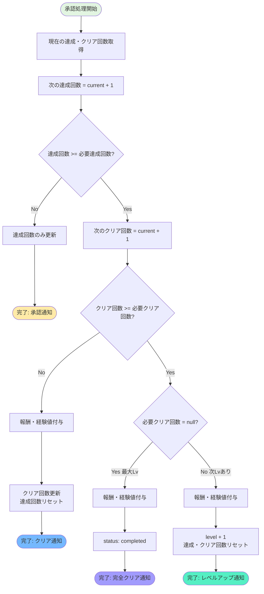
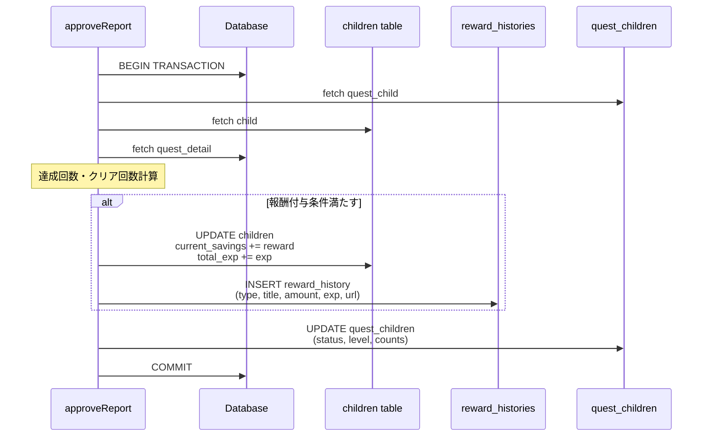

(2026年3月記載)

# 報酬システム フロー図

## 報酬付与フロー（クエスト承認時）



## 報酬履歴取得フロー

```mermaid
flowchart TD
    Start([GET /api/children/[id]/reward/histories]) --> Auth[認証チェック]
    Auth --> FetchUser[ユーザー情報取得]
    FetchUser --> FetchChild[子供情報取得]
    FetchChild --> CheckFamily{家族一致?}
    
    CheckFamily -->|不一致| Error[エラー: 権限なし]
    CheckFamily -->|一致| GetParam[クエリパラメータ取得<br/>yearMonth]
    
    GetParam --> FetchHistories[報酬履歴取得<br/>fetchRewardHistories]
    FetchHistories --> FetchStats[月別統計取得<br/>fetchRewardHistoryMonthlyStats]
    
    FetchStats --> Response[レスポンス返却<br/>histories + monthlyStats]
    Response --> End([完了])
    
    Error --> End
    
    style Start fill:#e1f5e1
    style End fill:#ffe1e1
    style Error fill:#f5c6cb
```

## 報酬支払い完了フロー

```mermaid
flowchart TD
    Start([POST /api/children/[id]/reward/pay/complete]) --> Auth[認証チェック]
    Auth --> FetchUser[ユーザー情報取得]
    FetchUser --> FetchChild[子供情報取得]
    FetchChild --> CheckFamily{家族一致?}
    
    CheckFamily -->|不一致| Error1[エラー: 権限なし]
    CheckFamily -->|一致| CheckUserType{ユーザータイプ?}
    
    CheckUserType -->|parent| Error2[エラー: 子供のみ実行可]
    CheckUserType -->|child| CheckOwner{自分の報酬?}
    
    CheckOwner -->|他人| Error3[エラー: 自分の報酬のみ]
    CheckOwner -->|自分| UpdateStatus[報酬履歴更新<br/>is_paid: true<br/>paid_at: now]
    
    UpdateStatus --> Response[レスポンス返却<br/>success: true]
    Response --> End([完了])
    
    Error1 --> End
    Error2 --> End
    Error3 --> End
    
    style Start fill:#e1f5e1
    style End fill:#ffe1e1
    style Error1 fill:#f5c6cb
    style Error2 fill:#f5c6cb
    style Error3 fill:#f5c6cb
```

## レベルアップ判定ロジック



## 報酬計算と更新の詳細


