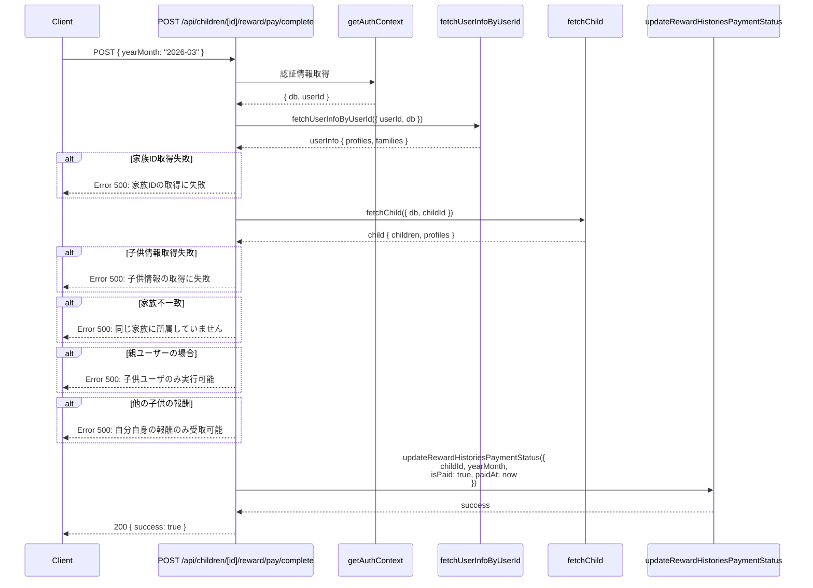
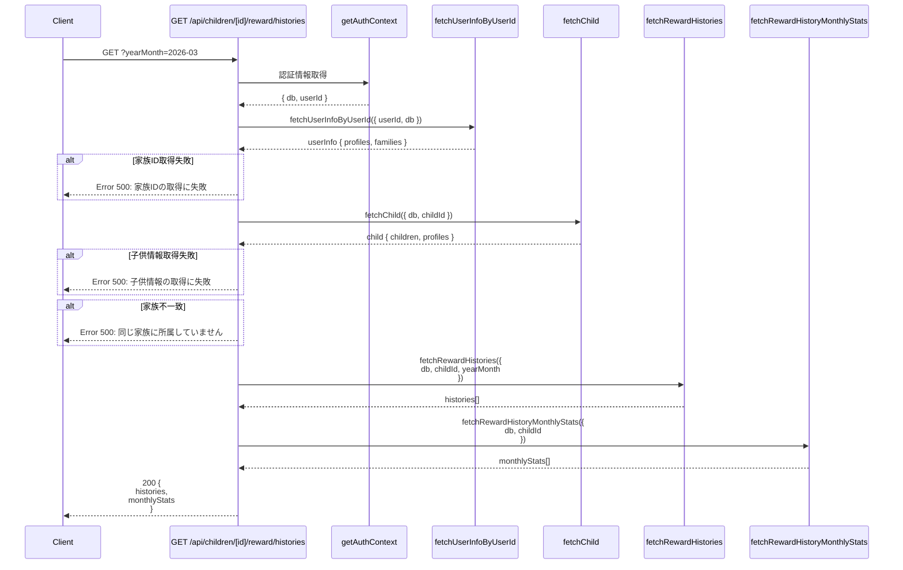
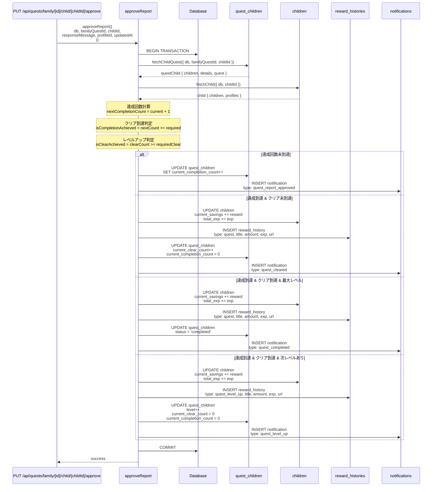
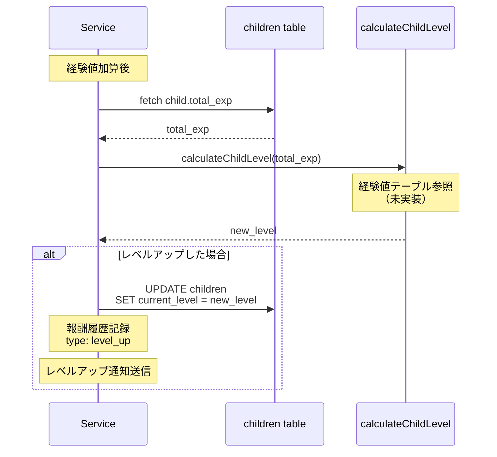
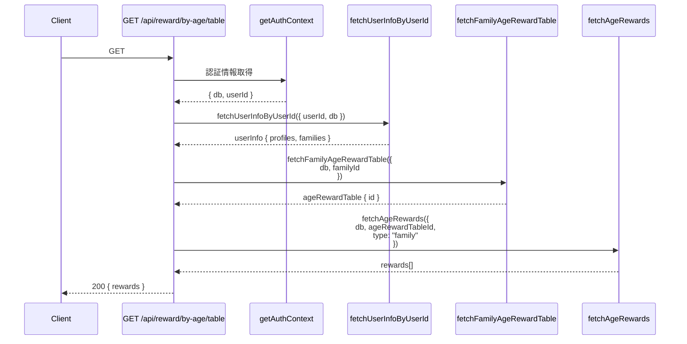

(2026年3月記載)

# 報酬API シーケンス図

## POST /api/children/[id]/reward/pay/complete - 報酬支払い完了

## GET /api/children/[id]/reward/histories - 報酬履歴取得

## approveReport (内部) - クエスト承認時の報酬付与

## レベル計算ロジック（TODO実装予定）

## 年齢別/レベル別報酬設定取得

