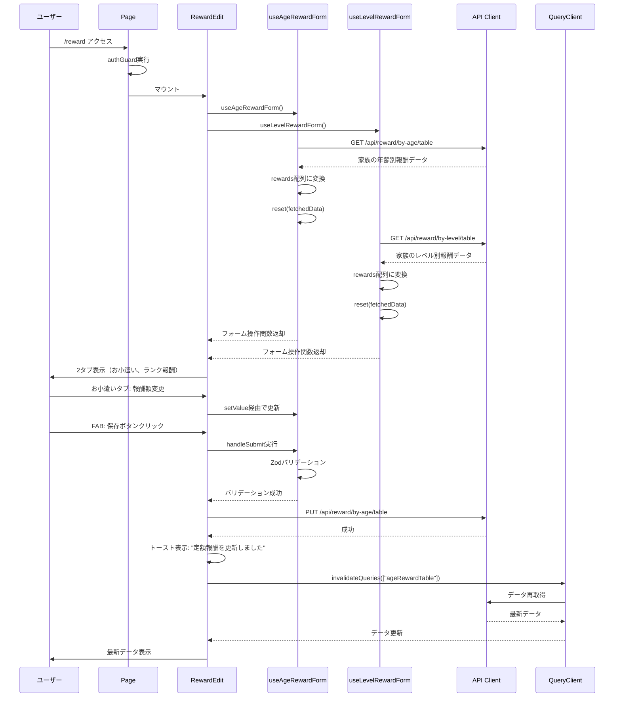
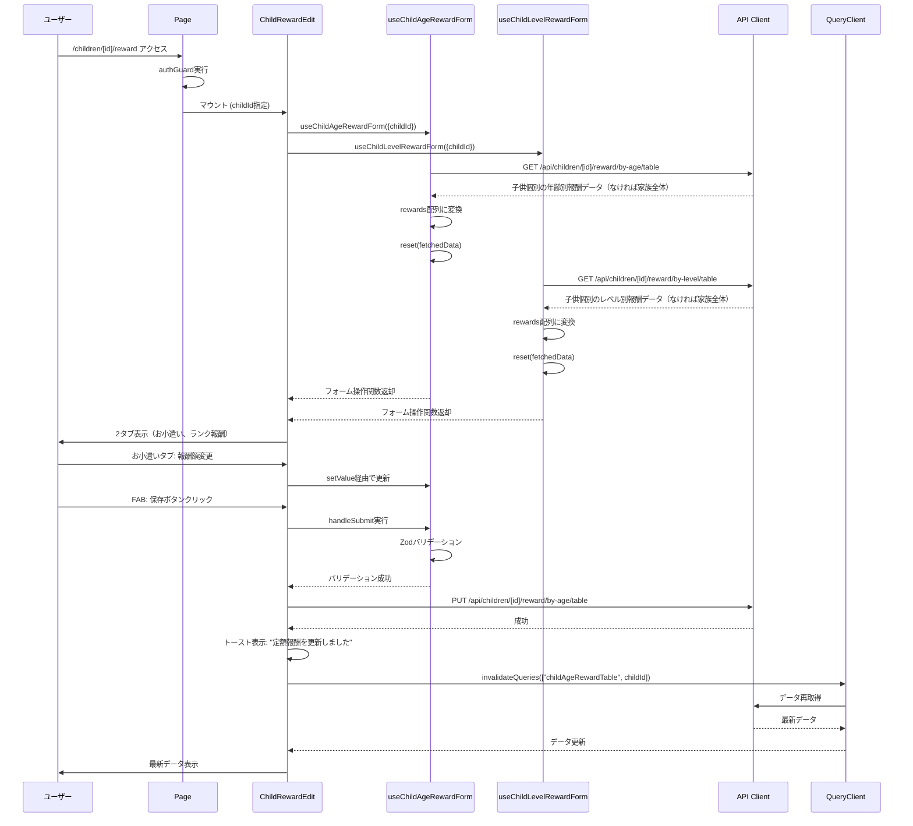
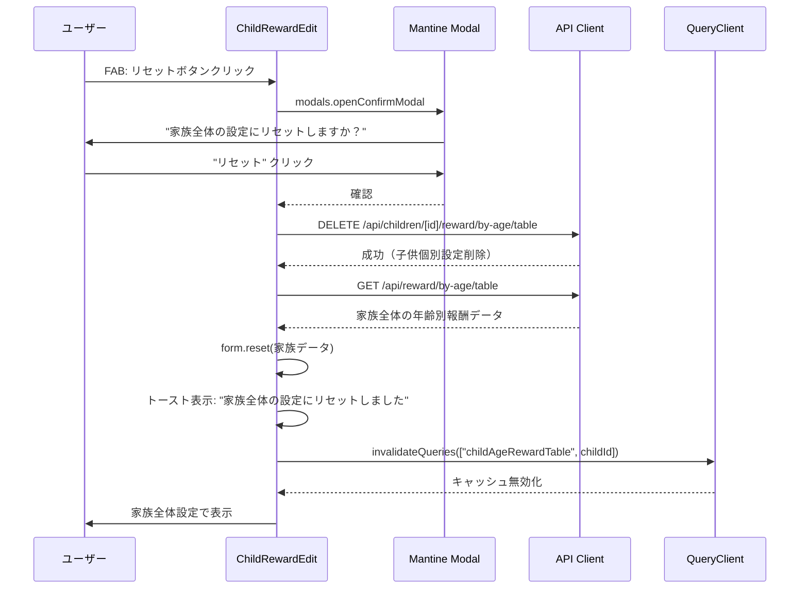
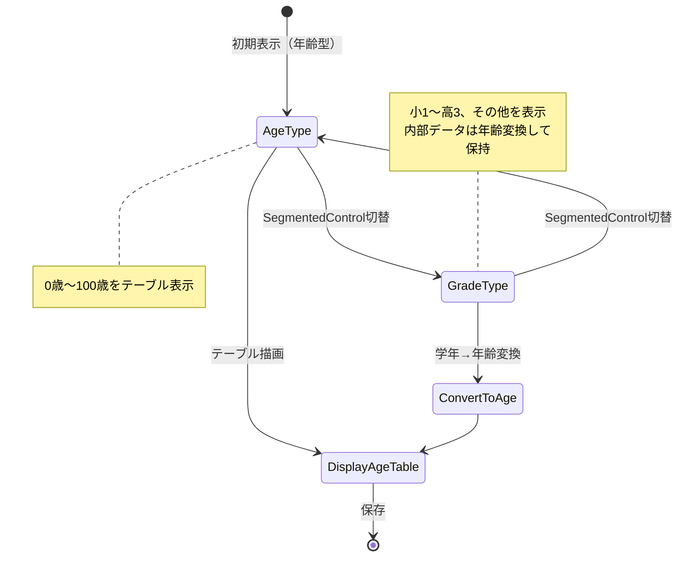
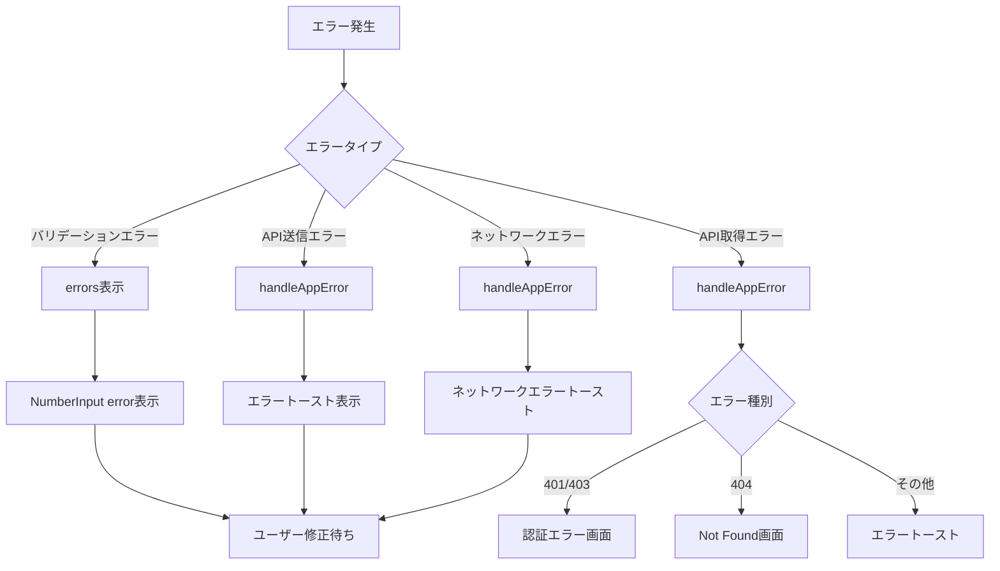
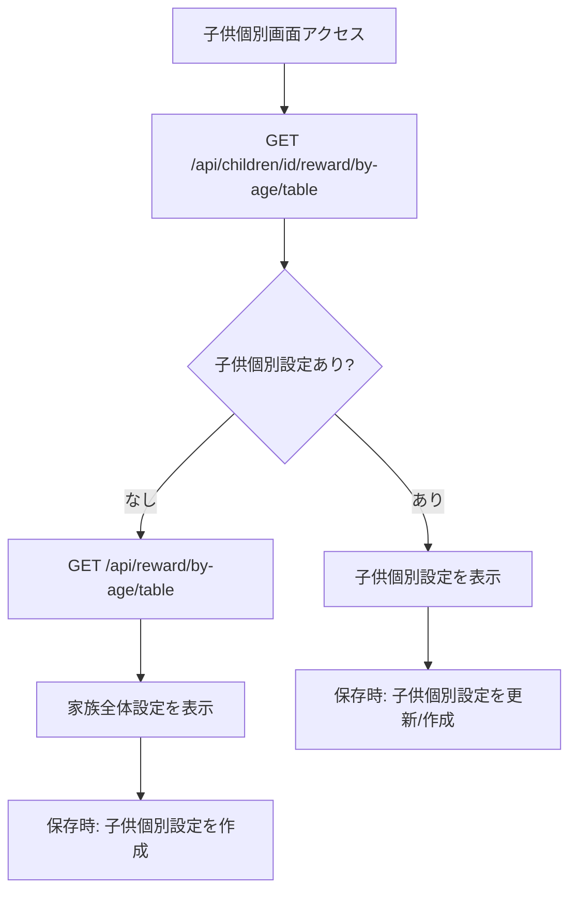
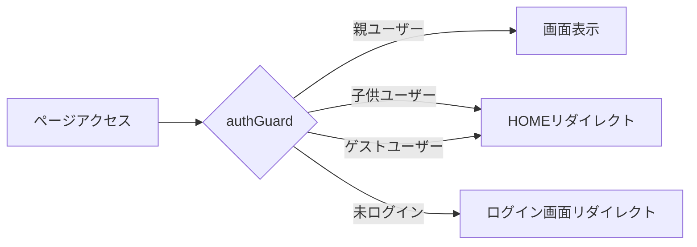

# 報酬設定 - フロー図

**2026年3月記載**

## 全体フロー

```mermaid
graph TD
    A[ユーザーアクセス] --> B{authGuard}
    B -->|親ユーザー| C{画面タイプ}
    B -->|子供/ゲスト| D[HOMEへリダイレクト]
    
    C -->|家族全体| E[RewardEdit 表示]
    C -->|子供個別| F[ChildRewardEdit 表示]
    
    E --> G[家族報酬データ取得]
    F --> H[子供報酬データ取得]
    
    G --> I[フォーム初期化]
    H --> J[フォーム初期化: 子供設定 or 家族設定]
    
    I --> K[ユーザー入力待ち]
    J --> K
    
    K --> L{入力イベント}
    L -->|タブ切替| M[activeTab更新]
    L -->|年齢型切替| N[ageSettingType更新]
    L -->|報酬額入力| O[setValue実行]
    L -->|FAB: 保存| P[onSubmit実行]
    L -->|FAB: リセット| Q[handleReset実行] 子供個別のみ
    
    M --> K
    N --> R[テーブル再描画]
    R --> K
    
    O --> K
    
    P --> S{バリデーション}
    S -->|失敗| T[エラー表示]
    T --> K
    
    S -->|成功| U{タブ?}
    U -->|お小遣い| V[PUT /api/reward/by-age/table]
    U -->|ランク報酬| W[PUT /api/reward/by-level/table]
    
    V --> X{API成功?}
    W --> Y{API成功?}
    
    X -->|成功| Z[トースト: 定額報酬を更新しました]
    X -->|失敗| AA[エラートースト]
    
    Y -->|成功| AB[トースト: ランク報酬を更新しました]
    Y -->|失敗| AA
    
    Z --> AC[キャッシュ無効化]
    AB --> AC
    
    AC --> AD[データ再取得]
    AD --> K
    
    AA --> K
    
    Q --> AE{確認モーダル}
    AE -->|キャンセル| K
    AE -->|OK| AF[DELETE /api/children/id/reward/by-age/table]
    AF --> AG{API成功?}
    AG -->|成功| AH[家族全体データ取得]
    AG -->|失敗| AA
    AH --> AI[フォームリセット]
    AI --> AJ[トースト: 家族全体の設定にリセットしました]
    AJ --> K
```

## 家族全体の報酬設定フロー



## 子供個別の報酬設定フロー



## リセットフロー（子供個別のみ）



## 年齢型切替フロー



## エラーハンドリングフロー



## データ取得の優先順位（子供個別）



**優先順位:**
1. 子供個別設定が存在すればそれを表示
2. なければ家族全体設定を表示（フォールバック）
3. 保存時は必ず子供個別設定として保存

## 認証ガードフロー


