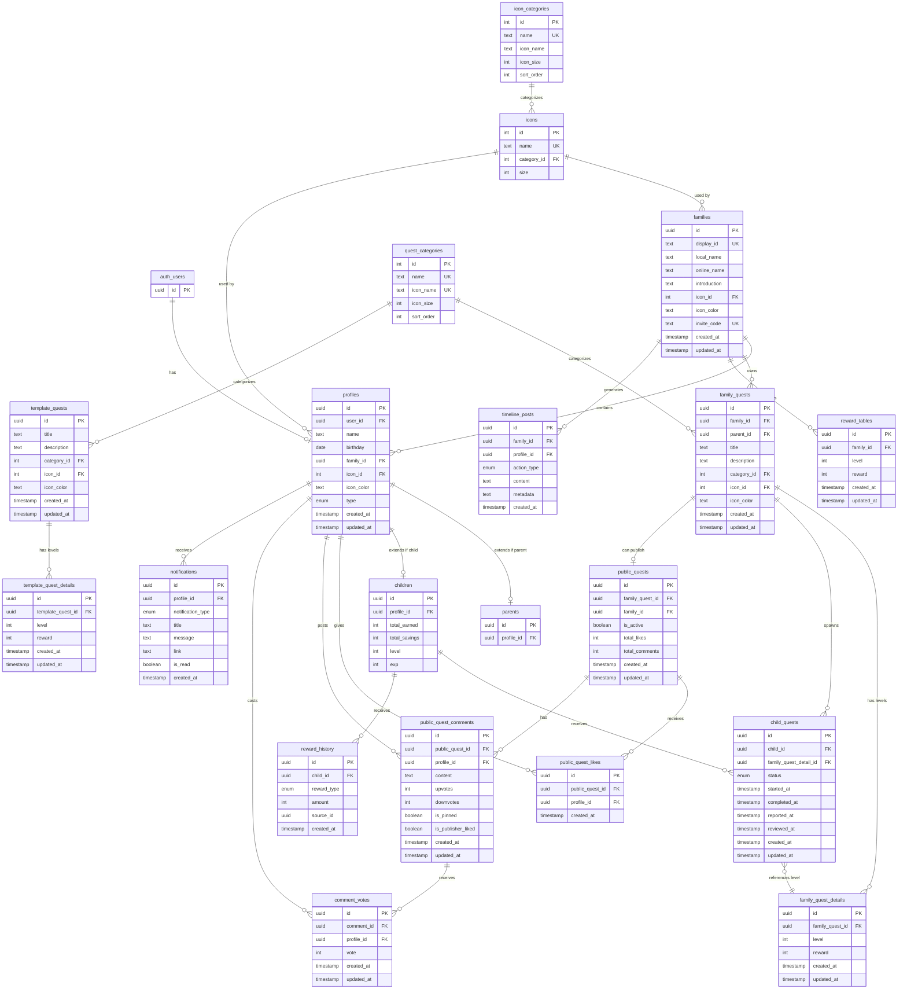

(2026年3月記載)

# データベーススキーマ ER図

## 全体構造

## 主要なリレーション

### 1. ユーザーと家族
- `auth.users` → `profiles`: 1対1（Supabase認証からプロフィールへ）
- `profiles` → `parents` or `children`: 1対1（タイプに応じて親または子供に拡張）
- `families` → `profiles`: 1対多（家族は複数のプロフィールを持つ）

### 2. クエストのライフサイクル
- `family_quests` → `family_quest_details`: 1対多（クエストは複数のレベル詳細を持つ）
- `family_quest_details` → `child_quests`: 1対多（レベル詳細から子供クエストが生成される）
- `family_quests` → `public_quests`: 1対0..1（家族クエストは公開クエストとして公開可能）

### 3. 公開クエストのエンゲージメント
- `public_quests` → `public_quest_likes`: 1対多（公開クエストは複数のいいねを受ける）
- `public_quests` → `public_quest_comments`: 1対多（公開クエストは複数のコメントを受ける）
- `public_quest_comments` → `comment_votes`: 1対多（コメントは複数の投票を受ける）

### 4. 報酬システム
- `families` → `reward_tables`: 1対多（家族ごとのレベル別報酬テーブル）
- `children` → `reward_history`: 1対多（子供は複数の報酬履歴を持つ）

### 5. 通知とタイムライン
- `profiles` → `notifications`: 1対多（プロフィールは複数の通知を受ける）
- `families` → `timeline_posts`: 1対多（家族は複数のタイムライン投稿を生成）

## カスケード削除ルール

### restrict（削除不可）
- `families` → `profiles.family_id`: 家族にプロフィールが紐づいている場合は削除不可
- `icons` → `families.icon_id`, `profiles.icon_id`: アイコンが使用中の場合は削除不可
- `quest_categories` → 各クエストテーブル: カテゴリが使用中の場合は削除不可

### cascade（連鎖削除）
- `auth.users` → `profiles`: ユーザー削除時にプロフィールも削除
- `profiles` → `parents`, `children`: プロフィール削除時に親/子供レコードも削除
- `family_quests` → `family_quest_details`, `child_quests`: クエスト削除時に関連データも削除
- `public_quests` → `public_quest_likes`, `public_quest_comments`: 公開クエスト削除時に関連データも削除
