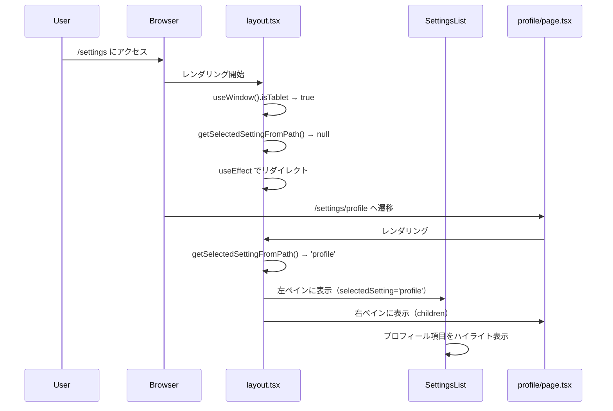
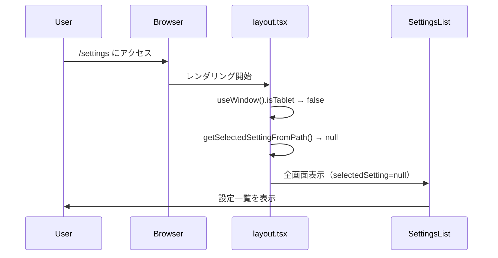
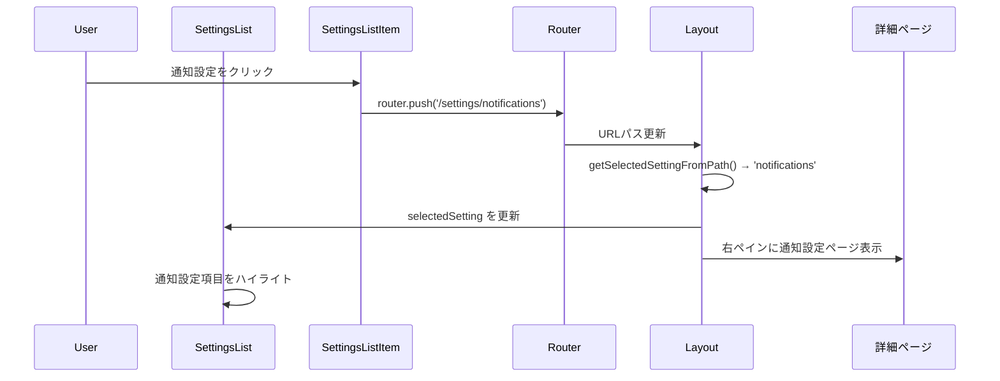
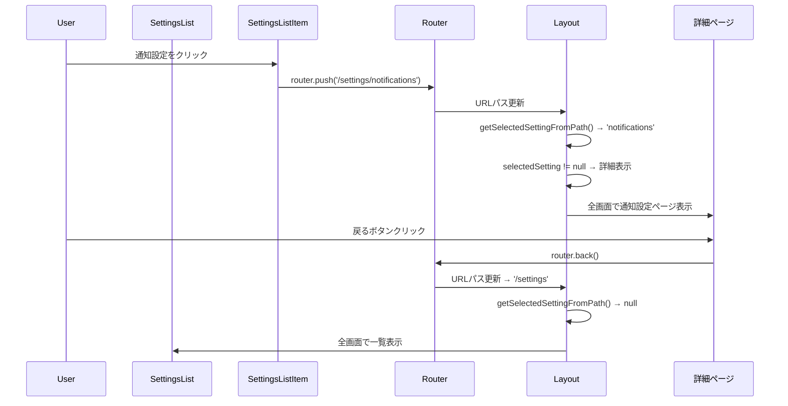
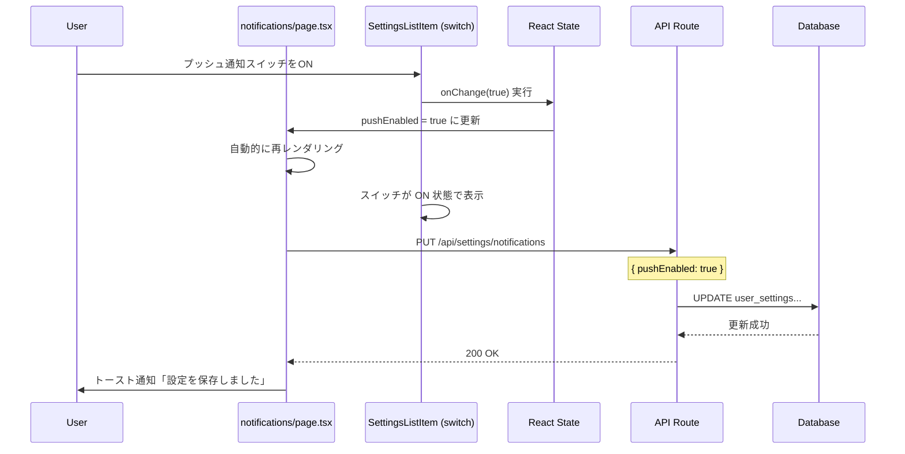
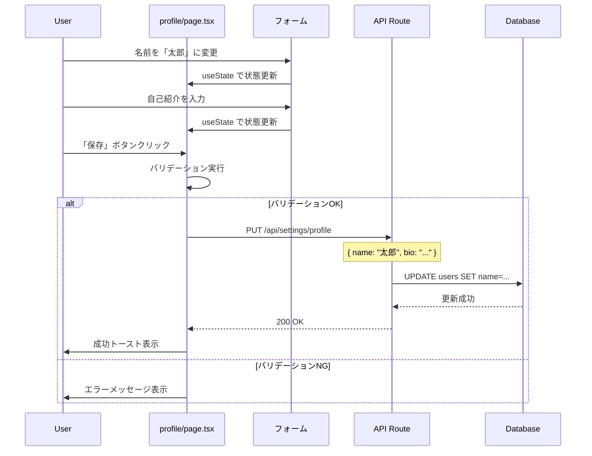
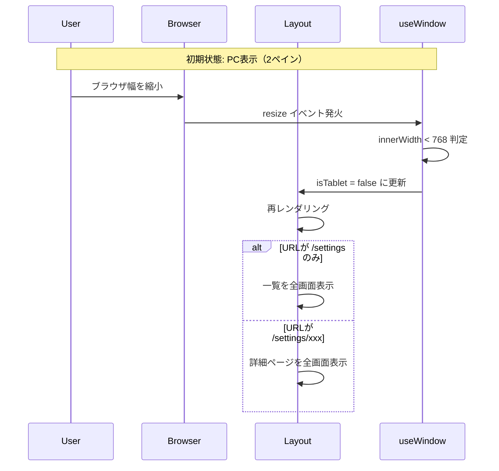
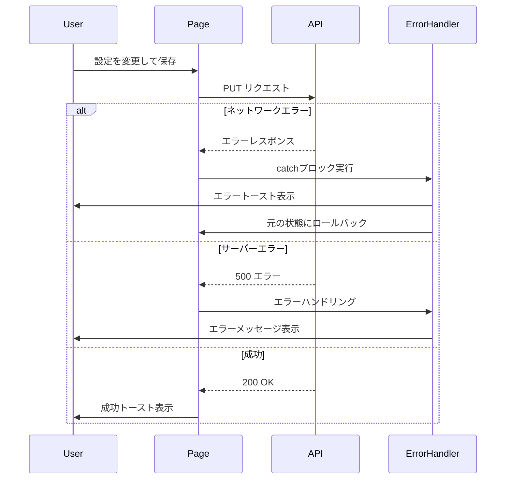
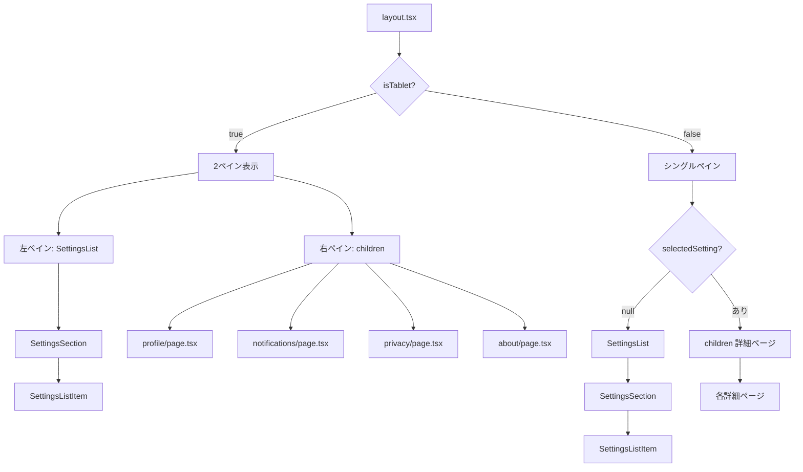

# 設定画面 処理フロー図

(2026年3月記載)

## 概要

設定画面の主要な処理フローを図解します。PC（2ペイン）とモバイル（シングルペイン）の違い、設定項目のクリックフロー、データ保存フローを含みます。

## 初期表示フロー（PC）



## 初期表示フロー（モバイル）



## 設定項目クリックフロー（PC）



## 設定項目クリックフロー（モバイル）



## スイッチ型設定項目の変更フロー



## フォーム型設定の保存フロー



## レスポンシブ切り替えフロー



## エラーハンドリングフロー



## ページ遷移の状態管理

```mermaid
graph TB
    Start[/settings/] --> Check{isTablet?}
    Check -->|true PC| Redirect[useEffect でリダイレクト]
    Check -->|false モバイル| ShowList[一覧表示]
    
    Redirect --> Profile[/settings/profile/]
    Profile --> PC_Layout[2ペインレイアウト]
    PC_Layout --> List[左: 設定一覧]
    PC_Layout --> Detail[右: プロフィール詳細]
    
    ShowList --> Click{項目クリック}
    Click --> Push[router.push()]
    Push --> Mobile_Detail[詳細ページ全画面表示]
    
    Mobile_Detail --> Back{戻るボタン}
    Back --> ShowList
```

## コンポーネント階層図



## ベストプラクティス

### ✅ DO
- URLパスから状態を復元する（ブラウザ戻る/進むに対応）
- レスポンシブ切り替えは`useWindow`フックに統一
- エラー時は元の状態にロールバック
- 保存成功時はトースト通知で明示

### ❌ DON'T
- クライアント側の状態とURLが乖離しないようにする
- `window.innerWidth`を直接使用しない（SSR対応のため）
- 保存中のローディング状態を省略しない
- 戻るボタンの動作をカスタマイズしすぎない（標準動作を維持）
