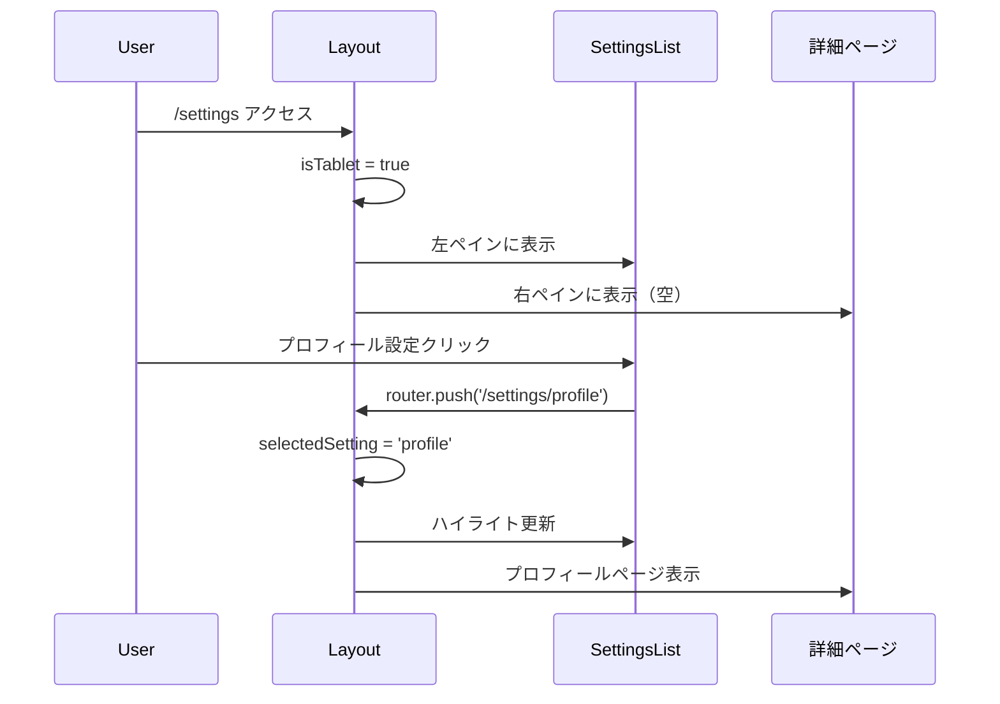
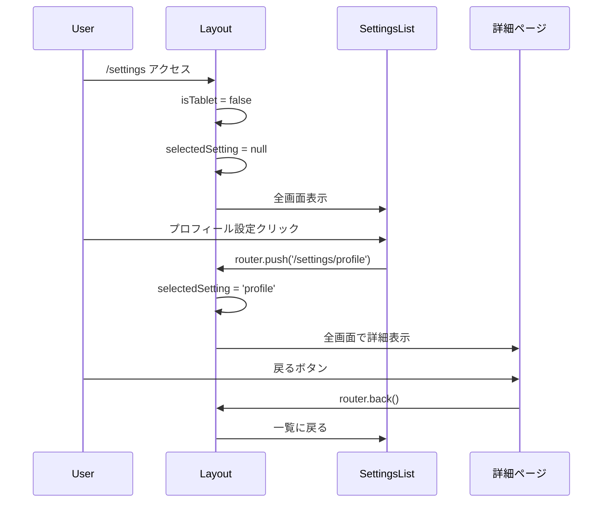

# 設定画面 レイアウト構造

(2026年3月記載)

## 概要

設定画面は、PCでは2ペイン、モバイルではシングルペインのレスポンシブレイアウトを採用しています。家族メンバー一覧画面のパターンを参考にした設計です。

## ファイル構成

```
packages/web/app/(app)/settings/
├── layout.tsx                    # 2ペインレスポンシブレイアウトコントローラー
├── page.tsx                      # ルートページ（/settingsへのアクセス処理）
├── _components/
│   ├── SettingsList.tsx         # 設定一覧（カテゴリ別リスト）
│   └── SettingsListItem.tsx     # iPhone風リストアイテム
├── profile/
│   └── page.tsx                 # プロフィール設定詳細
├── notifications/
│   └── page.tsx                 # 通知設定詳細
├── privacy/
│   └── page.tsx                 # プライバシー設定詳細
└── about/
    └── page.tsx                 # アプリ情報詳細
```

## layout.tsx の詳細構造

### インポート

```typescript
"use client";

import { usePathname } from "next/navigation";
import { Box } from "@mantine/core";
import { useWindow } from "@/app/(core)/hooks/useWindow";
import SettingsList from "./_components/SettingsList";
```

### 選択中の設定判定ロジック

```typescript
const getSelectedSettingFromPath = (pathname: string): string | null => {
  const match = pathname.match(/\/settings\/([^\/]+)/);
  return match ? match[1] : null;
};
```

- URLパスから`/settings/xxx`の`xxx`部分を抽出
- `/settings`のみの場合は`null`を返す

### レスポンシブ表示切り替え

#### PC表示（isTablet = true）

```typescript
if (isTablet) {
  return (
    <Box className="flex h-full gap-4">
      {/* 左ペイン: 設定一覧 */}
      <Box className="w-1/3">
        <SettingsList selectedSetting={selectedSetting} />
      </Box>
      
      {/* 右ペイン: 詳細ページ */}
      <Box className="flex-1">{children}</Box>
    </Box>
  );
}
```

**特徴:**
- `flex`コンテナで左右分割
- 左ペイン: `w-1/3`（全体の1/3幅）
- 右ペイン: `flex-1`（残りのスペースを埋める）
- `gap-4`で1remの間隔
- `selectedSetting`を渡してハイライト表示

#### モバイル表示（isTablet = false）

```typescript
if (!selectedSetting) {
  return <SettingsList selectedSetting={null} />;
}

return <>{children}</>;
```

**特徴:**
- `/settings`のみの場合: 一覧を全画面表示
- `/settings/xxx`の場合: 詳細ページを全画面表示
- 一覧と詳細がスウィッチする単画面ナビゲーション

## ページ遷移フロー

### PC（2ペイン）



### モバイル（シングルペイン）



## page.tsx の役割

```typescript
"use client";

import { useEffect } from "react";
import { useRouter } from "next/navigation";
import { SETTINGS_URL } from "@/app/(core)/endpoints";

export default function SettingsPage() {
  const router = useRouter();

  useEffect(() => {
    // デフォルトでプロフィール設定にリダイレクト
    router.replace(SETTINGS_URL.PROFILE);
  }, [router]);

  return null;
}
```

**目的:**
- `/settings`へのアクセス時、自動的に`/settings/profile`へリダイレクト
- PC表示時に右ペインが空にならないようにする

## レスポンシブブレークポイント

`useWindow`フックの`isTablet`定義:
- **タブレット判定**: 画面幅 ≥ 768px
- **モバイル判定**: 画面幅 < 768px

```typescript
const { isTablet } = useWindow(); // isTablet = window.innerWidth >= 768
```

## スタイリング詳細

### Tailwind CSS クラス

| 要素 | クラス | 説明 |
|------|--------|------|
| コンテナ | `flex h-full gap-4` | Flexbox、高さ100%、1rem間隔 |
| 左ペイン | `w-1/3` | 全体の1/3幅 |
| 右ペイン | `flex-1` | 残りスペースを埋める |

### Mantine Box コンポーネント

```typescript
<Box className="...">
  {children}
</Box>
```

- Mantineの`Box`コンポーネントをベース
- Tailwind CSSでレスポンシブスタイル適用

## ベストプラクティス

### ✅ DO
- `useWindow`フックで画面サイズを判定
- URLパスから選択状態を復元
- PC/モバイルで一貫したナビゲーション体験

### ❌ DON'T
- `window.innerWidth`を直接使用しない（SSR対応のため`useWindow`を使う）
- レイアウトロジックを詳細ページに実装しない（layout.tsxで集約）
- ハードコードされたブレークポイントを使用しない（`useWindow`に統一）

## 家族メンバー一覧画面との比較

| 項目 | 家族メンバー一覧 | 設定画面 |
|------|-----------------|----------|
| レイアウトパターン | 2ペイン（PC）/ シングルペイン（モバイル） | 同じ |
| 左ペイン幅 | `w-1/3` | `w-1/3` |
| 右ペイン | `flex-1` | `flex-1` |
| 間隔 | `gap-4` | `gap-4` |
| URL構造 | `/families/[id]/members/[memberId]` | `/settings/[category]` |

**参考になった点:**
- 2ペインレイアウトの実装パターン
- `useWindow`フックの使用方法
- URLから選択状態を判定するロジック
