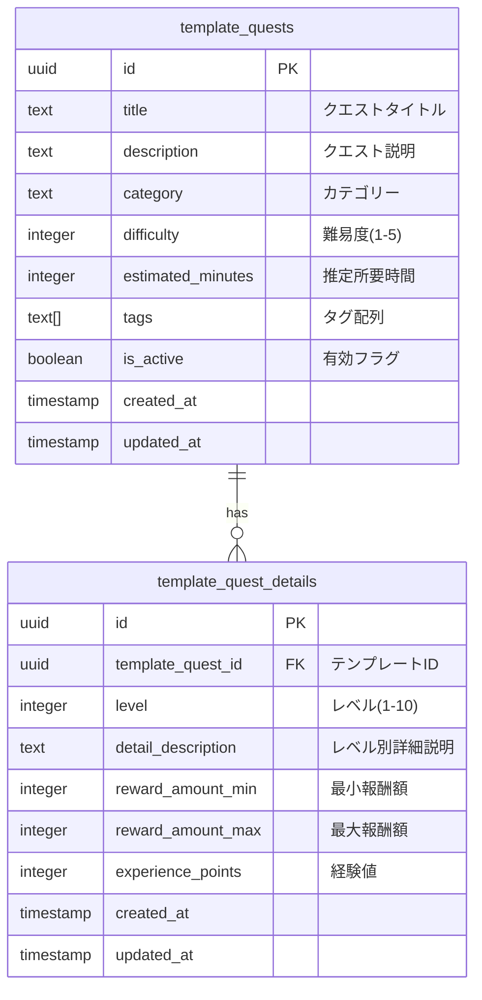

# テンプレートクエスト ER図

(2026年3月15日 14:30記載)

## テーブル構造

## テーブル説明

### template_quests
システムが提供するクエストテンプレート本体。管理者のみが作成・編集可能。

**主要カラム**:
- `title`: クエスト名（例: "お部屋の片付け", "宿題サポート"）
- `category`: カテゴリー（例: "家事", "勉強", "お手伝い"）
- `difficulty`: 難易度レベル（1=簡単、5=難しい）
- `is_active`: 表示制御フラグ（falseの場合は非表示）

### template_quest_details
テンプレートのレベル別詳細設定。子供のレベルに応じた報酬と経験値を定義。

**主要カラム**:
- `level`: 子供のレベル（1-10）
- `reward_amount_min` / `reward_amount_max`: 報酬の範囲
- `experience_points`: このレベルでの獲得経験値

## リレーション特徴

- **読み取り専用**: ユーザーはテンプレートの閲覧のみ可能
- **採用時の動作**: テンプレートから family_quests へコピー
- **レベル対応**: 子供のレベルに応じた適切な詳細を選択

## 採用先テーブル（参照）

テンプレートが採用される際の遷移先：
- `template_quests` → `family_quests`（基本情報コピー）
- `template_quest_details` → `family_quest_details`（レベル対応詳細コピー）
