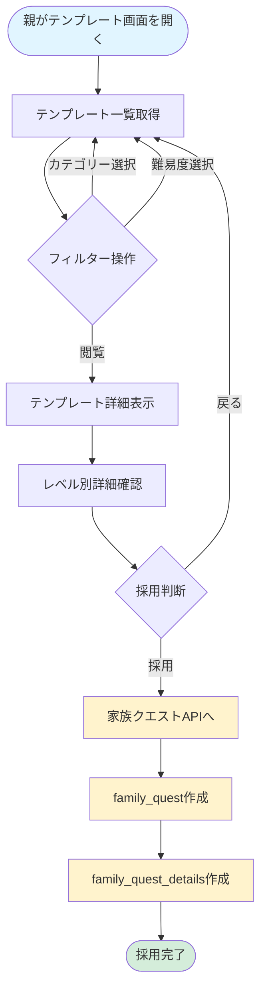

# テンプレートクエスト フロー図

(2026年3月15日 14:30記載)

## 全体フロー

## 簡易フロー説明

### 1. テンプレート閲覧フェーズ
- 親がテンプレート一覧画面を開く
- カテゴリー、難易度、タグでフィルタリング
- 気になるテンプレートの詳細を確認

### 2. 詳細確認フェーズ
- テンプレートの基本情報確認
- レベル別の報酬と経験値を確認
- 推定時間、難易度を判断

### 3. 採用フェーズ（家族クエストAPIに移行）
- 「採用」ボタンクリック
- 家族クエストAPIが実行される
- テンプレート情報から family_quests を作成
- レベル対応の family_quest_details を作成

## ステータス補足

テンプレートクエスト自体にステータスはありません。
採用後は family_quests のステータス管理に従います。

## 権限

- **閲覧**: 家族の親のみ
- **採用**: 家族の親のみ
- **作成・編集**: システム管理者のみ（外部操作）
