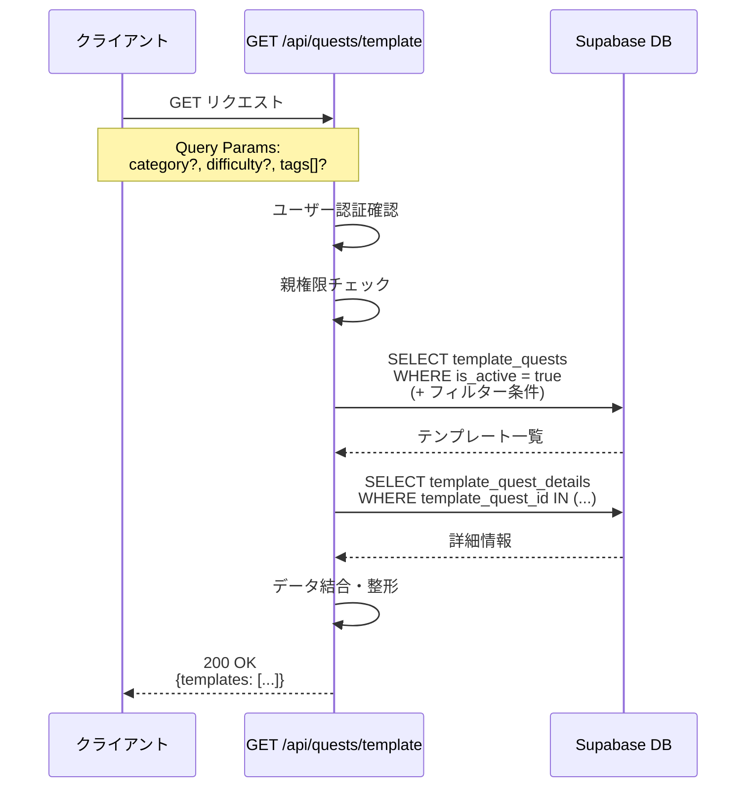
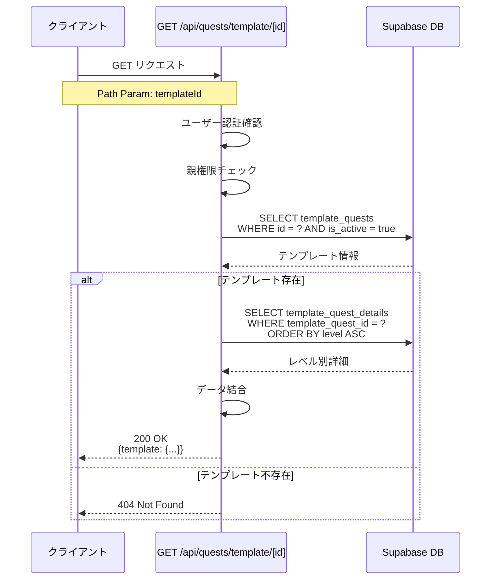

# テンプレートクエスト API シーケンス図

(2026年3月15日 14:30記載)

## 1. テンプレート一覧取得



### リクエスト例
```typescript
GET /api/quests/template?category=家事&difficulty=2
```

### レスポンス例
```typescript
{
  templates: [
    {
      id: "uuid",
      title: "お部屋の片付け",
      description: "自分の部屋をきれいに片付ける",
      category: "家事",
      difficulty: 2,
      estimatedMinutes: 30,
      tags: ["整理整頓", "日常"],
      details: [
        {
          level: 1,
          rewardAmountMin: 50,
          rewardAmountMax: 100,
          experiencePoints: 10
        },
        // level 2-10...
      ]
    }
  ]
}
```

## 2. テンプレート詳細取得



### リクエスト例
```typescript
GET /api/quests/template/550e8400-e29b-41d4-a716-446655440000
```

### レスポンス例
```typescript
{
  template: {
    id: "550e8400-e29b-41d4-a716-446655440000",
    title: "お部屋の片付け",
    description: "自分の部屋をきれいに片付ける",
    category: "家事",
    difficulty: 2,
    estimatedMinutes: 30,
    tags: ["整理整頓", "日常"],
    details: [
      {
        level: 1,
        detailDescription: "おもちゃを箱に入れる",
        rewardAmountMin: 50,
        rewardAmountMax: 100,
        experiencePoints: 10
      },
      {
        level: 2,
        detailDescription: "おもちゃの整理と床の掃除",
        rewardAmountMin: 80,
        rewardAmountMax: 150,
        experiencePoints: 15
      }
      // level 3-10...
    ]
  }
}
```

## エラーパターン

### 認証エラー
```typescript
401 Unauthorized
{
  error: "認証が必要です"
}
```

### 権限エラー
```typescript
403 Forbidden
{
  error: "親のみアクセス可能です"
}
```

### 存在しないテンプレート
```typescript
404 Not Found
{
  error: "テンプレートが見つかりません"
}
```

## 処理時間目安

- 一覧取得: 100-300ms
- 詳細取得: 50-150ms

## キャッシュ戦略

テンプレートは更新頻度が低いため、React QueryのstaleTimeを長めに設定推奨：
```typescript
useQuery({
  queryKey: ['templates'],
  queryFn: fetchTemplates,
  staleTime: 1000 * 60 * 30 // 30分
})
```
