(2026年3月記載)

# テンプレートクエスト一覧 フロー図

## 初期表示フロー

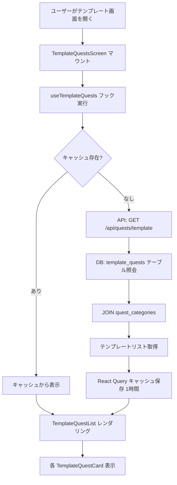

## カテゴリフィルタフロー

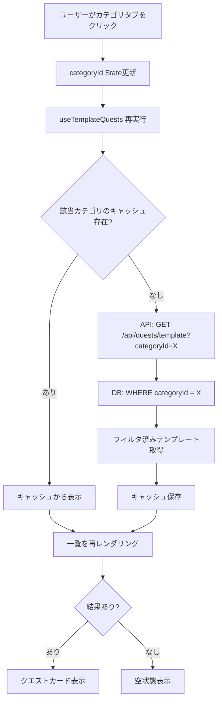

## テンプレート採用フロー

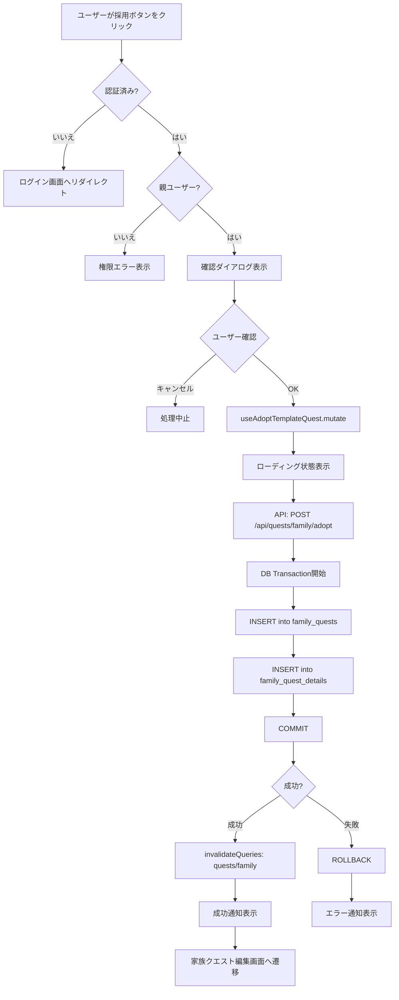

## プリフェッチフロー

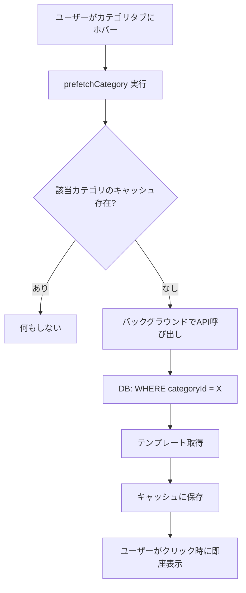

## 詳細モーダル表示フロー

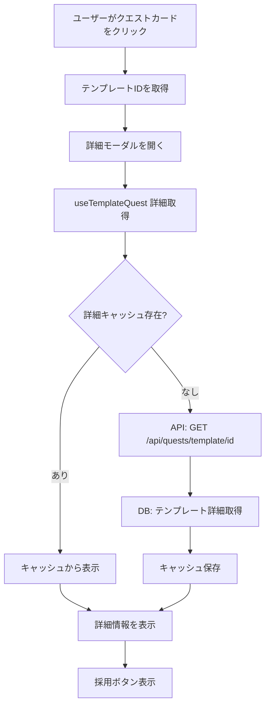

## カスタマイズ後採用フロー（将来実装）

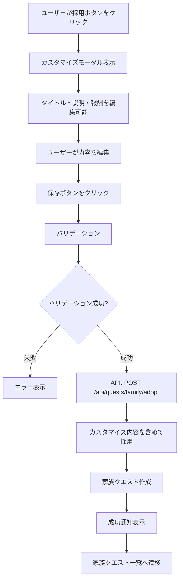

## エラーハンドリングフロー

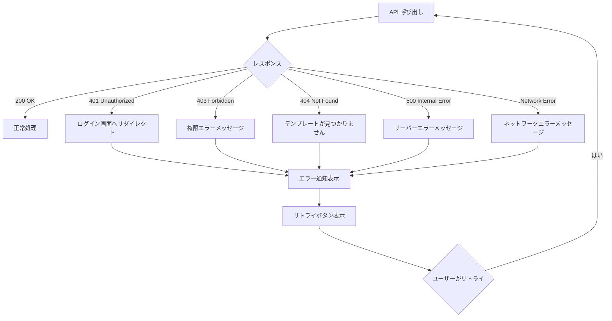

## 状態遷移図

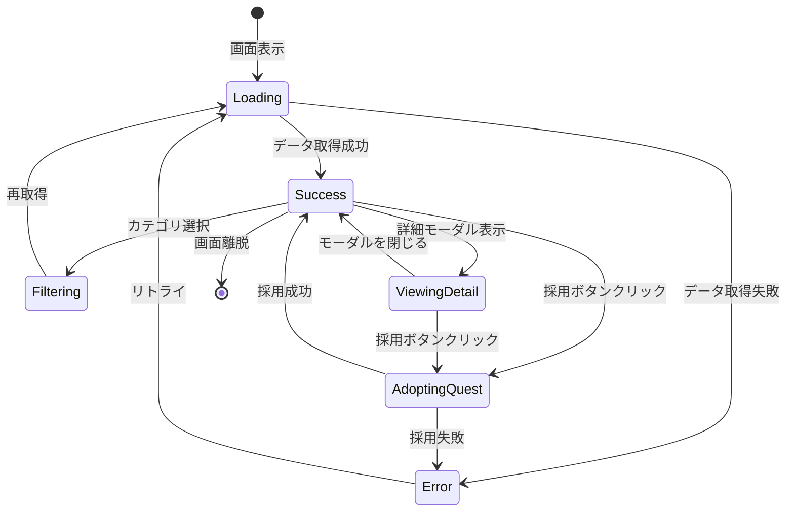

## キャッシュ管理フロー

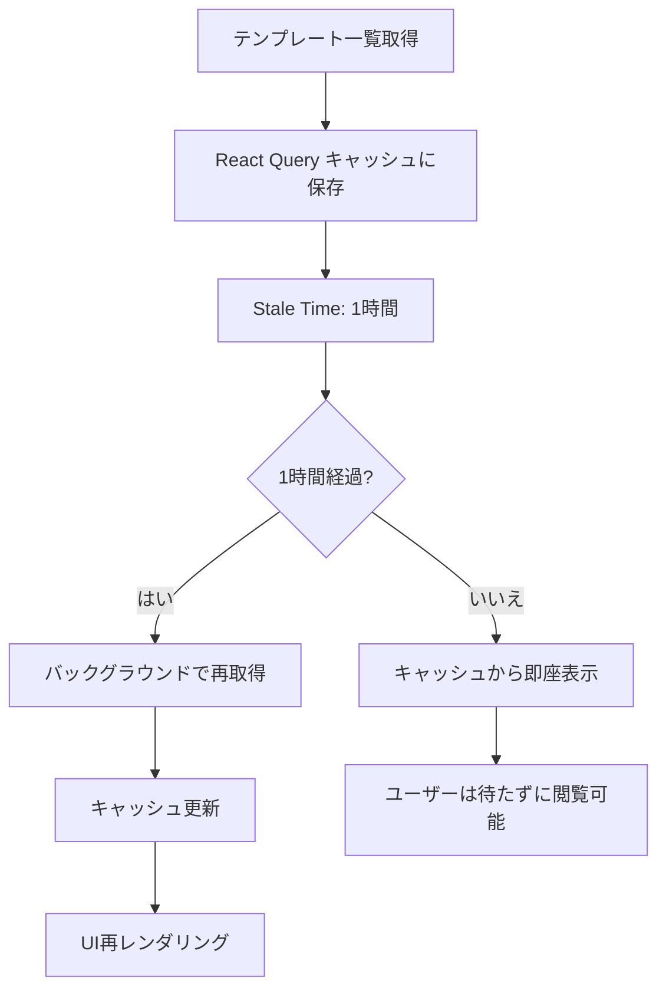

## 複数テンプレート同時採用フロー（将来実装）

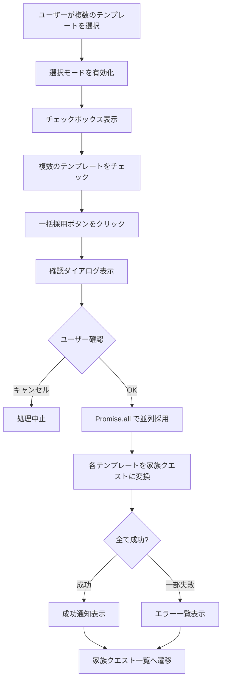

## 検索機能フロー（将来実装）

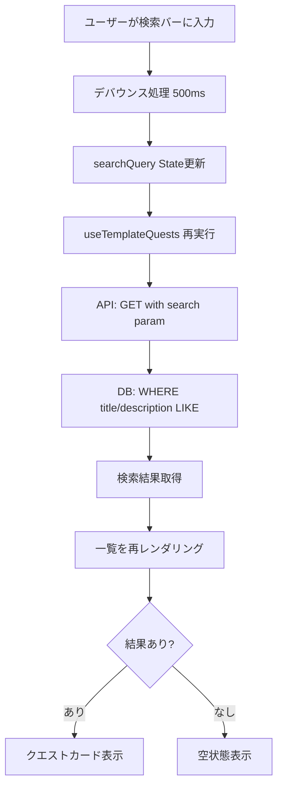
