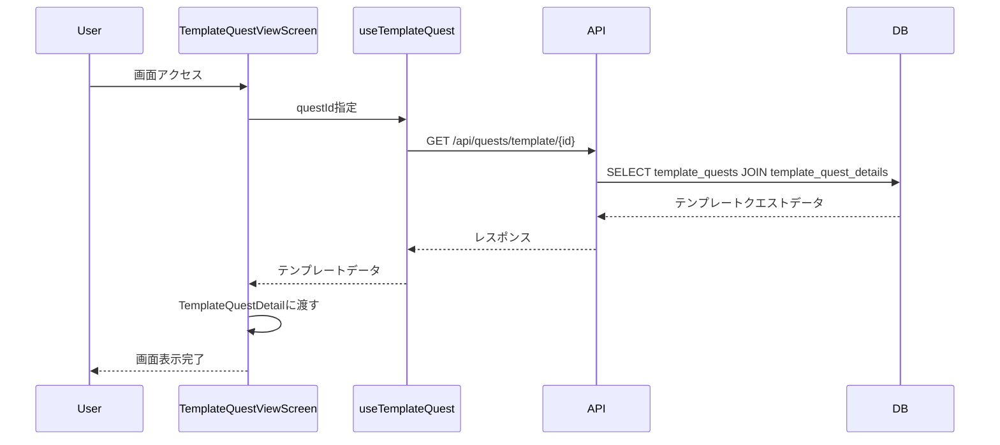
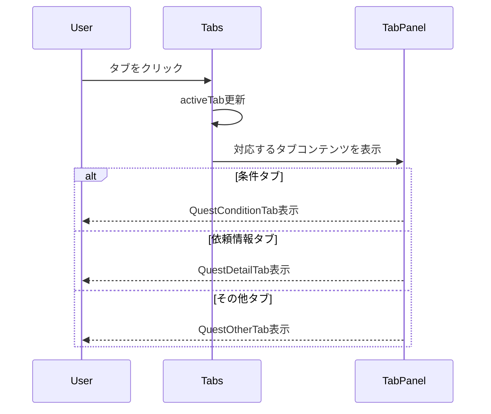
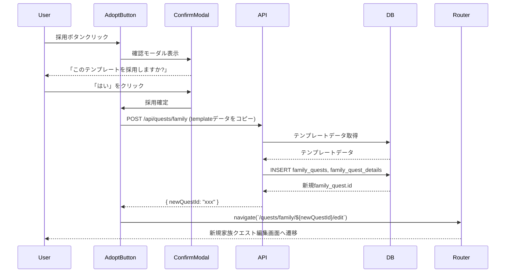
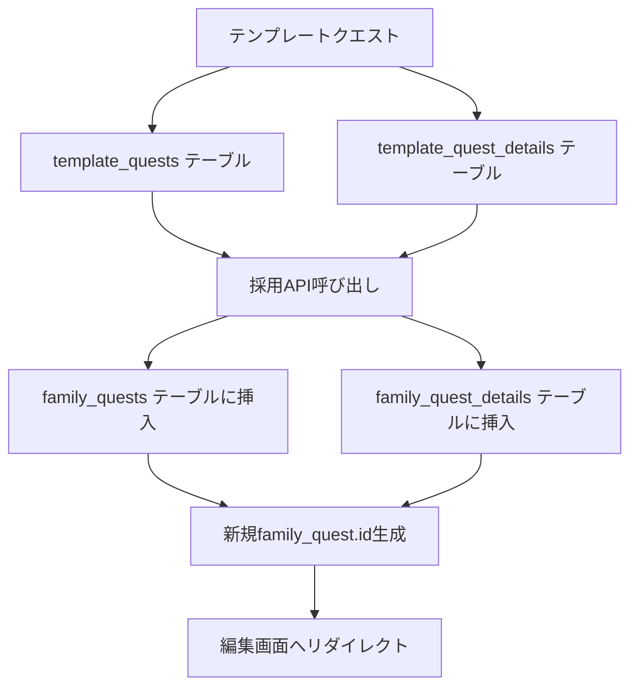
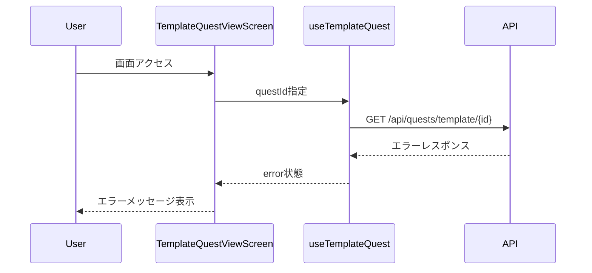
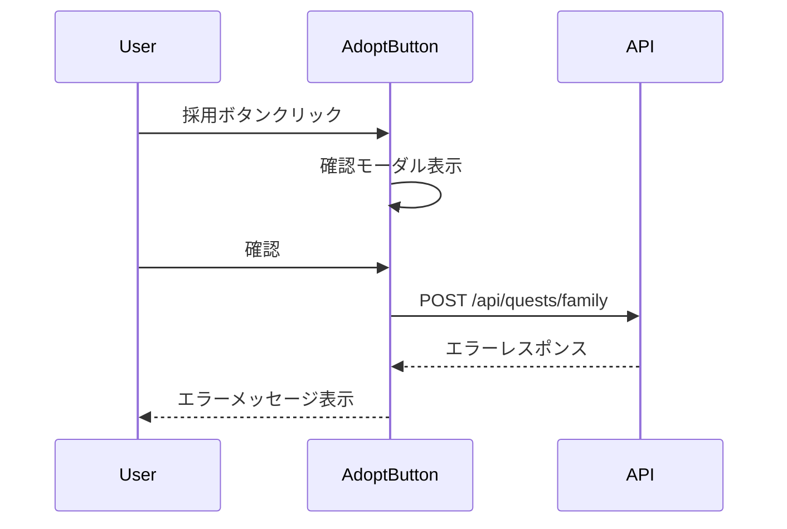
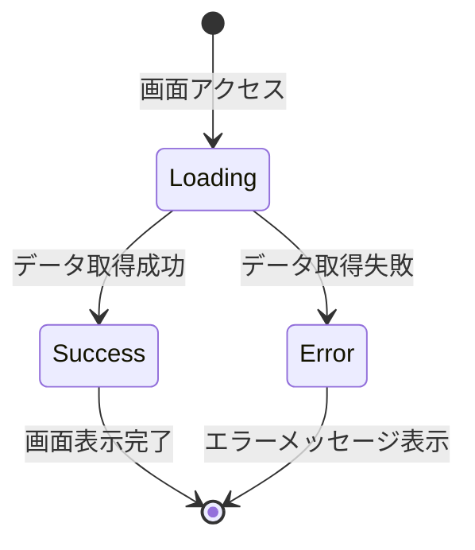
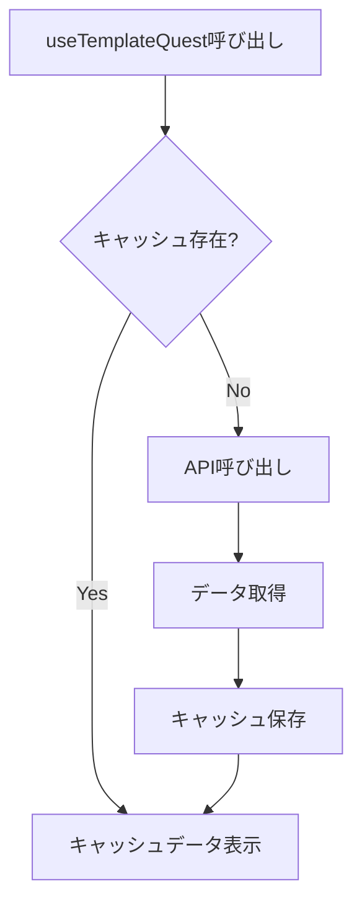
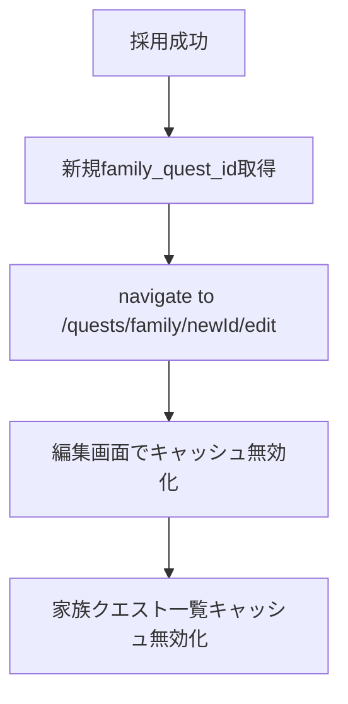

# テンプレートクエスト閲覧画面 レンダリング・インタラクションフロー

**最終更新: 2026年3月記載**

## 初期表示フロー



**処理ステップ:**
1. `TemplateQuestViewScreen` がマウント
2. `useTemplateQuest` フックでテンプレート詳細を取得
3. `TemplateQuestDetail` コンポーネントにデータを渡して表示
4. タブは「条件」タブを初期表示

---

## タブ切り替えフロー



**タブ種類:**
1. **条件タブ**: レベル、カテゴリ、達成条件、報酬、経験値、必要完了回数
2. **依頼情報タブ**: 依頼主、依頼内容
3. **その他タブ**: タグ、推奨年齢・月齢

---

## 採用フロー



**処理詳細:**
1. ユーザーが「採用」ボタンをクリック
2. 確認モーダル表示
3. 確認後、テンプレートデータを基に家族クエスト作成API呼び出し
4. APIはテンプレートの全レベルデータをコピーして family_quests, family_quest_details に挿入
5. 新規作成された家族クエストIDを返す
6. 家族クエスト編集画面へリダイレクト

**APIエンドポイント:**
```
POST /api/quests/family
{
  templateId: "template_quest_id"
}
```

**レスポンス:**
```json
{
  "id": "new_family_quest_id"
}
```

---

## データ変換フロー（テンプレート→家族クエスト）



**データマッピング:**

| テンプレート (template_quests) | 家族クエスト (family_quests) |
|-------------------------------|------------------------------|
| id                             | -（新規生成）                  |
| name                           | name                          |
| created_at                     | -（新規作成日時）              |
| updated_at                     | -（新規作成日時）              |
| family_id                      | -（ログインユーザーの家族ID）   |

| テンプレート (template_quest_details) | 家族クエスト (family_quest_details) |
|---------------------------------------|-------------------------------------|
| template_quest_id                     | family_quest_id（新規ID）          |
| level                                 | level                               |
| category                              | category                            |
| success_condition                     | success_condition                   |
| reward                                | reward                              |
| exp                                   | exp                                 |
| required_completion_count             | required_completion_count           |
| client                                | client                              |
| request_detail                        | request_detail                      |
| tags                                  | tags                                |
| age_from/age_to                       | age_from/age_to                     |
| month_from/month_to                   | month_from/month_to                 |
| icon_name/icon_size/icon_color        | icon_name/icon_size/icon_color      |
| background_color                      | background_color                    |

---

## エラーハンドリングフロー

### データ取得失敗



**エラーメッセージ例:**
- データ取得失敗: 「テンプレートクエストの読み込みに失敗しました。」
- 存在しないID: 「テンプレートクエストが見つかりません。」

---

### 採用失敗



**エラーメッセージ例:**
- 採用失敗: 「テンプレートの採用に失敗しました。もう一度お試しください。」
- 権限エラー: 「家族クエストを作成する権限がありません。」

---

## ローディング状態フロー



**ローディングUI:**
- Skeleton表示（ヘッダー、タブ、コンテンツエリア）
- 採用ボタンは非表示

**成功時UI:**
- 完全なテンプレートクエスト詳細表示
- 採用ボタン表示

**エラー時UI:**
- エラーメッセージ表示
- 再試行ボタン表示

---

## React Query キャッシュフロー



**キャッシュキー:**
```typescript
['template-quest', questId]
```

**キャッシュ有効期限:**
- staleTime: 5分
- cacheTime: 30分

---

## 採用後の状態管理



**キャッシュ無効化:**
- 採用成功後、`['family-quests']` キャッシュを無効化
- 家族クエスト一覧を最新状態に更新
