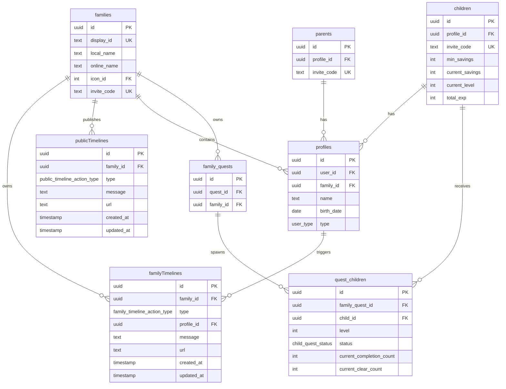

(2026年3月15日 14:30記載)

# タイムライン関連テーブル ER図

## タイムラインのデータ構造

## アクションタイプ

### 家族タイムラインアクションタイプ (family_timeline_action_type)

- `quest_created`: クエスト作成
- `quest_completed`: クエスト完了
- `quest_cleared`: クエストクリア
- `quest_level_up`: クエストレベルアップ
- `child_joined`: 子供が参加
- `parent_joined`: 親が参加
- `reward_received`: 報酬受け取り
- `savings_updated`: 貯金額更新
- `savings_milestone_reached`: 貯金額マイルストーン達成（100円、500円、1000円、5000円...）
- `quest_milestone_reached`: クエスト達成マイルストーン（10回、50回、100回、500回...）
- `comment_posted`: コメント投稿
- `other`: その他

### 公開タイムラインアクションタイプ (public_timeline_action_type)

- `quest_published`: クエスト公開
- `likes_milestone_reached`: いいね数マイルストーン達成（初回、10、50、100、500、1000...）
- `posts_milestone_reached`: 投稿数マイルストーン達成（初回、10、50、100、500、1000...）
- `comments_milestone_reached`: コメント数マイルストーン達成
- `comment_posted`: コメント投稿
- `like_received`: いいね受け取り
- `other`: その他

## データモデルの特徴

### 家族タイムライン (familyTimelines)

- 家族内のアクティビティを追跡
- `profileId`でアクション実行者を識別
- `message`でアクティビティの説明を表示
- `url`で関連リソース（クエスト、プロフィールなど）へのリンクを提供

### 公開タイムライン (publicTimelines)

- 公開コミュニティのアクティビティを追跡
- 家族単位での公開活動を記録
- マイルストーン達成を追跡
