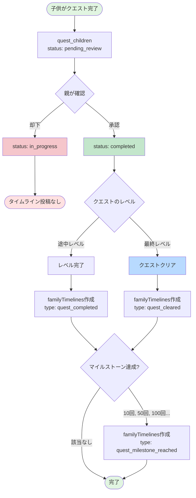
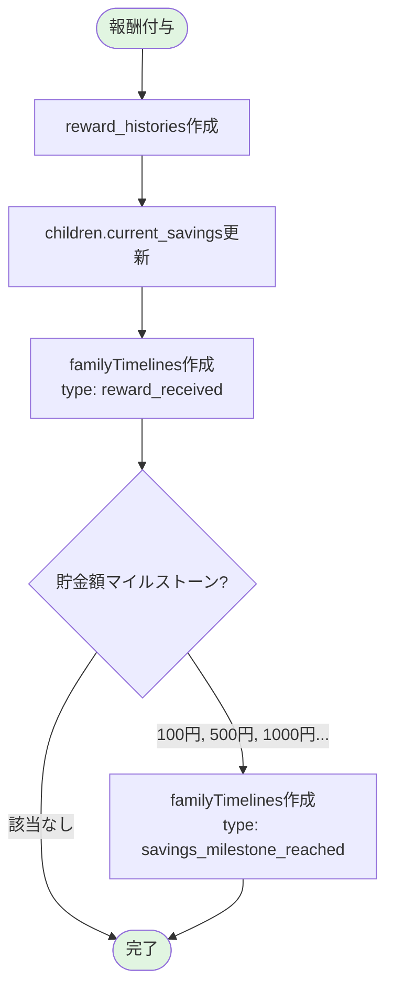
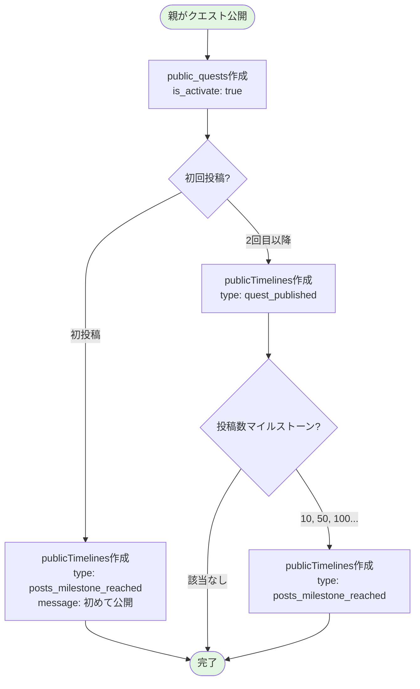
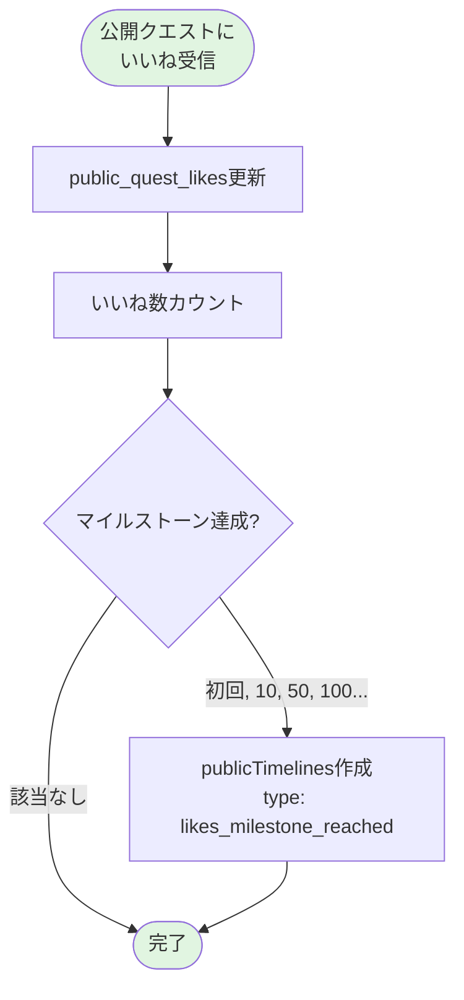
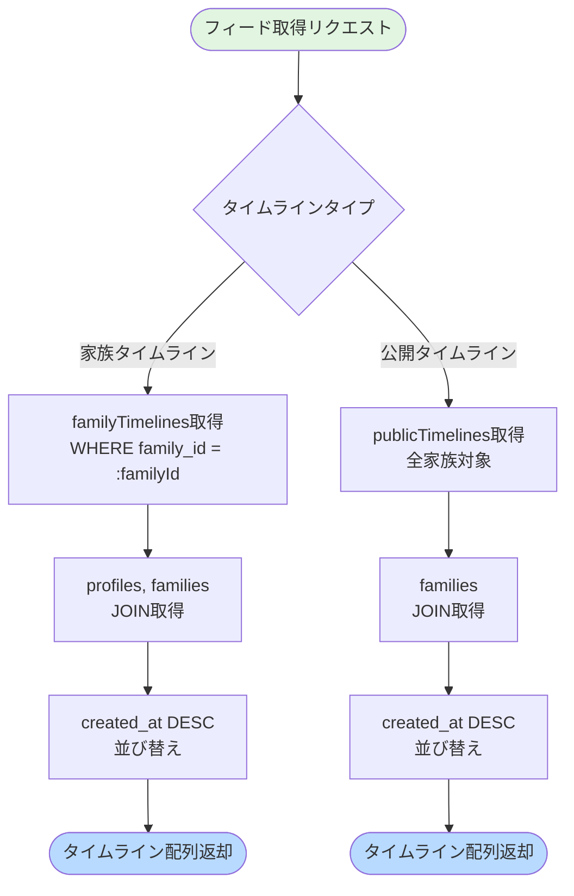

(2026年3月記載)

# タイムライン生成フロー図

## クエスト完了からタイムライン投稿までのフロー

## 報酬受け取りからタイムライン投稿までのフロー

## クエスト公開から公開タイムライン投稿までのフロー

## いいね受け取りから公開タイムライン投稿までのフロー

## タイムラインフィード集約フロー

## アクティビティ種別による投稿パターン

### 即時投稿型

- クエスト作成
- クエスト完了
- クエストクリア
- 報酬受け取り
- 家族メンバー参加

### 条件付き投稿型（マイルストーン）

- クエスト達成回数（10, 50, 100, 500...）
- 貯金額（100円, 500円, 1000円, 5000円...）
- いいね数（初回, 10, 50, 100, 500...）
- 投稿数（初回, 10, 50, 100, 500...）
