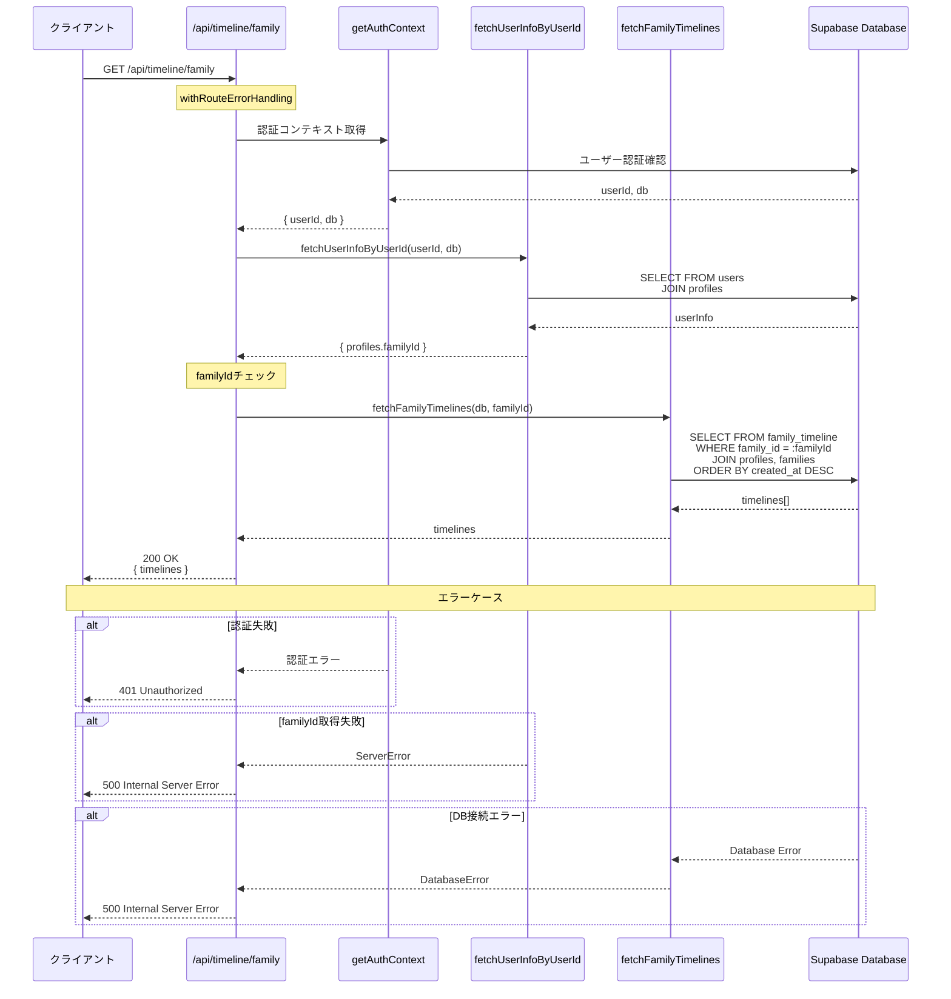
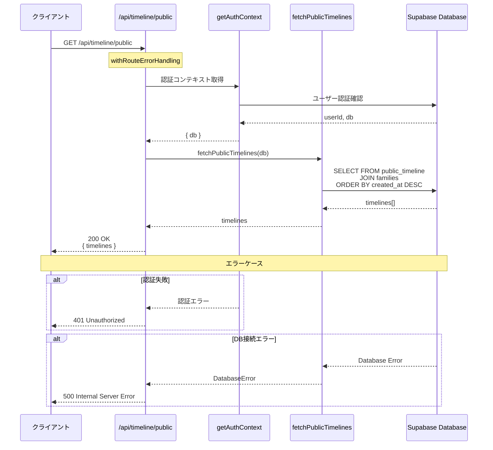
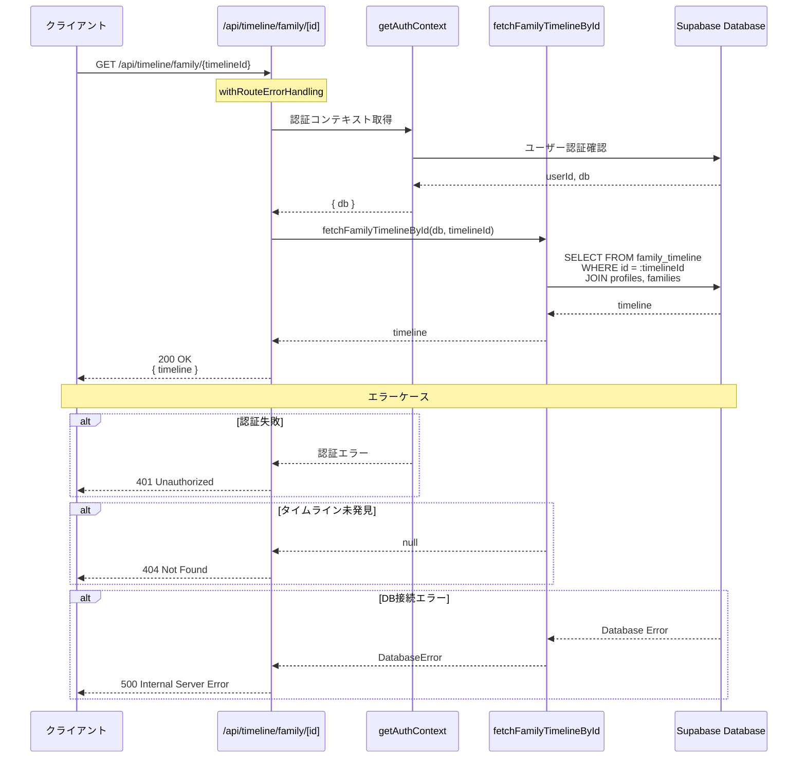
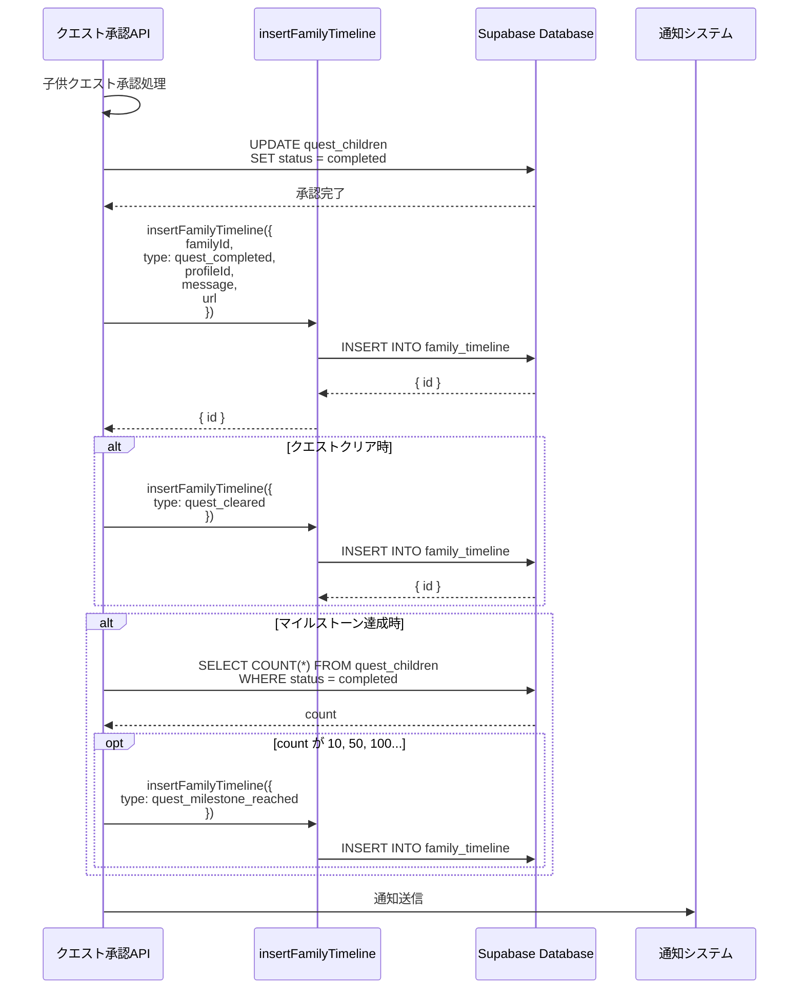
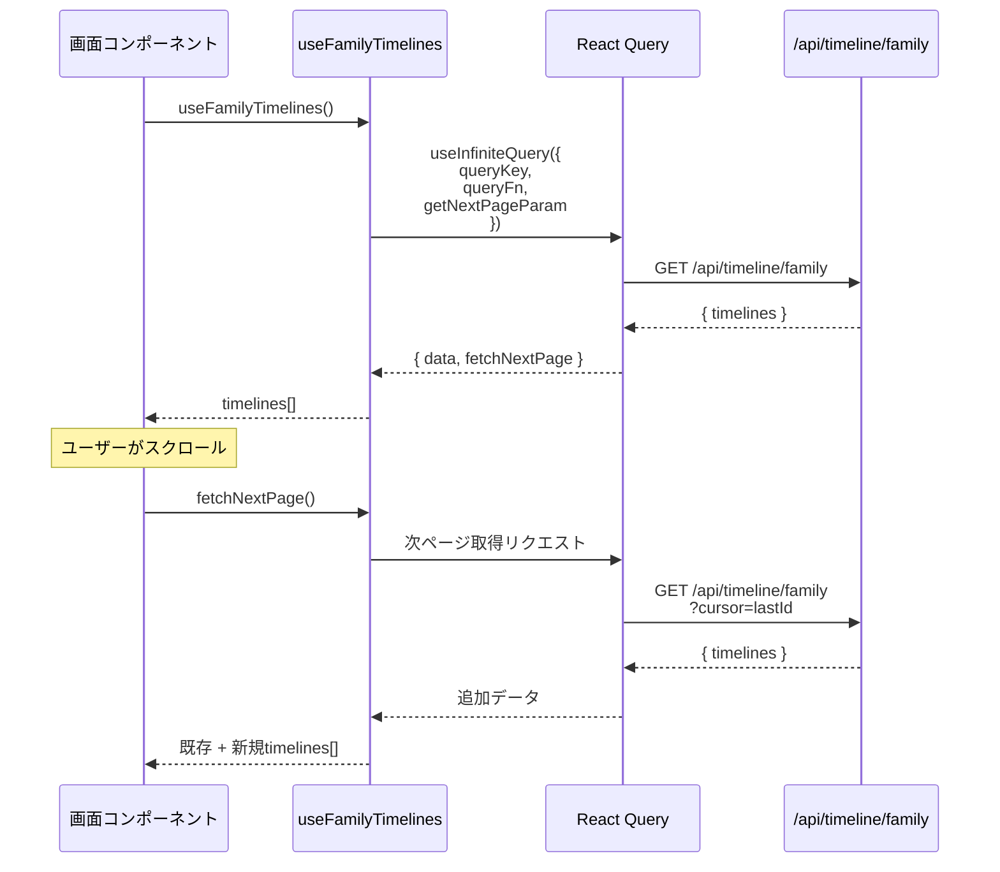

(2026年3月記載)

# タイムラインAPI シーケンス図

## GET /api/timeline/family (家族タイムライン取得)



## GET /api/timeline/public (公開タイムライン取得)



## GET /api/timeline/family/[id] (個別タイムライン詳細取得)



## タイムライン投稿作成（クエスト完了時）



## クライアント側フェッチフロー（React Query無限スクロール）



## フィルタリング・ページネーション最適化

### カーソルベースページネーション

```sql
SELECT * FROM family_timeline
WHERE family_id = :familyId
  AND created_at < :cursor
ORDER BY created_at DESC
LIMIT :pageSize
```

### アクションタイプフィルタリング

```sql
SELECT * FROM family_timeline
WHERE family_id = :familyId
  AND type IN (:types[])
ORDER BY created_at DESC
LIMIT :pageSize
```

### プロフィールフィルタリング（特定メンバーのアクティビティ）

```sql
SELECT * FROM family_timeline
WHERE family_id = :familyId
  AND profile_id = :profileId
ORDER BY created_at DESC
LIMIT :pageSize
```
